|[Home](../README.md)|[Course Page]()|
|---------------------|--------------|

# MLOps (Machine Learning Operations) Fundamentals

[TOC]

##  Introduction to MLOps Fundamentals

###  Course Introduction

##  Why and When to Employ MLOps

* Pain Points:

* the real challenge isn't building an ml model it is building an integrated ml system in continuously operating it in production

  * keeping track of the many models they have trained is difficult they want to keep track of the different versions of the code the values they chose for the different hyper parameters and the metrics they are evaluating 

  * they have trouble keeping track of which ideas have been tried which ones worked and which ones did not 

  * they cannot pinpoint the best model which was possibly trained two weeks previously reproduce it and run it on full production data 

  * reproducibility is a major concern because data scientists want to be able to rerun the best model with a more through parameter sweep

  * putting a model in production is difficult unless it can be reproduced because many companies have that as a policy or requirement 

  * when the team is able to successfully train a model and make it ready for production usage in a streamlined fashion performance and agility are considerably

  *  traceability becomes paramount

    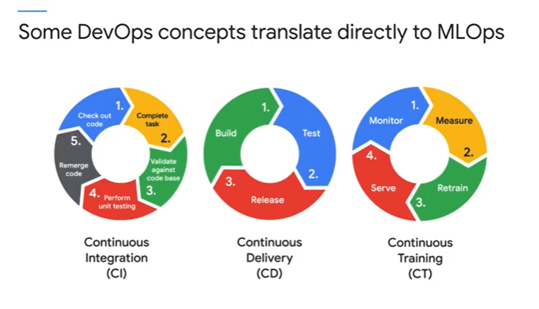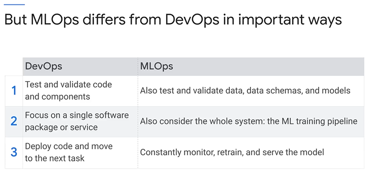

    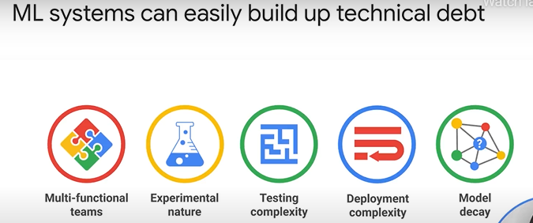

    

###  Machine Learning Lifecycle

###  MLOps Architecture and TensorFlow Extended Components

* 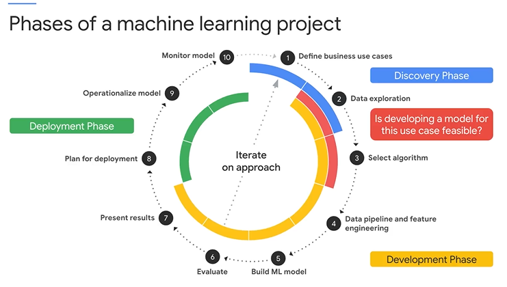
* 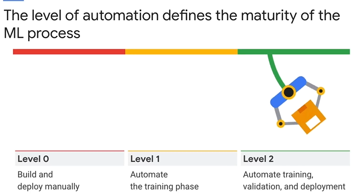
* 

##  Introduction

###  Introduction to Containers

###  Containers and Container Images

###  Lab introduction

###  Working with Cloud Build

###  Lab solution

###  Introduction to Kubernetes

[Kubernetes Components explained! Pods, Services, Secrets, ConfigMap | Kubernetes Tutorial 14 - YouTube](https://www.youtube.com/watch?v=Krpb44XR0bk)

[Kubernetes Components explained! Pods, Services, Secrets, ConfigMap | Kubernetes Tutorial 14 - YouTube](https://www.youtube.com/watch?v=Krpb44XR0bk)

* Key terms
  * Cluster: 
  * Master Node:
    * 
  * Worker Nodes:
    * Pods
    * Container
  * Volumes:
  * Networking:
    * Service: In case a pod stops working and new pod is created, it is assigned a new IP address. The "Service" component is an abstraction on top of this which keeps a track of the changing underlying IP address so that we don't have to keep a track of the IP address.
    * Ingress:
  * Declarative Componets:
    * Deployments: This is where we declare the state we require our desired application to be in. This is not used for stateful services like database, because pods are considered to be effemeral (i.e. can be destroyed easily) components. This is where you write the config.yaml file.
    * Stateful Sets: 
  * Environment Variable Storage
    * ConfigMap : Instead of hardcoding the ip address of database or any other service, we can declare it here. This ensures that we don't have to make changes in our code, build new image if the url of the database changes.
    * Secrets: This is same like config map but instead of links to different services, we save our username and password here.

###  Introduction to Google Kubernetes Engine

###  Compute Options Detail

###  Kubernetes Concepts

###  The Kubernetes Control Plane

###  Google Kubernetes Engine Concepts

###  Lab Introduction

###  Deploying Google Kubernetes Engine

###  Lab Solution

###  Deployments 1

###  Ways to Create Deployments

###  Services and Scaling

###  Updating Deployments

###  Rolling Updates

###  Canary Deployments

###  Managing Deployments

###  Lab Intro

###  Creating Google Kubernetes Engine Deployments

###  Jobs and CronJobs

###  Parallel Jobs

###  CronJobs

##  Introduction to AI Platform Pipelines

###  Overview

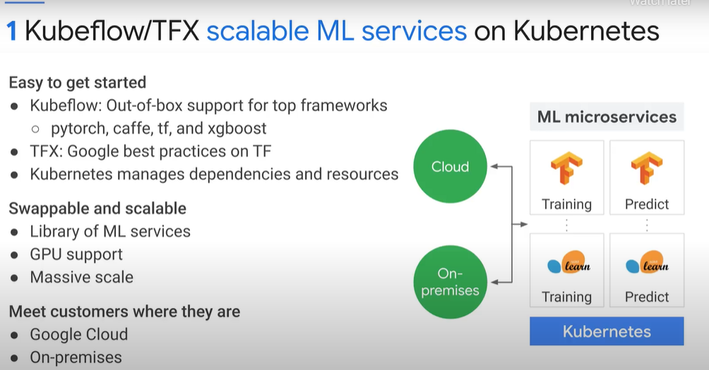

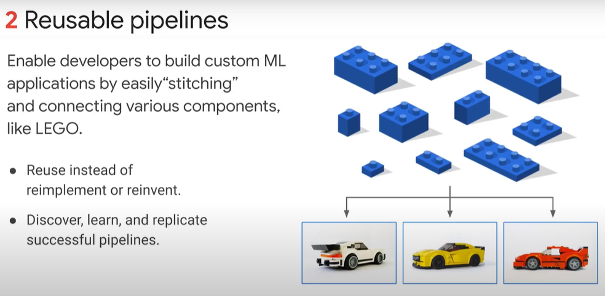

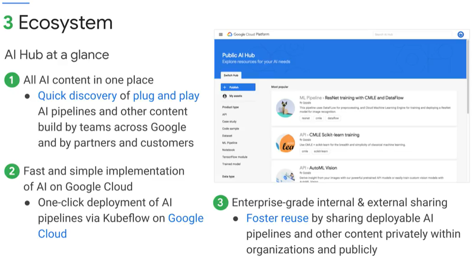

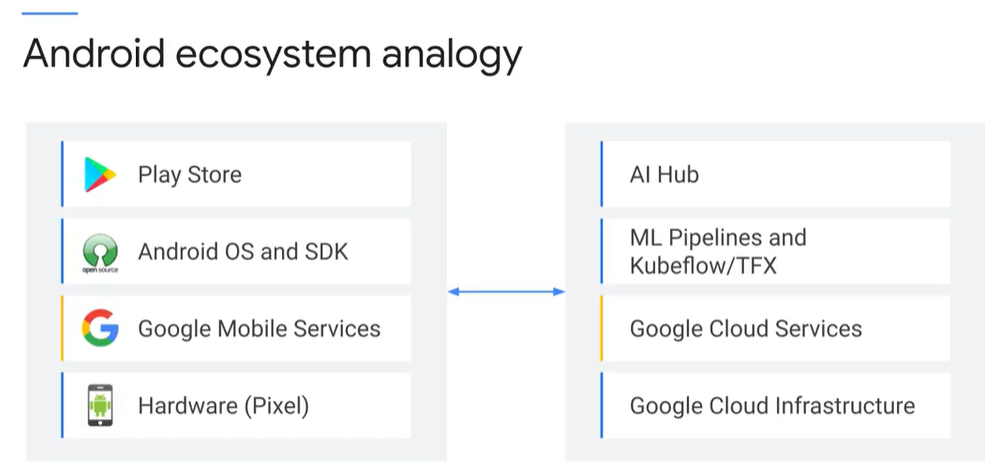

###  Introduction to AI Platform Pipelines

* 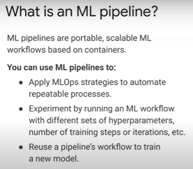

* 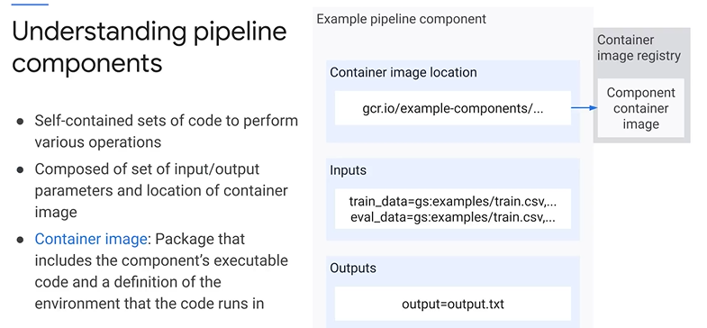

  * pipeline components are self-contained sets of code that perform one step in a pipeline's workflow such as data preprocessing data transformation model training and so on 
  * 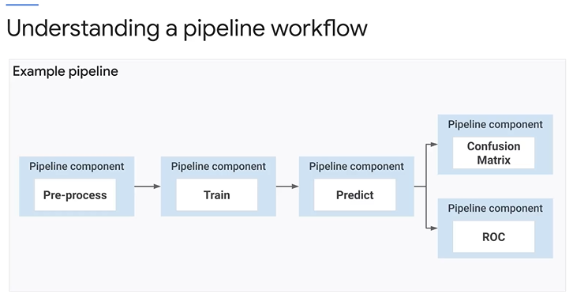
  * Tasks are instances of pipeline components
    * They have input parameters,outputs and container image.
  * to create the workflow graph ai platform pipelines analyzes the task dependencies. for eg.
    * the pre-processing task does not depend on any other tasks so it can be the first task in the workflow or it can run concurrently with other tasks
    * the training task relies on the data produced by the pre-processing task so training must occur after preprocessing 
    * the prediction task relies on the trained model produced by the training task so prediction must occur after the training task or the training step 
    * building the confusion metrics and performing roc receiver operating characteristic analysis both rely on the output of the prediction task so they must occur after prediction is complete 
    * building the confusion metrics and performing roc analysis can occur concurrently because they both depend on the output of the prediction task but they are independent of each other 
    * based on this analysis the ai platform pipeline systems runs the pre-processing training and prediction tasks sequentially and then runs the confusion matrix and roc tasks concurrently

* Why was AI Platform needed?

  * 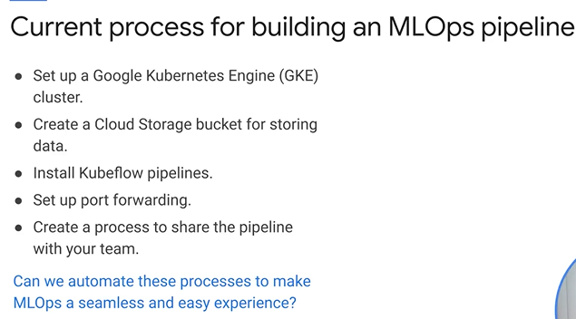
  * 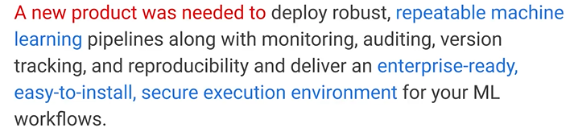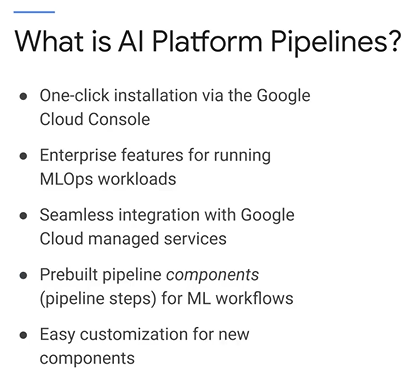

* Components of Google AI Platform:

  * 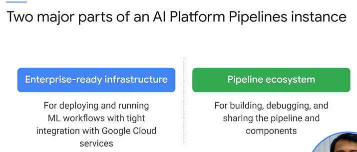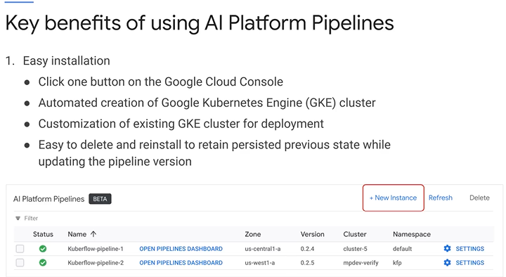
  * 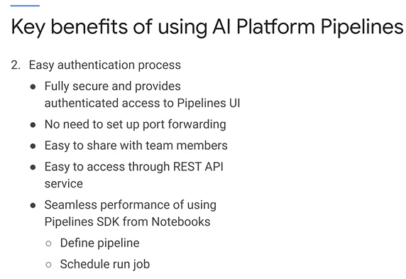

* How to setup Kubeflow Pipelines?

  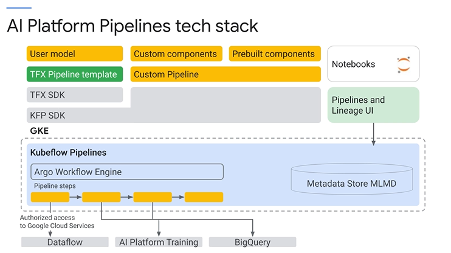

  * You specify your pipeline by using the kubeflow pipelines sdk or by customizing the tensorflow extended

  * ai pipelines uses the argo workflow engine to run the pipeline and has additional microservices to record metadata handle components i o and schedule pipeline runs.

  * pipeline steps are executed as individual isolated pods in a gke google kubernetes engine cluster which enables the kubernetes native experience for the pipeline components 

  * the components can leverage google cloud services such as data flow ai platform training and prediction and bigquery for handling scalable computation and data processing 

  * the pipelines can also contain steps that perform sizable gpu and tpu computation in the cluster directly leveraging gke auto scaling and node auto provisioning 

    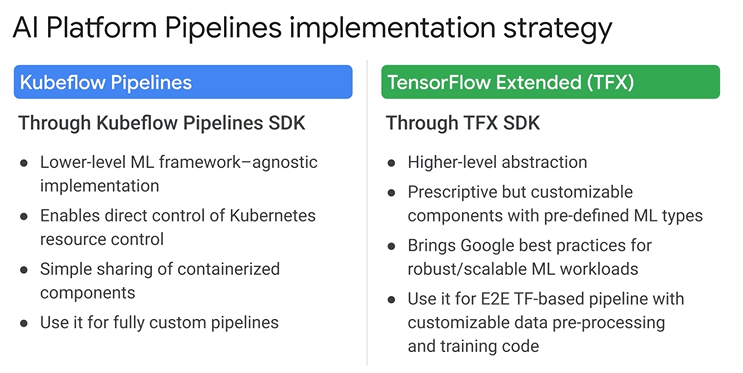

  * the kubeflow pipeline's sdk is a lower level sdk that's ml framework neutral and enables direct kubernetes resource control and simple sharing of containerized components as shown in the pipeline steps 

  * the tfx sdk is currently in preview mode and is designed for ml workloads. 

    * It provides a higher level abstraction with prescriptive but customizable components with predefined machine learning types that represent google best practices for durable and scalable machine learning pipelines 
    * it also comes with a collection of customizable tensorflow optimized templates developed and used internally at google consisting of component archetypes for production machine learning 
    * you can configure the pipeline templates to build train and deploy your model with your own data,
    * automatically perform schema inference data validation model evaluation and model analysis and automatically deploy your trained model to the ai platform prediction service 

* Features of AI Pipelines:

  * Feature 1- TFX Examples:
    * to make it easier for developers to get started with machine learning pipeline code the tfx sdk provides templates or scaffolds with step-by-step guidance on building a production machine learning pipeline for your own data 
    * with a tfx template you can incrementally add different components to the pipeline and iterate on them 
    * tfx templates can be accessed by the ai platform pipelines getting started page in the google cloud console
    * the tfx sdk currently provides a template for classification problem types and is optimized for tensorflow with more templates being designed for different use cases and problem types
  * Feature 2- Pipeline Versioning:
    * ai platform pipelines also supports pipeline versioning it lets you upload multiple versions of the same pipeline and group them in the ui so you can manage semantically related workflows together
  * Feature 3 - Artifact tracking.
  * Feature 4 - Lineage Tracking.

* When to use AI Pipelines?

  Below are top 3 features AI Pipelines enable out of the box:

  * Workflow Orchestration : this feature provides you to actually visualize your pipeline and various components used in it as a lego train

    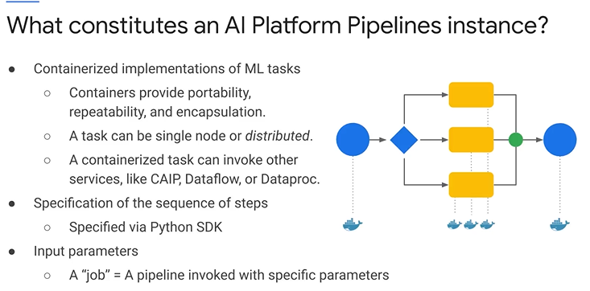

  * Rapid reliable and repeatable experimentation: this is a very important feature for any organization to run quick experiments and make decisions accordingly

    * keep track of metrics and outputs
    * you can clone pipelines

  * Ecosystem to share reuse and compose your work:

    * 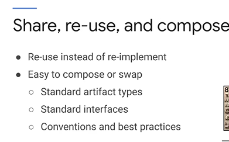

    * 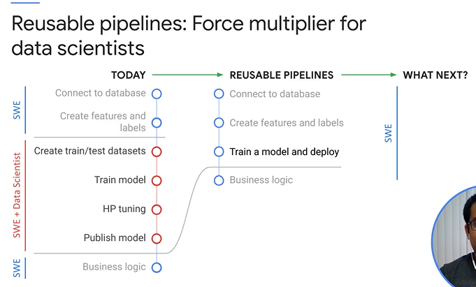

    * AI HUB:

      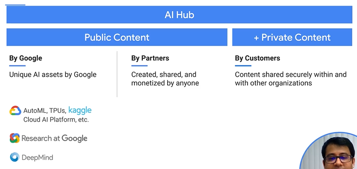

      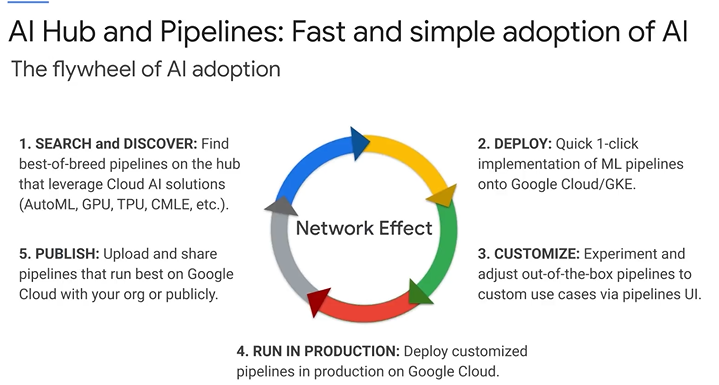

      

###  Running AI Platform Pipelines

##  System and concepts overview

###  Create a reproducible dataset

* Use of hashing
  * To ensure that the same training examples end up in the training bucket every time, we use hashing
  * Join all the column into a single dummy string column and compute the has for that column
  * Then divide it into training, validation and test datasets by using modulo function.

###  Implement a tunable model

###  Build and push a training container

###  Train and tune the model

###  Serve and query the model

###  Using custom containers with AI Platform Training

###  Lab Solution

##  Kubeflow Pipelines on AI Platform

* 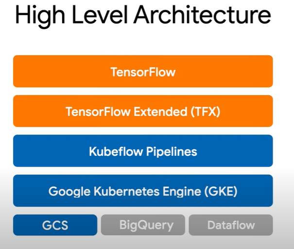
  * the smallest component in the above graph is the top most (tensorflow) which is engulfed in the bigger component (TFX) which in turns is controlled by Kubeflow pipelines and so on..
* Cloud setup for using kubeflow.
  * When you create kubeflow instance in Google cloud, you also get a notebook server instance along with it.
* In kubeflow we have two steps
  1. Define the ops (operations)
  2. Connect them via a graph

###  System and concept overview

* As long as a container follows a protocol as to how they accept inputs and how they produce output any containerized task can be converted into a workflow step.

## Steps for writing pipeline.

### Step 1  and Step 2

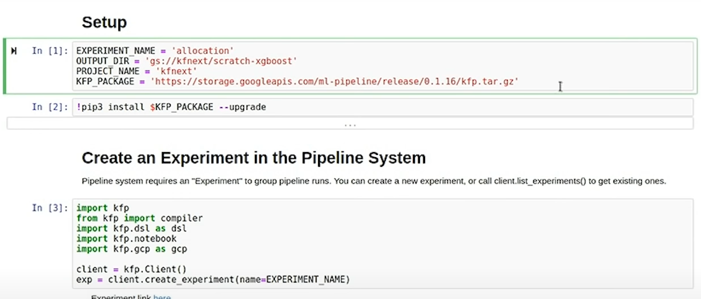

### Step 3  Define Ops

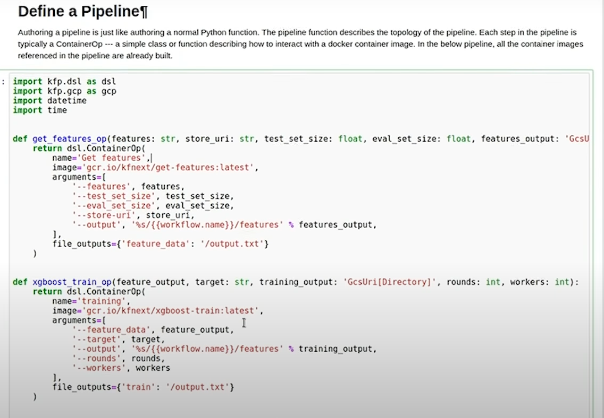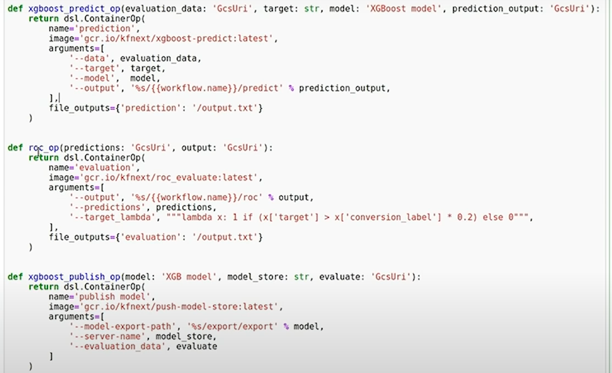

### Step 4 Define Pipeline

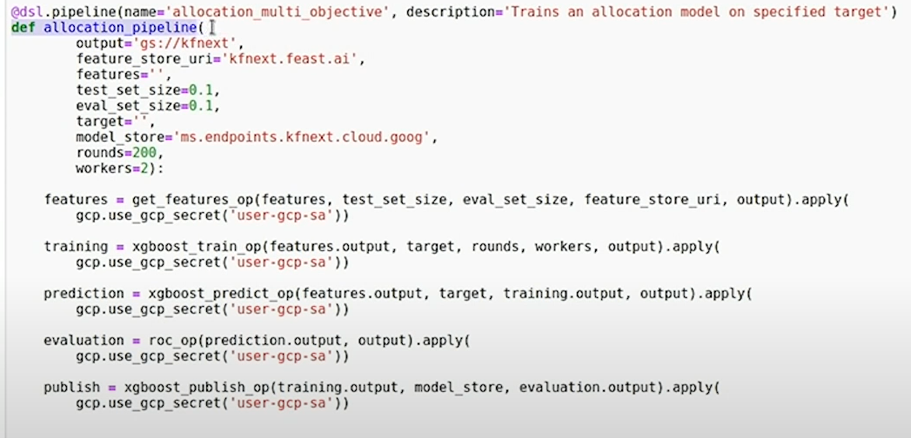

### Step 5 Compile Pipeline

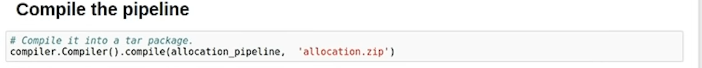

### Step 6 Submit Pipeline Run

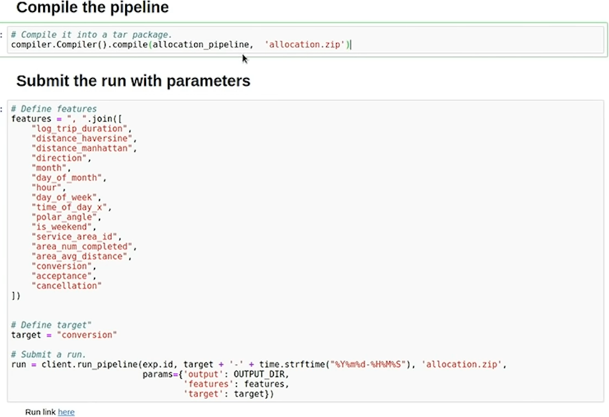

### Step 7 Change the pipeline parameters and run pipeline again.

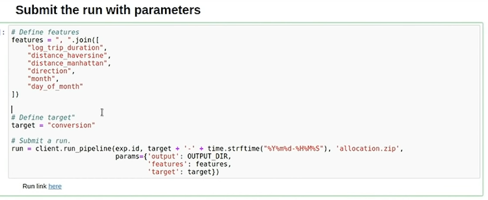

* The parameters defined in the below step, become available to us in the Cloud portal when we define a pipleline run in kubeflow dashboard.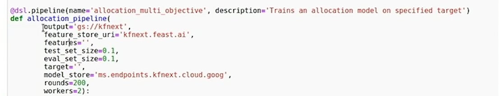

  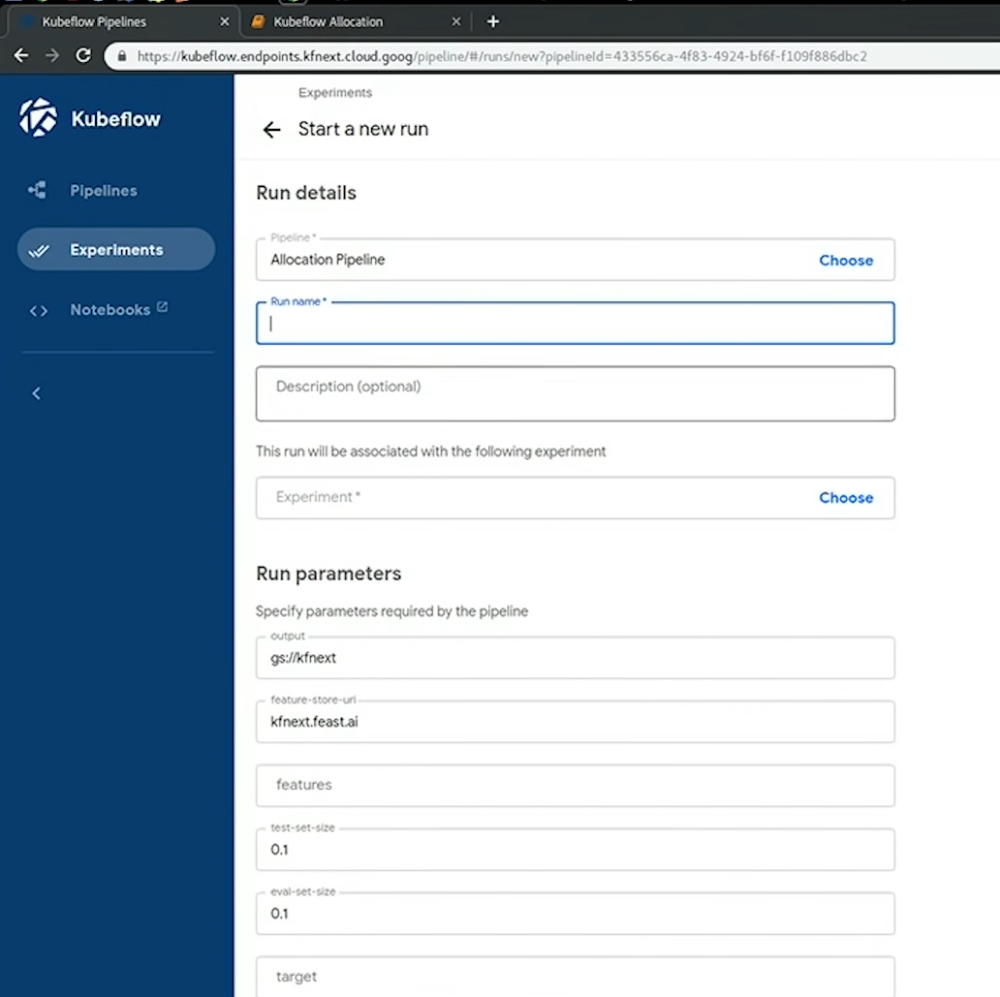

  

* Using the decorator as mentioned here, this will convert your custom code into a docker image... 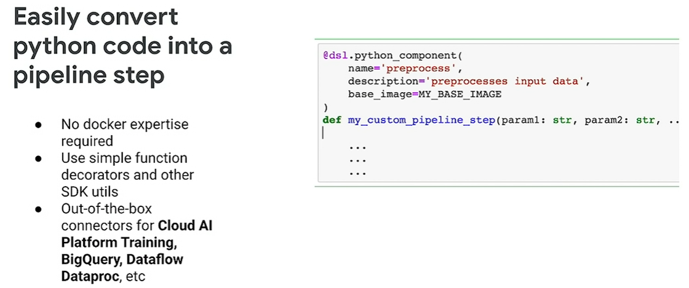

* The pipeline ops can be TFX components and using those we can create a Kubeflow pipeline with TFX components.

* 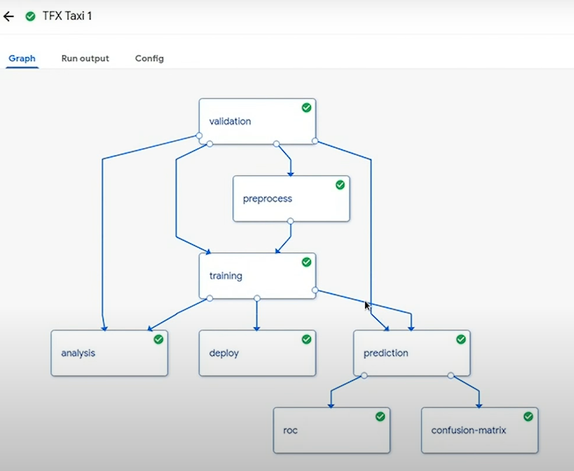

* For running TFX Components on the kubeflow pipeline use the following steps

  Cloud setup for using kubeflow.

  * When you create kubeflow instance in Google cloud, you also get a notebook server instance along with it.

  * 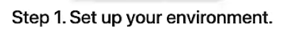

    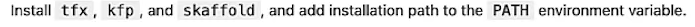

    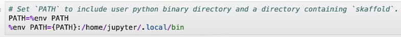

    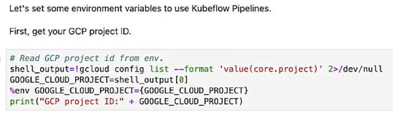

    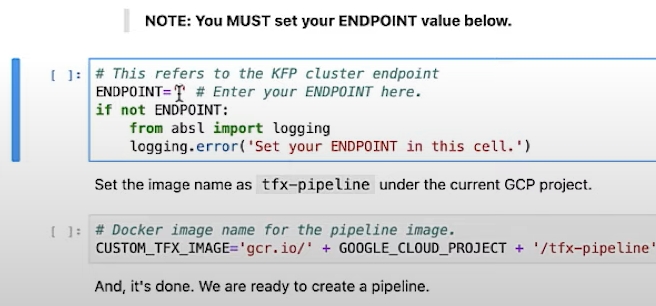

  * 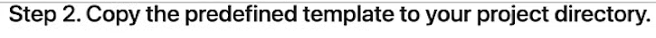

    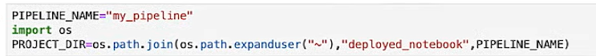

    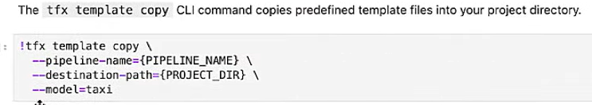

    * This steps create copies a template folder. 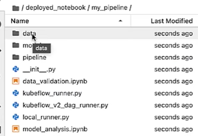

      

  * 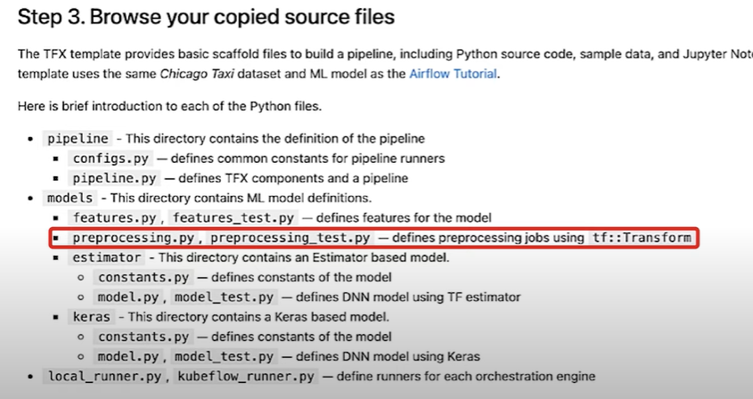

    * As seen above inside the pipeline folder we have a `pipeline.py` file. 

      * This file is where you define the TFX Pipeline

        * Step 1  Import libraries.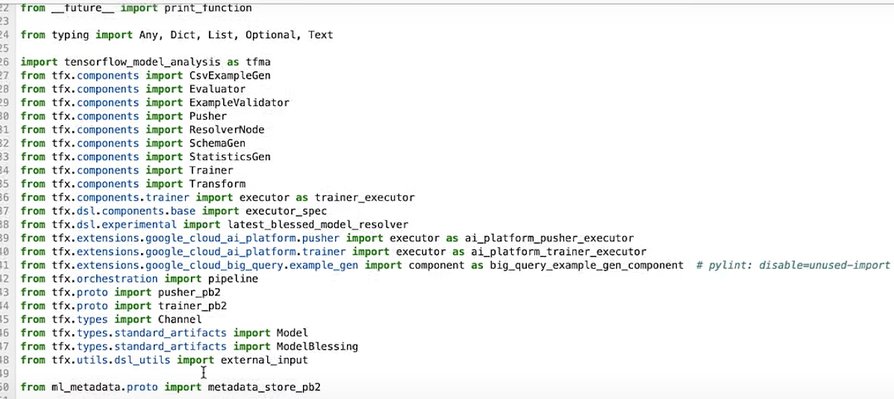

        * Step 2: Create TFX Pipeline

          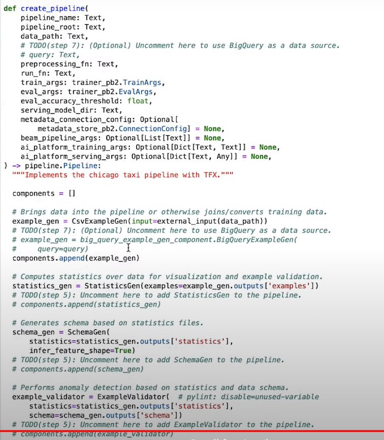

          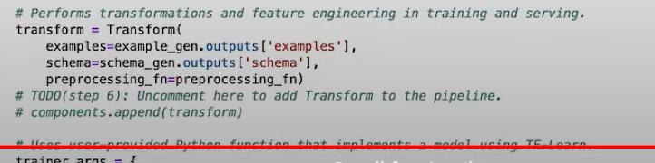

          

    * The `kubeflow_v2_dag_runner.py` file defines runners for each orchestration engine.

      * i.e. the `kubeflow_runner.py`  and
      * `local_runner.py`

  * 

    * First copy data from local system to cloud

      

    * 

    * After exection of above command additonal files are created in the ml-pipeline folder as below

      * Dockerfile
      * build.yaml
      * my_pipeline.tar.gz - This is the pipeline definition file which will be used by "**<u>Argo</u>**"

      

    * 

###  Describing a Kubeflow Pipeline with KF DSL

###  Lightweight Python Components

###  Custom components

###  Continuous Training Pipeline with Kubeflow Pipeline and Cloud AI Platform

###  Lab Solution

##  Concept Overview

* The goal is to run a cloud builder whenever a trigger is detected. This requires two things

  * The actual individual cloud builder which will build the containers.

  * A config file to tell which cloud builders to run 

  * Trigger the actual build using the following command

    

    

###  Cloud Build Builders


* Standard Builders are already packaged configuration actions that are really common such as building a docker container and pushing that docker container to a registry all these pre-packaged configuration actions are in the google cloud platform cloud builders repository.

  * 
  * Components of a standard Cloud Builders.
    * They boil down to two parts 
      * one a script that executes the configuration actions and 
      * two a docker container that wraps the script with all the dependencies that it needs to be executed
      * Example Docker File
      * Example Script File 

* Custom Builders:  custom cloud builders are special configuration actions that you have to package into docker containers yourself generally these are pushed to your own google cloud registry

  * 

  

###  Cloud Build Configuration

* remember that the goal is to run a cloud builder whenever a trigger is detected well this raises the question how does cloud build know which cloud builder to run well the answer lies in a cloud build configuration file we tell cloud build which builders to run in a cloudbuild.yaml.

* cloudbuild.yaml describes the cloud builder to be run and what arguments should be passed to the entry point command defined in the corresponding docker file 

* 

  * the name is the uri of the corresponding cloud builder container 

  * the args contains the arguments to be passed to the entry point.

  * Trigger Cloud Build using the command

    

  * A single cloud builder step as defined in the above config file

    

    * The `dir` variable is a persistent data storage which will allow the data to be shared by the next pipeline step.

      

  * In the above command to run the actual cloud build we have a $Substitution variable which allows us to substitue variable values before the cloud build is run

    * For example in the while runninng the cloud build command below we are substituting the 
      * $_PIPELNE_FOLDER = . (this is the current directory)
      * $_IMAGE_NAME with value = trainer_base

    

    * ​	Another way to passing dynamic values is to pass environment variables.

* Difference between custom and standard builder

  * Nothing except the uri will point to our own image in gcr

* After building the images we need to push them

  * Add the `Images` section to your config.yaml file.
  * 
  * note you don't actually need to specify where to push these containers because the location is already given by the name of the container image that you built 
  * if you forget this field your container will simply be built but not pushed so not available in production so it's very important to remember to push

###  Cloud Build Triggers

* Trigger 1: Manual

  * 

* Trigger 2: Automatically

  

  * Step 1: Link the Github Repo with the project.

    * Go to github and activate Cloud Build App
    * Allow access to the required repository.
    * On the GCP side, specify which repo you want to add to cloud build

  * Step 2: Setup trigger type

    

    * Specify location of the `config.yaml` file for cloud build.

      

  * Done!

    

  * Test

    * push new code to github using a specific tag

      

    * Monitor the cloud build steps

      * Here the first training code image is built and pushed.
      * Next, the base image of all the lightweight components are built and pushed.
      * Then a Kubeflow pipeline is compiled into a .yaml file
      * Finally the same kubeflow pipeline is uploaded to the cluster.

##  Course Summary

###  Course Summary

