|[Home](../README.md)|[Course Page]()|
|---------------------|--------------|

# ML Pipelines on Google Cloud

[TOC]

##  Introduction

* [Architecture for MLOps using TFX, Kubeflow Pipelines, and Cloud Build  | Cloud Architecture Center  | Google Cloud](https://cloud.google.com/architecture/architecture-for-mlops-using-tfx-kubeflow-pipelines-and-cloud-build)
* [There's a difference between CI/CD and CT Training Pipelines](https://cloud.google.com/architecture/architecture-for-mlops-using-tfx-kubeflow-pipelines-and-cloud-build#cicd_pipeline_compared_to_ct_pipeline)
  * 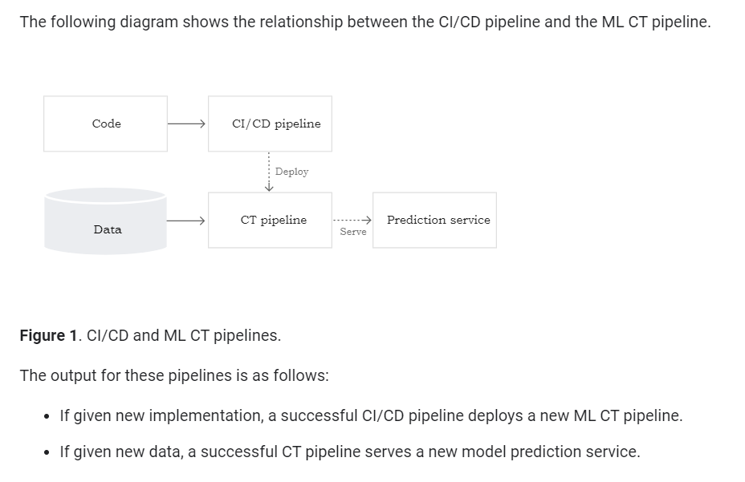
  * 

##  Introduction to TFX Pipelines

* 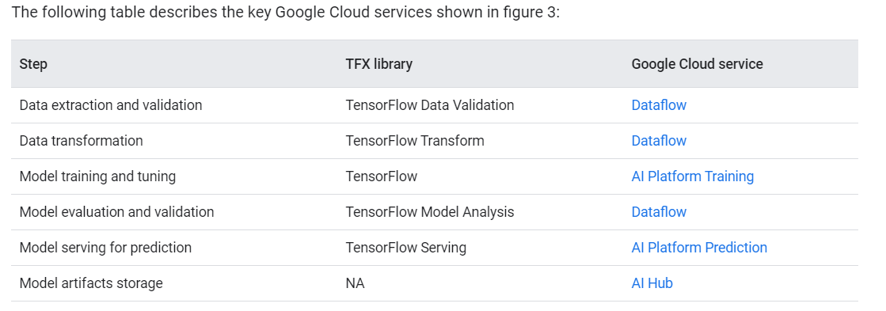
* 
* 

###  TFX concepts

* Example Notebook [DL E2E | Taxi dataset - TFX E2E.ipynb - Colaboratory (google.com)](https://colab.research.google.com/gist/rafiqhasan/2164304ede002f4a8bfe56e5434e1a34/dl-e2e-taxi-dataset-tfx-e2e.ipynb)

  

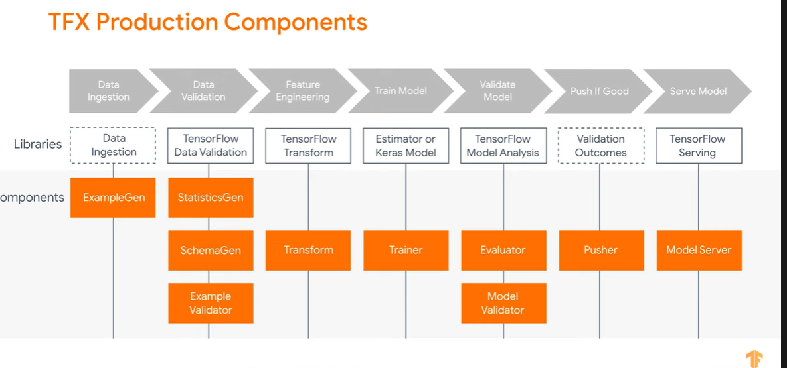

TFX components: 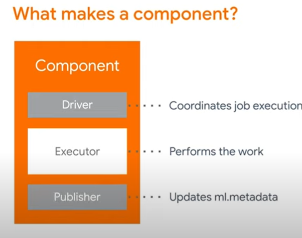

* Driver : Boilerplate code, you don't need to change it often. It handles job execution and feeding data to executor
* Publisher :  Boilerplate code, you don't need to change it often. Takes result of executor and updates metadata store.

How to work with components?

* 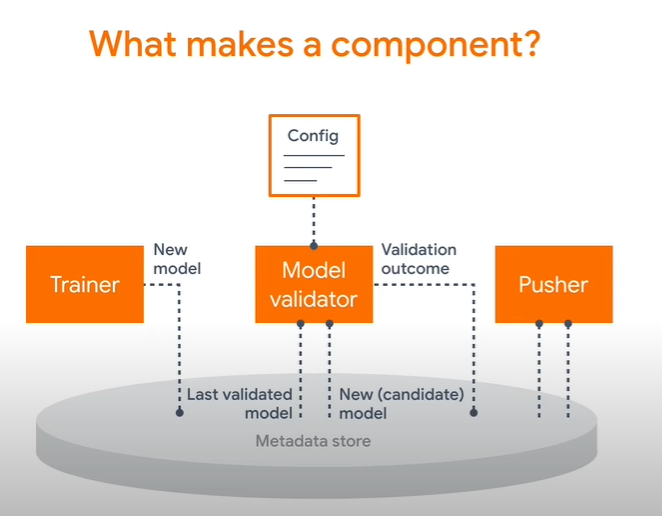
  1. We need a `config` for our component. This is done in python
  2. We need input to our component and place to store the results. ( For most component, input will come from metadata store and will be written back into the metadata store.)

Need for an orchestrator:

* An orchestrator provides a management interface 
* TFX Provides facility to 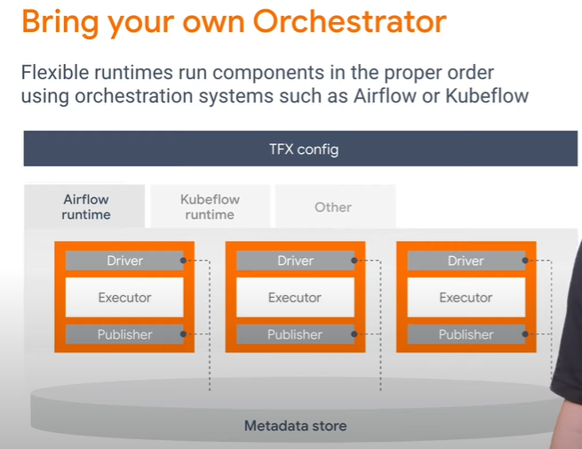 like Apache airflow and kubeflow.
* Example of DAG's on different orchestrator                                                                               

What do we store in metadata store?

* This is a relational database like SQL                                                                                                                                                                                                                                                                                                                                                                                                                                                                                                                                                                                                                                                                                                                     
* The data itself is stored outside the metadata store, we only save the pointer to the location of the data.
*  We refer to things we store in metadata as **<u>artifacts</u>**

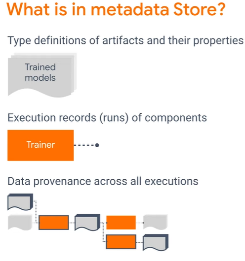

* Several TFX Components run on top of Apache Beam

  * 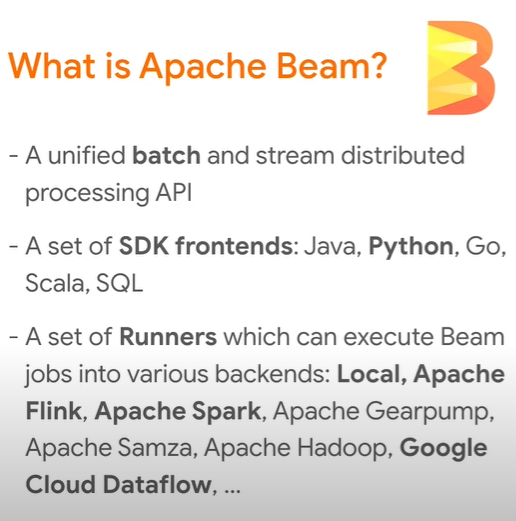
  * Apache Beam is a unified programming model that can run on nearly any execution engine. Beam allows you to use a distributed processing you already have. 
  * TFX interoperates with several other managed google cloud services like Cloud Dataflow, and Apache Beam
  * Several TFX components use Apache Beam to implement data parallel pipelines and it means you can distribute data processing workflows using cloud data flow
  * TFX also inter operates with Vertex AI for traning and prediction 

  

* TFX Components

  * We also have a reference architecture for tfx pipeline

  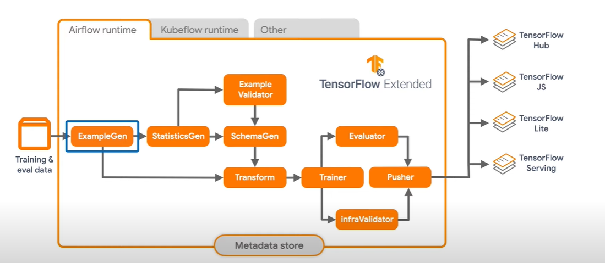

  * Ingest and split the data using 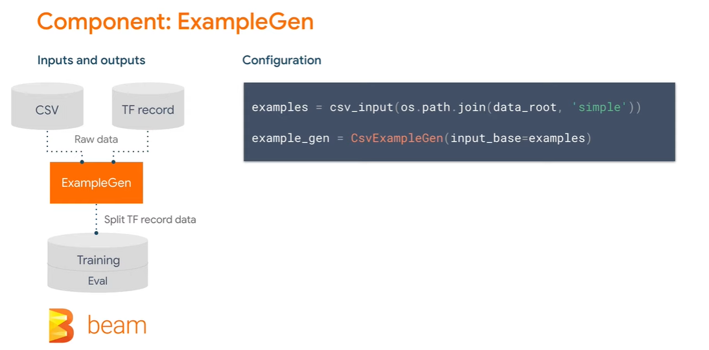

    * Instead of passing the csv file from local machine, there is also a different component called the "BigQureyGen"

      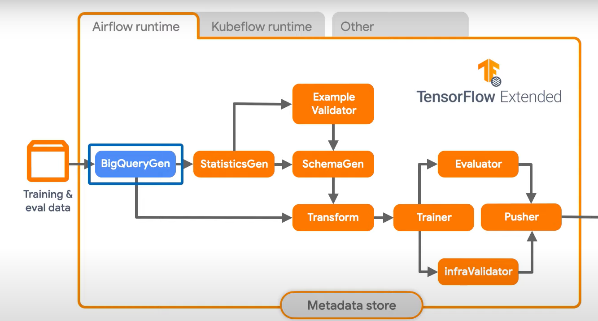

  * Calculate statistics of dataset using

  * Examine statistics and create data schema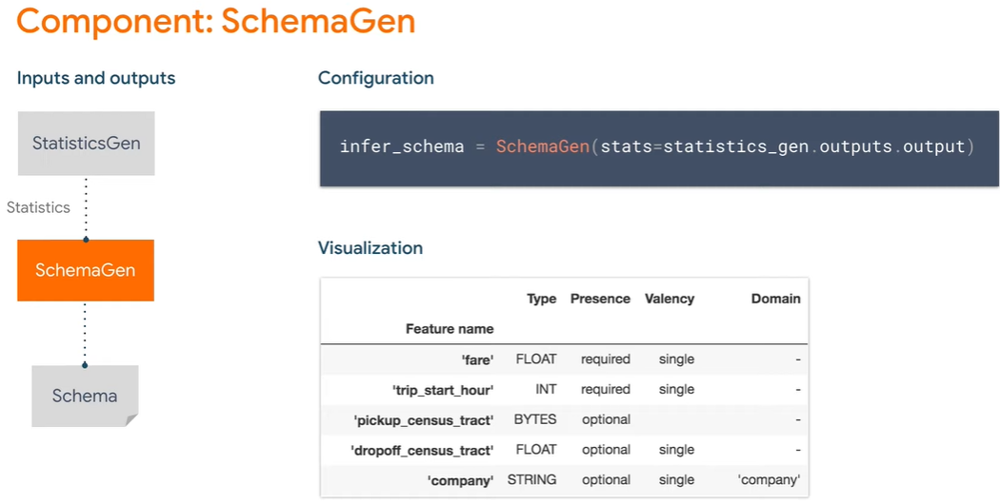

  * Look for anomalies and missing value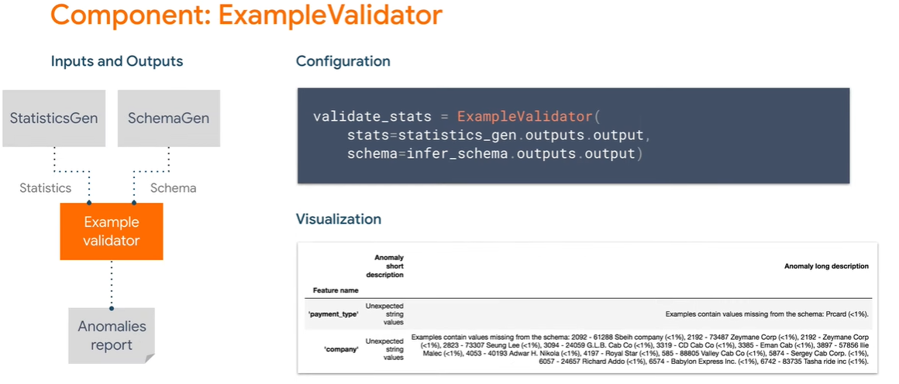

  * To Increase predictive quality of data, feature engineering and reduce dimensionality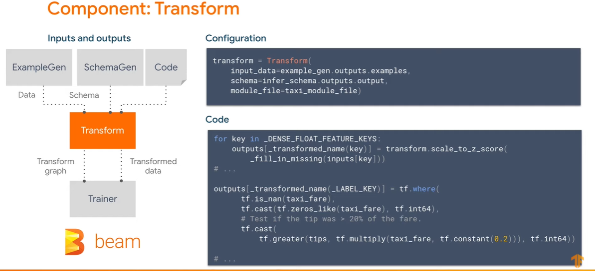

    * For constant values (like mean, stddev) Transform will  output tf.constants()
    * For changing values, transform will output "ops"
    * Same transformations are applied during training and serving which eliminates training/serving skew.
    * Transform eliminates the traning serving skew by running the exact same code

  * To train model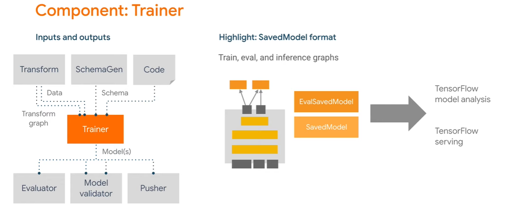

    * Training takes in the transform graph and data from "TransformGen"   and schema from "SchemaGen" and trains

    * It will output two models

      * Normal saved model: to be deployed in production
      * Eval saved model: used to analyze the performance of model.

    * You can use Tensorboard to keep track of model while training.

    * From the reference architecture you can use Vertex AI component to carry out Training jobs and also for deployment

      * 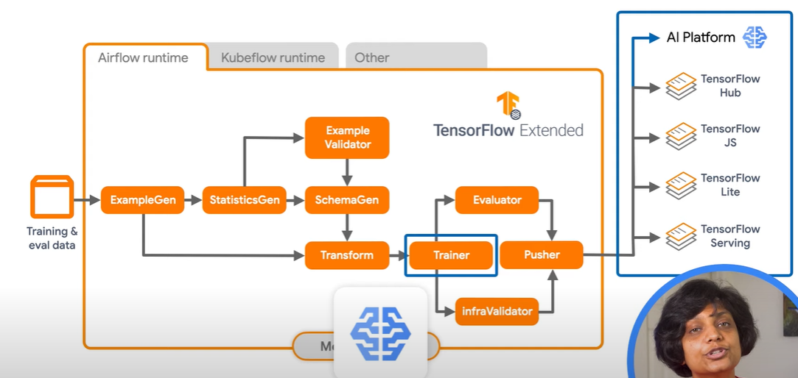

        

  * Perform deep analysis of training results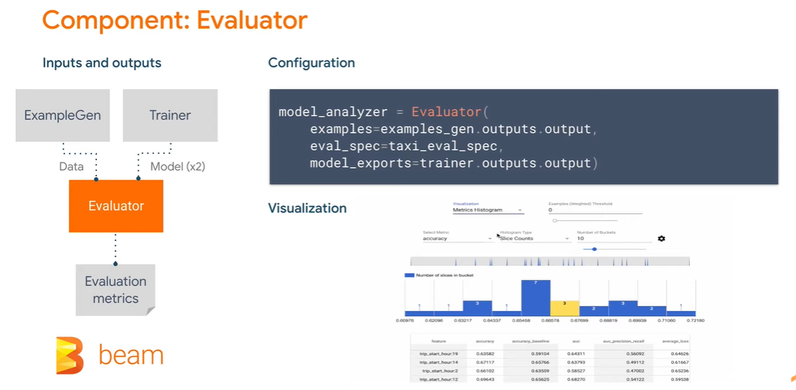

    * It looks at individual slices of the data for evaluation not just entire dataset.

  * 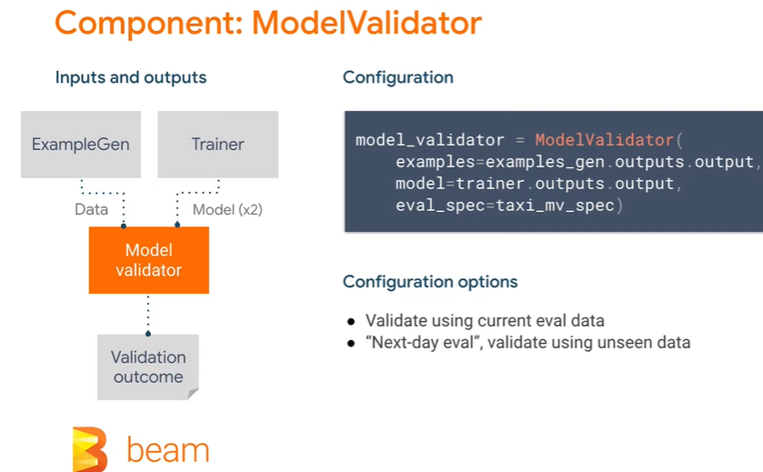

    * Deploy model to serving infra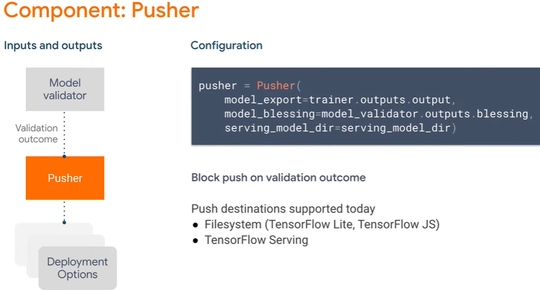

      

###  TFX standard data components

###  TFX standard model components

###  TFX pipeline nodes

###  TFX libraries

###  TFX Standard Components Walkthrough

##  Pipeline orchestration with TFX

###  TFX Orchestrators

###  Apache Beam

###  TFX on Cloud AI Platform

###  TFX on Cloud AI Platform Pipelines

##  

##  ML Metadata with TFX

###  TFX Pipeline Metadata

###  TFX ML Metadata data model

###  TFX Metadata

##  Containerized Training Applications

###  Continuous Training

##  Continuous Training with Cloud Composer

* The underlying open-source technology of Cloud Composer is Apache Airflow. 

* Apache Airflow is a popular open-source tool developed and open-sourced by Airbnb to offer, schedule, and monitor your workflows. 

  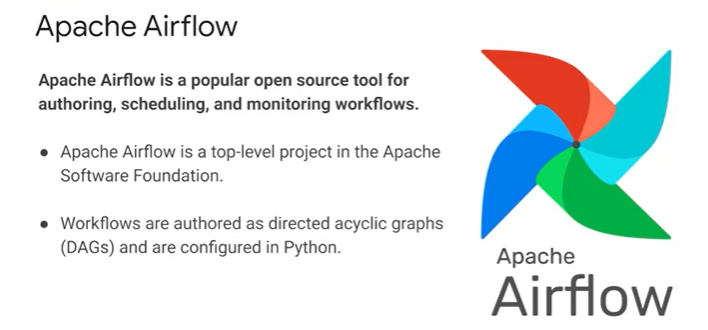

* Look at the list of limitations at the bottom, that's where cloud composer helps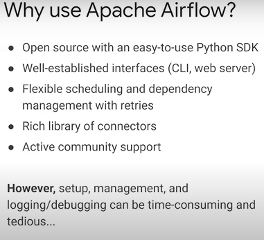

* Cloud Composer is a fully managed implementation of Apache Airflow on Google Cloud. 

  * It will handle the provisioning of a Google Kubernetes Engine Cluster with Airflow installed and a Cloud SQL database on a tenent project for use as the Airflow database. 
  * Logging and monitoring agents are preinstalled in your cluster so you can use cloud operations to monitor and debug your Cloud Composer environment. 

  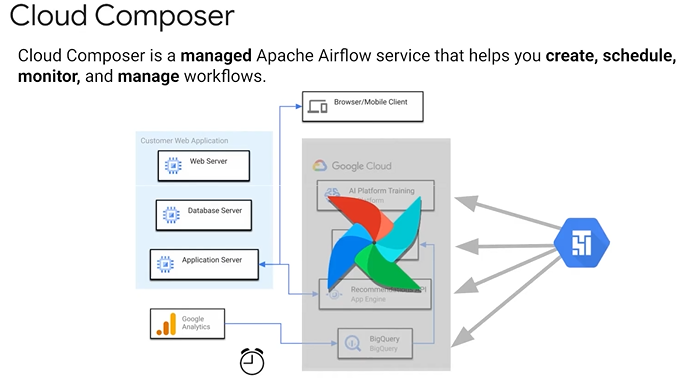

* 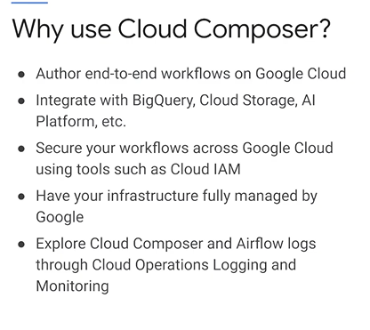

  * In short, you can focus on using Airflow for orchestrating your workflows and not worry about where or how your DAGs will run and interact with tools on Google Cloud.

* 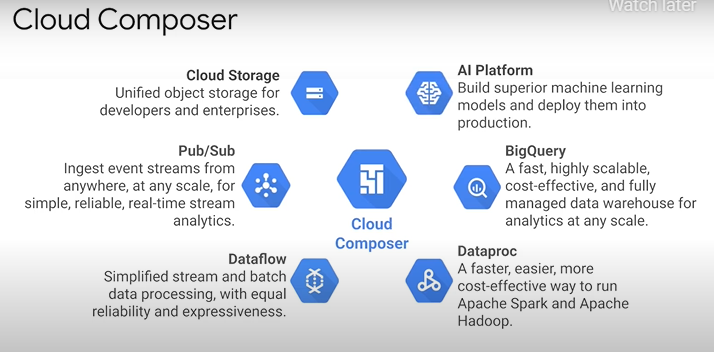

  * YOu can leave google cloud and still use it on different cloud platforms

  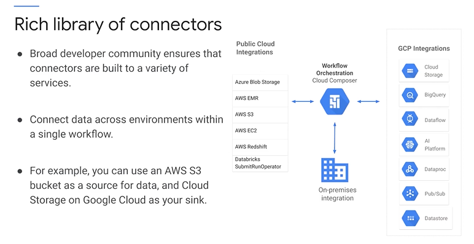

###  Core Concepts of Apache Airflow

* Airflow DAG is defined in a Python script.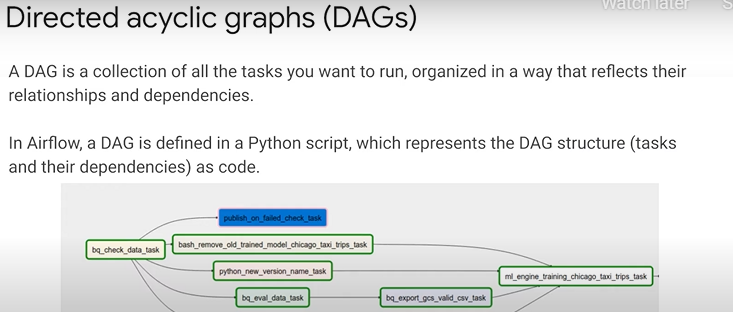

* The scripts have five main sections:

  * **<u>Imports</u>**
    * 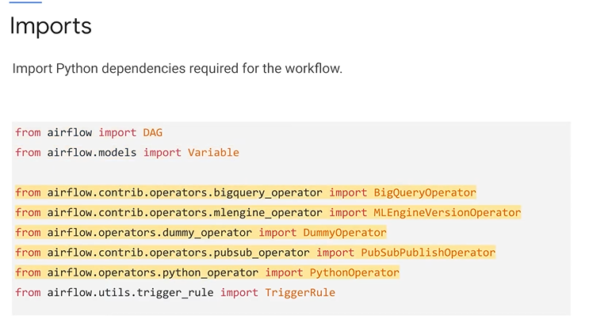
  * **<u>Arguments:</u>**
    * 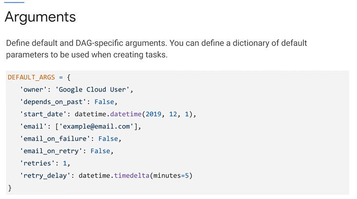
      *  **<u>depends_on_past</u>**, when set to true, keeps a task from being triggered if the previous schedule for the task did not succeed
  *  **<u>Instantiation of the DAG</u>**
    * 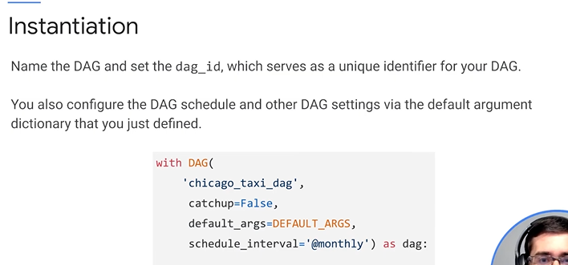
      * **<u>catchup</u>**: Remember, we had a start date as one of our default arguments. If the start date was a year ago, what happens to the runs we missed? If catchup is false, we simply forget them. If catchup is true, however, we will backfill the runs with the appropriate execution time for each run.
  *  **<u>Task definitions</u>**
    * 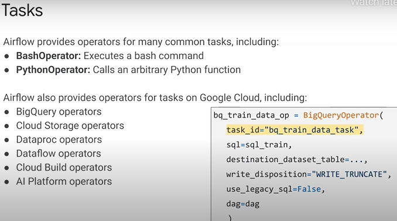
      * This task ID will be the name of the task within the DAG and will be used for reference and in the visual representation of the DAG in the Airflow web server.
  * **<u>Dependencies.</u>**
    * 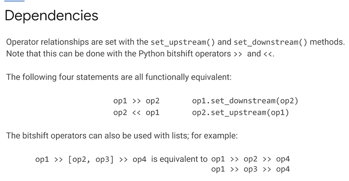

* 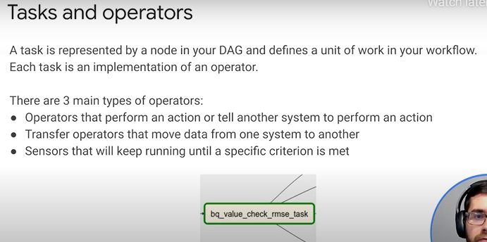

* What are these tasks?

  * They are parameterized implementations of operators that we will discuss in the next section.

  * [01:54](javascript:;)Operators are usually, but not always, atomic. This means that they can work alone and they don't need to share resources with any other operators.

  * The DAG will make sure that operators run in the correct order. Other than those dependencies, operators do generally run independently. In Airflow you can leverage x comms if you do need to pass information between different operators.

* Airflow supports three main types of operators:

  * operators that perform an action or tell another system to perform an action.
  * There are transfer operators that move data from one system to another, for example, BigQuery to Cloud storage.

  * And then, finally, sensors that will keep running until a specific criterion is met, such as a file sensor that waits until a file is present at a certain location before triggering any downstream task.

* With the right terminology explained, we're ready to build our DAGs.

  * As a reminder, an Airflow DAG is defined in a Python script.
  * The scripts have five main sections:
    *  imports, 
    * arguments,
    *  instantiation of the DAG,
    *  task definitions, and 
    * dependencies.

* How do we create a Cloud Composer environment?

  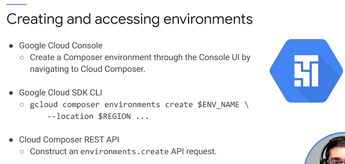

* how do we get our files onto the Airflow web server?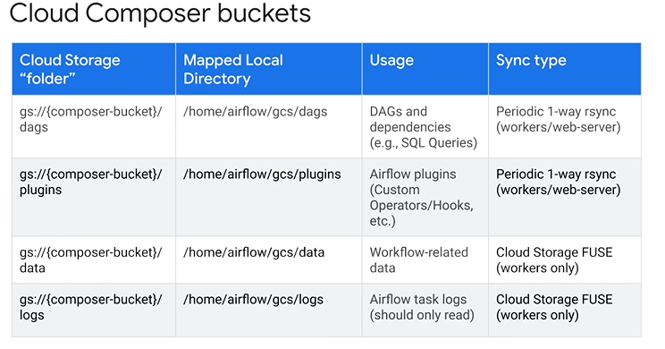

  * all you need to do is be sure that your files make it to the right location in cloud storage, and the rest will be managed for you.

* 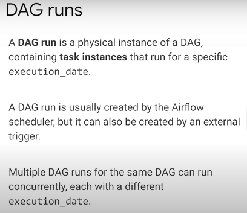

* 

###  Continuous Training Pipelines with Cloud Composer

##  ML Pipelines with MLflow

###  Introduction

###  Overview of ML development challenges

###  How MLflow tackles these challenges

###  MLflow tracking

###  MLflow projects

###  MLflow models

###  MLflow model registry

##  Summary

###  Course Summary