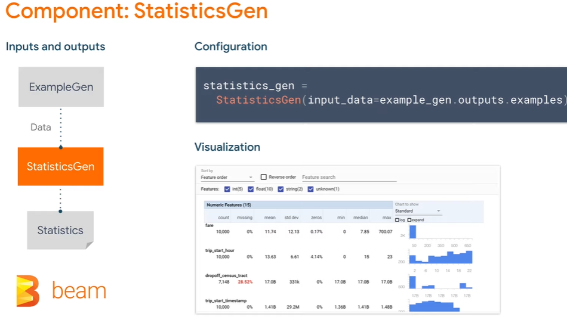
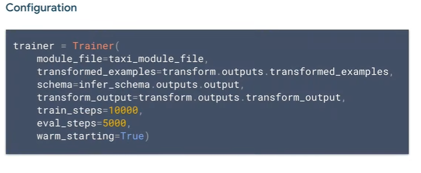

|[Home](../README.md)|[Course Page]()|
|---------------------|--------------|

# ML Pipelines on Google Cloud

[TOC]

##  Introduction

* [Architecture for MLOps using TFX, Kubeflow Pipelines, and Cloud Build  | Cloud Architecture Center  | Google Cloud](https://cloud.google.com/architecture/architecture-for-mlops-using-tfx-kubeflow-pipelines-and-cloud-build)
* [There's a difference between CI/CD and CT Training Pipelines](https://cloud.google.com/architecture/architecture-for-mlops-using-tfx-kubeflow-pipelines-and-cloud-build#cicd_pipeline_compared_to_ct_pipeline)
  * 
  * 

##  Introduction to TFX Pipelines

* 
* 
* 

###  TFX concepts

* Example Notebook [DL E2E | Taxi dataset - TFX E2E.ipynb - Colaboratory (google.com)](https://colab.research.google.com/gist/rafiqhasan/2164304ede002f4a8bfe56e5434e1a34/dl-e2e-taxi-dataset-tfx-e2e.ipynb)

  

TFX components: 

* Driver : Boilerplate code, you don't need to change it often. It handles job execution and feeding data to executor
* Publisher :  Boilerplate code, you don't need to change it often. Takes result of executor and updates metadata store.

How to work with components?

* 
  1. We need a `config` for our component. This is done in python
  2. We need input to our component and place to store the results. ( For most component, input will come from metadata store and will be written back into the metadata store.)

Need for an orchestrator:

* An orchestrator provides a management interface 
* TFX Provides facility to  like Apache airflow and kubeflow.
* Example of DAG's on different orchestrator                                                                               

What do we store in metadata store?

* This is a relational database like SQL                                                                                                                                                                                                                                                                                                                                                                                                                                                                                                                                                                                                                                                                                                                     
* The data itself is stored outside the metadata store, we only save the pointer to the location of the data.
*  We refer to things we store in metadata as **<u>artifacts</u>**

* Several TFX Components run on top of Apache Beam

  * 
  * Apache Beam is a unified programming model that can run on nearly any execution engine. Beam allows you to use a distributed processing you already have. 
  * TFX interoperates with several other managed google cloud services like Cloud Dataflow, and Apache Beam
  * Several TFX components use Apache Beam to implement data parallel pipelines and it means you can distribute data processing workflows using cloud data flow
  * TFX also inter operates with Vertex AI for traning and prediction 

  

* TFX Components

  * We also have a reference architecture for tfx pipeline

  

  * Ingest and split the data using 

    * Instead of passing the csv file from local machine, there is also a different component called the "BigQureyGen"

      

  * Calculate statistics of dataset using

  * Examine statistics and create data schema

  * Look for anomalies and missing value

  * To Increase predictive quality of data, feature engineering and reduce dimensionality

    * For constant values (like mean, stddev) Transform will  output tf.constants()
    * For changing values, transform will output "ops"
    * Same transformations are applied during training and serving which eliminates training/serving skew.
    * Transform eliminates the traning serving skew by running the exact same code

  * To train model

    * Training takes in the transform graph and data from "TransformGen"   and schema from "SchemaGen" and trains

    * It will output two models

      * Normal saved model: to be deployed in production
      * Eval saved model: used to analyze the performance of model.

    * You can use Tensorboard to keep track of model while training.

    * From the reference architecture you can use Vertex AI component to carry out Training jobs and also for deployment

      * 

        

  * Perform deep analysis of training results

    * It looks at individual slices of the data for evaluation not just entire dataset.

  * 

    * Deploy model to serving infra

      

###  TFX standard data components

###  TFX standard model components

###  TFX pipeline nodes

###  TFX libraries

###  TFX Standard Components Walkthrough

##  Pipeline orchestration with TFX

###  TFX Orchestrators

###  Apache Beam

###  TFX on Cloud AI Platform

###  TFX on Cloud AI Platform Pipelines

##  

##  ML Metadata with TFX

###  TFX Pipeline Metadata

###  TFX ML Metadata data model

###  TFX Metadata

##  Containerized Training Applications

###  Continuous Training

##  Continuous Training with Cloud Composer

###  Core Concepts of Apache Airflow

###  Continuous Training Pipelines with Cloud Composer

##  ML Pipelines with MLflow

###  Introduction

###  Overview of ML development challenges

###  How MLflow tackles these challenges

###  MLflow tracking

###  MLflow projects

###  MLflow models

###  MLflow model registry

##  Summary

###  Course Summary