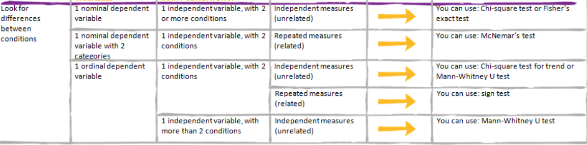

|[Home](../README.md)|[Course Page]()|
|---------------------|--------------|

## 3 Launching into Machine Learning

[TOC]

###  Introduction to Course

####  Intro to Course

* Step 1: Is there already a law/theory that explains the phenomenon without the use of statistical analysis.
* Step 2: Is statistical analysis enough 
* Step 3: Machine Learning
* Step 4: Deep Learning

###  Improve Data Quality and Exploratory Data Analysis

####  Introduction

####  Improving Data Quality

####  Exploratory Data Analysis
*  Classical Analysis: Problem => Data => Model => Analysis =>  Conclusions

*  EDA: Problem => Data => Analysis => Model => Conclusions

*  Baysian: Problem => Data => Model => Prior Distribution => Analysis => Conclusions

* Some Definitions:

  * **<u>Parametric Tests vs Non-Parametric Tests</u>**:  Parametric tests are those that make assumptions about the parameters of the population distribution from which the sample is drawn. This is often the assumption that the population data are normally distributed. Non-parametric tests are “distribution-free” and, as such, can be used for non-Normal variables.

  * **<u>Nominal, ordinal, Quantitative</u>**: **Nominal data** is classified without a natural order or rank, whereas **ordinal data** has a predetermined or natural order. On the other hand, **numerical or quantitative data** will always be a number that can be measured.

  * **<u>Univariate, bi-variate, multivariate:</u>** 

  * [Hypothesis Test Calculator: t-test, chi-square, analysis of variance (datatab.net)](https://datatab.net/statistics-calculator/hypothesis-test)

    * univariate: there is only one dependable variable

      * Frequency Distribution Tables
      * Bar Charts
      * Histograms
      * Pie Charts
      * Frequency Polygons

    * Bivariate: The analysis is related to cause and the relationship between the two variables. 

      * Numerical-Numerical

        * Scatter Plot

      * Categorical-Categorical

        * Chi-Squared: Given 
        * Basically in a chi squared test we're determining the null hypothesis to be valid or not, the chi squared value (i.e. X^2) ranges from 0 to infinity.
        * If the null hypothesis is true (i.e. the results are not correlated) then this value of X^2 is close to 0.
        * THe more the value of X^2 then null hypothesis is voided.
        * This threshold of value below which the null hypothesis is voided is determined by looking at the value of the distribution in the table.
       

          * Step 1: Calculate the below two tables
          
          Expected Table is calculated by summing up the row for eg first row sum is 13
          Then multiply it by summing the totals i.e. 43+49 = 92
          
          Expected for female for first row is then, 13*(43/92) = 6.08

          

          * Step 2: 

      * Numerical-Categorical

        * Z-test and t-test: A t-test is a type of inferential statistic used to determine if there is a significant difference between the means of two groups, which may be related in certain features.

        * ANOVA : **<u>Analysis of Variance checks if there are statistically significant differences between more than two groups</u>** (groups means different levels/values in a categorical features). It is the extension of the t-test for independent samples to more than two groups.

          * Example : To compare if there is a difference between salary of man and women, assumption is of independence of samples i.e. the person in one group dosen't have anything to do with other.

          * There are many types of ANOVA

          * Examples: 

            

          * The aim is to make a statement about the population from the sample with help of ANOVA

          * 

          * 

          * 

    * Multivariate Analysis: more than two variables have to be analyzed simultaneously.

      * Cluster Analysis
      * PCA
      * Correspondence Analysis

    

* Which statistical tests should you use?

  

  * Pearson correlation: Pearson correlation evaluates the linear relationship between two continuous variables.
  * Spearman correlation: Spearman correlation evaluates the monotonic relationship. The Spearman correlation coefficient is based on the ranked values for each variable rather than the raw data.

####  Exploratory Data Analysis Using Python and BigQuery

### Data Preparation

UnderSampling 

[Imbalanced Data  | Data Preparation and Feature Engineering for Machine Learning  | Google Developers](https://developers.google.com/machine-learning/data-prep/construct/sampling-splitting/imbalanced-data#downsampling-and-upweighting)

* To avoid data imbalance you have 2 options
  * Downsample Majority Class
  * Upweight (give more importance)  minority class. So while preparing data for training, more samples from this will be used.

###  Practical ML

####  Supervised Learning
There are two types of problem in supervised learning

* classification 
* regression:

####  Regression and Classification
* **<u>MEAN SQUARED ERROR</u>** : a hyperplane which is just the generalization of a line 

  * to get a continuous value for the label in regression problems we want to minimize the error between our predicted continuous value and the label's continuous value usually using mean squared error 

* **<u>DECISION BOUNDARY</u>** : in classification problems instead of trying to predict a continuous variable we are trying to create a decision boundary that separates the different classes

* **<u>CROSS ENTROPY</u>** : in classification problems we want to minimize the error or misclassification between our predicted class and the labels class this is done usually using cross entropy

* A raw continuous feature can be discretized into a categorical feature and the reverse process a categorical feature can be embedded into a continuous space

* Both of these problem types regression and classification can be thought of as prediction problems in contrast to unsupervised problems which are like description problems

* 

* In the below chart 

  * Yellow - Classification
  * Green - Linear Regression
  * In Classification the points towards the boundary carry more weights to decide where the decision boundary is while in regression the decision boundary is decided by reducing the mean error

  

  * plotted in yellow is the output of a one-dimensional linear classifier logistic regression notice that it is very close to the linear regression's green line but not exactly because **regression models usually use mean squared error as their loss function whereas classification models tend to use cross entropy**

  * so what is the difference between the two without going into too much of the details just yet there is a quadratic penalty for mean squared error so it is essentially trying to minimize the euclidean distance between the actual label and the predicted label on the other hand 

  * **with classifications cross entropy the penalty is almost linear when the predicted probability is close to the actual label but as it gets farther away it becomes exponential when it gets close to predicting the opposite class of the label** therefore if you look closely at the plot the most likely reason the classification decision boundary line has a slightly more negative slope is so that some of those noisy red points red being the noisy distribution fall on the other side of the decision boundary and lose their high error contribution since they are so close to the line their error contribution would be small

    for linear regression because not only is the error quadratic but there is no preference to be on one side of the line or the other for regression as long as the distance is as small as possible so as you can see this data set is a great fit for both linear regression and

    linear classification unlike when we looked at the tip data set where it was only acceptable for linear regression and would be better for a non-linear classification

####  Introduction to Linear Regression

* LR was used to predict sweet pea sizes?

* There are four assumptions associated with a linear regression model:

  1. **Linearity**: The relationship between X and the mean of Y is linear.
  2. **Homoscedasticity**: The variance of residual is the same for any value of X.
  3. **Independence**: Observations are independent of each other.
  4. **Normality**: For any fixed value of X, Y is normally distributed

* 

* Assumption: we are first assuming that **<u>the gram matrix x transpose x is non-singular</u>** meaning that all the columns of our feature matrix x are linearly independent

* Finding inverse of matrix also has a time complexity of O(n^3) using the naive algorithm but still doesn't get much better using fancier algos.

* **<u>Cholesky or QR Decomposition</u>** : the multiplication to create the gram matrix we might instead solve the normal equations using something called a cholesky or qr decomposition

* **<u>Since the above methods are computationally expensive we make use of gradient descent optimization algorithm which is one less expensive computationally in both time and memory</u>** 

* In Gradient Descent we want to traverse the loss hypersurface searching for the global minimum in other words we hope to find the lowest value regardless of where we start on the hypersurface this can be done by finding the gradient of the loss function and multiplying that with a hyperparameter learning rate and then subtracting that value from the current weights this process iterates until convergence choosing the optimal.

  

####  Introduction to Logistic Regression

####  Decision Trees 

* **<u>CART (Classification and Regression Tree) Algorithm</u>** : the algorithm tries to choose a feature and threshold pair that will produce the purest subsets when split. A common metric to use is the **<u>gini impurity</u>** but there is also **<u>entropy</u>** once it has found a good split it searches for another feature threshold pair and does so recursively
* **<u>Recursively creating these hyperplanes in a tree is analogous to layers of linear classifier nodes in a neural network</u>**
* To generalize the model there are some methods to regularize it such as setting the minimum number of samples per leaf node or you can also build the full tree and then prune unnecessary nodes to really get the most out of trees
* 

####  Random Forests

* Random Forrest is essentially performing bagging on decision tree. (see below for what means by bagging.)

* **<u>Ensemble Learning</u>** : A group of predictors is an ensemble which when combined in this way leads to ensemble learning the algorithm that performs this learning is an ensemble method

* 

* Decision Tree for 
  * Classification : if this is classification there could be a majority vote across all trees which would then be the final output class
  * Regression : if it is regression it could be an aggregate of the values such as the mean max median etc

* To Generalize the model we need to random sample records or features
  * **<u>Bagging</u>** (bootstrap aggregating) : random sampling examples/rows **<u>with replacement</u>**
  * **<u>Pasting</u>** : random sampling examples/rows **<u>without replacement</u>** 

* Method of validation your error:
  * **<u>K-fold</u>** : validation using random holdouts 
  * **<u>Random Subspaces</u>** : are made when we sample from the features and
  * **<u>Random Patches</u>** :  if we random sample examples too is called random patches

* **<u>Boosting</u>** : we aggregate a number of weak learners to create a strong learner typically this is done by training each learner sequentially which tries to correct any issues the learner before it has had.
  * AdaBoost (Adaptive Boosting) (Current explaination is for Binary classification context)
    * Create initial dataset: In this dataset, the likelyhood of all the records being picked is uniform. (Basically no change, its passed as is to the first classifer.)
    * Create a decision tree (just 1 depth) based on one of the feature which has the lowest ginni index/entropy
    * the incorrectly classified records from this model are given a higher weight and a new dataset is created which oversamples the incorrectly classified records and passes it to the next classifier (which again is a decision tree of depth 1 on the feature which give the highest entropy/ginni coefficient)
  * Gradient boosting: (current explanation is from Regression context)
    * Create a most simple regressor (something that give a mean for all values)
    * Calculate psudo-residual (error) by substracting the actual from the predicted. (E1)
    * Create a decision tree regressor who's task is to predict this residual (the tree predicts the error)
    * Make a prediction again by passing the original data to our model, which now has two components, the initial regressor which gives the average value and a decision tree classifier which predicts the error which the intial regressor will produce
    * Aggregate the predictions made by each and calculate the residual again
      * E2 = yTrue - (Value predicted by regressor + (error predicted by decision tree))
    * In the above step the error predicted by the above combination will be smaller than had it just been the intial regressor
    * Continue to add decision tree regressor which now predicts E2 and so on.
  * Use your validation set to use early stopping so that we don't start overfitting

* **<u>Stacking and Blending</u>** :  (where we can have meta learners learn what to do with the pictures of the ensemble which can in turn also be stacked into meta meta learners and so on)

  * Unlike bagging and boosting where learners have to be homogeneous, (all the sequential learners have to be the same), Stacking can have learners of different types.
  * How Blending works:
    * Step 1: Create initial training and validation data split (say 80:20)
    * Step 2 : On the 80% training data records again create a 80:20 validation split
    * Step 3: Train multiple models on this data. These models can be very different for example lets say we're training 5 models, then 1st model can be linear regression, 2nd Decision Tree, 3rd SVM etc.
    * Step 4: Use these base models to make predictions on the data set (remember this is the 80% of the 80% dataset that we're making predictions upon)
    * Step 5: we will now have created a new dataset who's features are the predictions made by the 5 models (so 5 columns) and the final target feature remains the same. Each column contains the prediction made by that base model for example column 1 will have all the predictions made by our linear regression model, column 2 will contain all predictions made by Decision Tree and so on.
    * Step 6: Use this training set to train a "meta-model".

* Stacking: We use K-Fold cross validation instead of keeping 80:20 split in the above step 2 on which our base models will be train.

  

  

#### Kernel Methods (SVM)

* Uses **<u>hinge loss function</u>** compared to cross-entropy which is used in logistic regression.
* svms perform better when there is a high number of dimensions and when the predictors nearly certainly predict the response
* support vector machines which are maximum margin classifiers 
* core to an svm is a non-linear activation and a sigmoid output for maximum margins

* svm classifiers aim to maximize the margin between the two support vectors using a **<u>hinge loss function</u>** compared to logistic regression's minimization of cross-entropy
* what happens if the data is not linearly separable into the two classes?
  * **<u>Kernel Transformation</u>** : apply a kernel transformation which maps the data from our input vector space to a vector space that now has features that can be linearly separated 
  *  kernel transformation is similar to how an activation function in neural networks maps the input to the function to transform space 
  * **<u>the number of neurons in the layer controls the dimension so if you have two inputs and you have three neurons you are mapping the input 2d space to a 3d space</u>**
  * Type of kernel:
    * basic linear kernel 
    * Polynomial kernel and 
    * Gaussian radial basis function kernel (Gaussian RBF Kernel) : Input space is mapped to infinite dimensions.
* When should an svm be used instead of logistic regression?
  * <u>**kernelized svms tend to provide sparser solutions and thus have better scalability**</u>
  * <u>**svms perform better when there is a high number of dimensions and when the predictors nearly certainly predict the response**</u>
  * 
  * 
* 

###  Optimization

####  Introduction Loss Functions

* RMSE - For regression

* Cross Entropy - For classification

   

####  Gradient descent

* 
* **<u>MINI BATCH GRADIENT DESCENT</u>** : to reduce the data points that is used to calculate the derivative of the loss function seems most feasible. (Step 1 data points). 
  * Typical Batch Size is between 10 to 1000
  * Sampling is done uniformly
  * Mini Batch Size = Batch Size (confusingly! but this what is referred in tf)
* **<u>BATCH GRADIENT DESCENT</u>** is different from Mini Batch Gradient Descent :batch gradient descent the batch there refers to batch processing so batch grading descent computes the gradient on the entire data
* **<u>STOCHASTIC GRADIENT DESCENT</u>**: One training sample (example) is passed through the neural network at a time and the parameters (weights) of each layer are updated with the computed gradient.

####  Troubleshooting Loss Curves

####  ML Model Pitfalls

Every backprop step consists of

* Step 1: Calculate derivative at that point of loss curve: The time taken to do it is proportional to 
  * Number of parameters (In practice this can be 10 to 100 Million)
  * Number of data points we're putting in our loss function (1K to 10's of B) (This can be a sample of those data points.)

* Take a step: Updating the parameter, happens just once in a loop and hence doesn't take much time.

* Check loss: (check loss step needed NOT be done at every pass)

  * number of data points in the set that we're using for measuring the loss. 
  * the complexity of our model
  * check loss step needed to NOT done at every pass and the reason for this is that most changes in the loss function are incremental so what can we change to improve training time 

* To decrease the training time, from there are 4 options available to us as show in the image below of which we choose:

  

  * **<u>MINI BATCH GRADIENT DESCENT</u>** : to reduce the data points that is used to calculate the derivative of the loss function seems most feasible. (Step 1 data points). 

    * Typical Batch Size is between 10 to 1000
    * Sampling is done uniformly
    * Mini Batch Size = Batch Size (confusingly! but this what is referred in tf)

  * **<u>BATCH GRADIENT DESCENT</u>** is different from Mini Batch Gradient Descent :batch gradient descent the batch there refers to batch processing so batch grading descent computes the gradient on the entire data

  * **<u>STOCHASTIC GRADIENT DESCENT</u>**: One training sample (example) is passed through the neural network at a time and the parameters (weights) of each layer are updated with the computed gradient.

    

* Frequency at which Step 3 is done

  * Time Based - once every hour
  * Step Based - like once every 1000 steps

  

####  LectureLoss Curve Troubleshooting 

####  Performance metrics

* [Evaluate AutoML models  | Vertex AI  | Google Cloud](https://cloud.google.com/vertex-ai/docs/training/evaluating-automl-models#forecasting)

* 

* Performance Matrices are much more connected to business goals than loss functions which are used to train gradient descent.

* Performance Metrics help us to reject models that have settled into inappropriate minima.

* There will always be a gap between the metrics we care about and the metrics that work well with gradient descent.

* the issue boils down to differentiability gradient descent makes incremental changes to our weights this in turn requires that we can differentiate the weights with respect to the loss piecewise functions however have gaps in their ranges and while tensorflow can differentiate them the resulting loss surface will have discontinuities that will make it much more challenging to traverse 

  

  

* Classification

  

  

  

* Summary of Optimization

###  Generalization and Sampling

*  **<u>If you have lots of data and can afford to hold out a test dataset</u>** : Perform Data Splits

  * While Training
    * training
    * validation

  * While Reporting and deciding to use in production
    * test

* **<u>Less data or cannot afford to hold out data</u>**
* Use cross validation methods

####  When to Stop Model Training

### History of ML: Neural Network

* **<u>Dimensionality Mapping for Neural Network</u>**

  * **<u>The number of neurons in the layer controls the dimension so if you have two inputs and you have three neurons you are mapping the input 2d space to a 3d space</u>**
  * **<u>it is the number of neurons per layer that determine how many dimensions of vector space you are in</u>** if i begin with three input features i am in the r3 vector space even if i have a hundred layers but with only three neurons each i will still be in r3 vector space.
  * **<u>the activation function changes the basis of the vector space but doesn't add or subtract dimensions, think of them as simply rotations and stretches and squeezes they may be non-linear but you remain in the same vector space as before</u>**
  * the loss function is your objective you are trying to minimize it is a scalar that uses its gradient to update the parameter weights of the model this only changes how much you rotate and stretch and squeeze not the number of dimensions

* Single Layer Perceptron

  

  * Different Activation Functions
  * Dropout layers began being used to help with generalization which works like ensemble methods
  * Convolutional layers were added that reduce the computational and memory load due to their non-complete connectedness as well as being able to focus on local aspects for instance images rather than comparing unrelated things in an image

####  Lecture Creating Repeatable Samples in BigQuery

####  Maintaining Consistency in Training with Repeatable Splitting

####  Explore and create ML datasets

####  Module Quiz

###  Summary

####  Course Summary

####  Course Quiz

###  Course Resources

####  Course Resources

####  All Course Readings
