|[Home](../README.md)|[Course Page]()|
|---------------------|--------------|

## Introduction to TensorFlow

[TOC]

### Introduction to Course

####  Revision

Wide and deep architecture.

### Introduction to TensorFlow

* TensorFlow represent numeric computations using a Directed Acyclic Graph (or DAG)
* The directed graph is a language independent representation of the code in your model you can build a dag in python store it in a saved model restore it in a c++
* as a developer you write your code in a high-level language like python and have it executed in different platforms by the tensorflow execution engine. The tensorflow execution engine is very efficient and targeted toward the exact hardware chip and its capabilities and it's written in c++

* 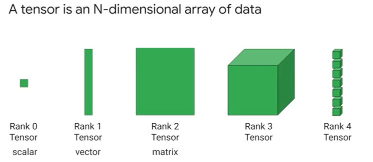
* In TensorFlow, tensors are multi-dimensional arrays with a uniform type (called adtype). All tensors are immutable like Python numbers and strings: you can never update the contents of a tensor, only create a new one.
* Hardware on which tf can run
  * CPU, GPU & TPU

####  TensorFlow API Hierarchy

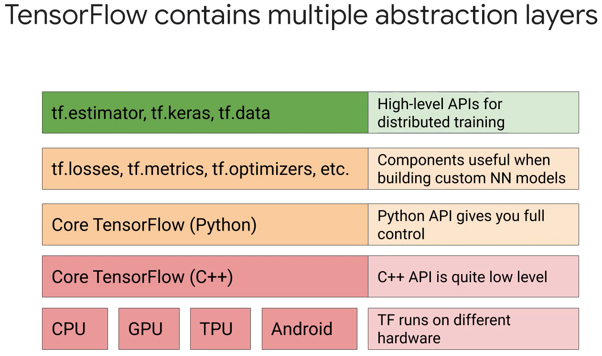

* APIs are used for distributed training
  * tf.estimator
  * tf.keras
  * tf.data
* tf.data.Dataset API is used to build performant, complex input pipelines from simple, re-usable pieces that will feed your model's training or evaluation loops.
* For custom Neural Network Models
  * tf.losses
  * tf.optimizers
  * tf.metrics
* The most preferred option when customizing the way to train the Neural network models is to use an estimator and we can use a high-level API such as Keras.

####  Introduction to Tensors and Variables

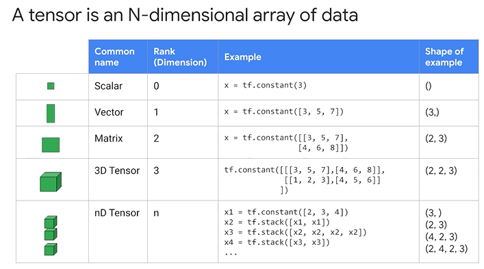

* To read the shape like (2,2,3) you have to say
  * There are 2 (2,3) matrices 
  * similarly for reading (2,4,2,3)
  * There are 2 (4,2,3) matrices
* 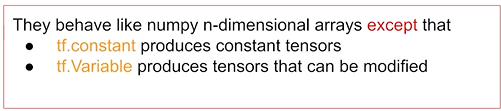
* model weights are tf.Variable type
* Example Operations
  * 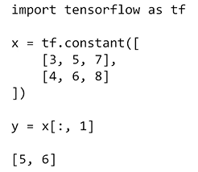
  * 
  * 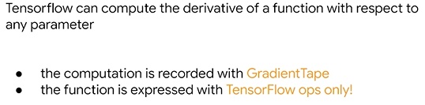
  * 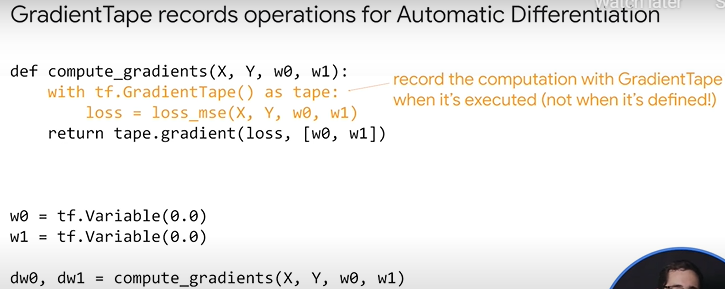
  * 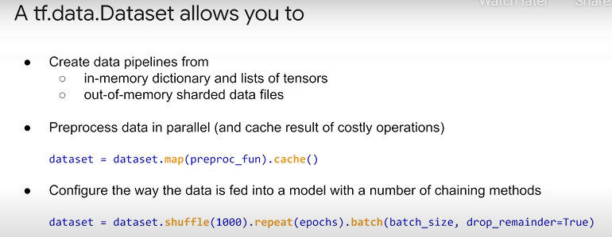
  * A data source constructs a Dataset from data stored in memory or in one or more files and 
  * a data transformation constructs a dataset from one or more tf.data.Dataset objects.
  * 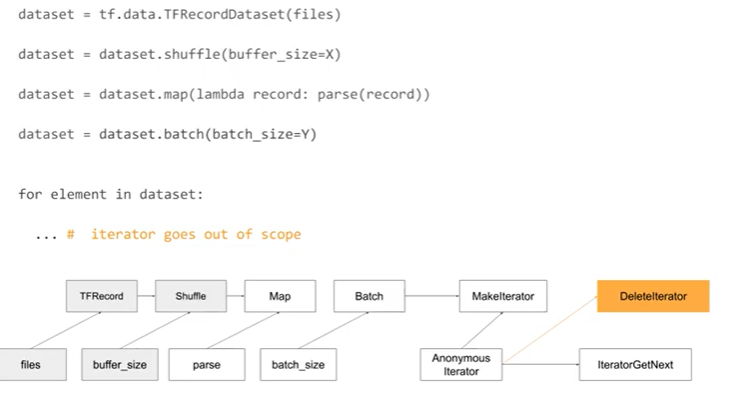
  * 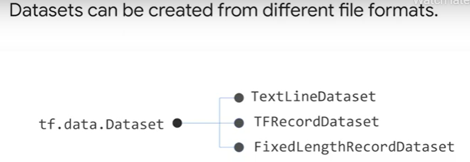
  * TFRecordDataset format is a simple format for storing a sequence of binary records. It is useful for standardizing input data and optimizing performance.
  * iter Method is invoked on the dataset - which triggers creation and execution of two operations
  * FixedLengthRecordDataset is a dataset object which has fixed-length records from one or more binary files
  * 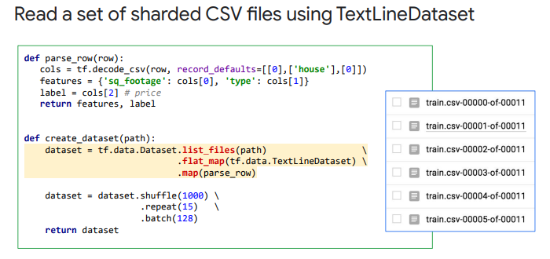
  * Important Methods
    * tf.decode_csv(row,record_defaults,features,label,)
    * tf.data.Dataset.list_files(path).flat_map(tf.data.TextLineDataset).map(parse_row)
      * .flat_map() is a **<u>one to many</u>** transformation since we're doing it for every file in the folder and to flatten all the read files into single object.
      * .map() is a **<u>one to one</u>** transformation since we're parsing a single line of text at a time
  * Dataset allows data to be prefetched.
  * 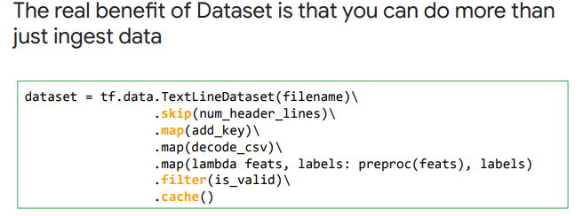

### Design and Build a TensorFlow Input Data Pipeline

####  Overview

####  Getting the data ready for model training

####  Introduction to Feature Columns

* Use `tf.feature_column.xxxxx` api to describe to the model the type of feature we're dealing with

  * .numeric_column('featureName')

  * .categorical_column_with_vocabulary_list('featureName',['house','apt'])

  * .categorical_column_with_vocabulary_file()

  * .categorical_column_with_identity() -> when categorical columns are in buckets from 0-1 

  * .categorical_column_with_hashbucket()

  * .bucketized_column() -> convert to discrete 

  * .embedding_column() -> use when one-hot encoding is not feasible

  * .crossed_column()

    

####  TensorFlow Dataset API

####  Feature Analysis Using TensorFlow Data Validation and Facets

* The TF data validation is used -> missing values, imbalances
* **<u>Facets</u>** is a visualization tool that describes data stats.

### Training neural networks with Tensorflow 2 and the Keras Sequential API

####  Activation functions

* Activation functions  can be used to add non-linearity to a model by adding a non-linear activation functions like sigmoid, tanh, relu
  * 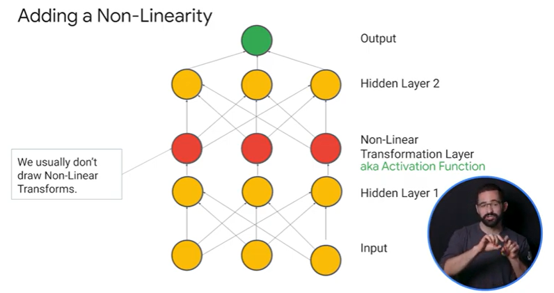 
  * Generally all the non linear layer of a neural network can usually be collapsed by into a single layer, which is why you don't have them in your network, except for in the final layer which can have linear tranformation for regression and sigmoid or softmax for classification
  * Relu has 10x speed on training than sigmoid.
  * Softplus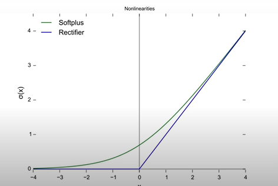
  * Leaky and parametric Relu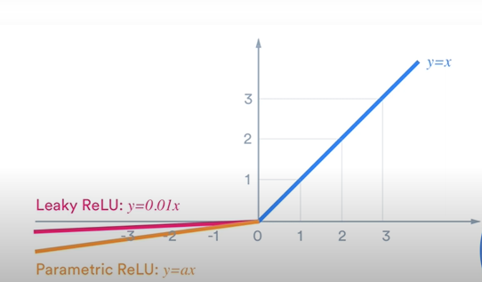
  * ELU 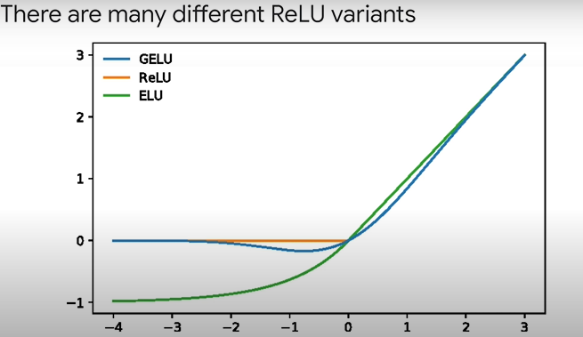

* Backpropagation

  * Ideally we should keep our gradients as close to 1 as possible as it speeds up training.

  * There are 3 common problems with gradient descent

    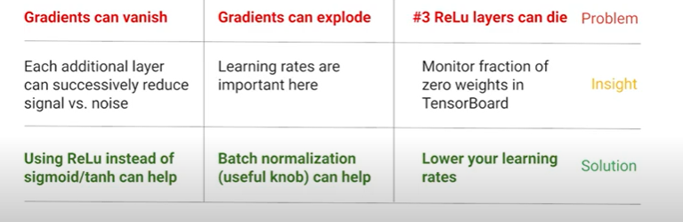

  * Vanishing Gradients

    * Each additional layer can decrease signal (not noise).
    * Eg: as we approach the 1, the derivative of sigmoid appx to 0
    * since the gradient value compounds, it eventually vanishes and this causes the weights to no longer update, grinding the training to halt.
    * Solution:
      * Use non linear activation functions like relu.

  * Exploding Gradients : Solution 

    * Weight Regularization
    * Smaller Batch Sizes
    * Gradient Clipping : Check to see if norm of gradient exceeds threshold after which we need to rescale the gradients.
    * Batch Normalization : **Solves the problem of internal covariate shift,** it speeds up training because gradients will then flow better. Using this enables us to use higher learning rate and also helps in getting rid of dropouts. How to do it?
      * Find the mini batch mean and sd.
      * Normalize input to that node.
  *  Batch Normalization Uses:
      *  Batch normalization ensures that the input distribution received by each layer during a forward pass has mean=0 and sd = 1
      *  Batch Normalization is performed at every layer of the neural net during the forward pass.
      *  If each layer is normalised, the weight changes made by the previous layer and noise between data is partially lost, as some non-linear relationships are lost during normalisation. This can lead to suboptimal weights being passed on.
      *  To fix this, batch normalisation adds two trainable parameters, gamma γ and beta β, which can scale and shift the normalised value.
      *  
      *  Stochastic gradient descent can tune γ and β during standard backpropagation to find the optimal distribution such that the noise between data and sparseness of the weight changes are accounted for. Essentially, these parameters scale and shift the normalised input distribution to suit the peculiarities of the given dataset.
      *  

      *  Internal Covariate Shift: After each epoch, every neuron gets a slightly different distribution of input.
      *  Vanishing and exploding gradients.
      *  [https://towardsdatascience.com/batch-normalisation-explained-5f4bd9de5feb](https://towardsdatascience.com/batch-normalisation-explained-5f4bd9de5feb)
      *  For small mini-batch size, use Batch-Renormalization instead of Batch-normalization. In this case it makes the estimates of the variable mean and standard deviation more stable across mini-batches. 
      *  [https://machinelearningmastery.com/batch-normalization-for-training-of-deep-neural-networks/](https://machinelearningmastery.com/batch-normalization-for-training-of-deep-neural-networks/)

  * Relu Layers can Die:

    * Use `tensorboard` to monitor summaries during and after training.
    * if you're using a pre-canned or pre-created deep neural network estimator there's automatically a scalar summary saved for each dnn hidden layer showing the fraction of zero values of the activations for that layer
    * the more added zero activations you have the bigger the problem you have
    * Solution:
      * Using leaky relu, and other non-zero activation functions.
      * Lower your learning rates

    

####  Neural Networks with Keras Sequential API

* The core data structure of Keras is a model, which let us organize and design layers. Sequential and Functional are two ways to build Keras models. 
  * Keras Sequential API : The Sequential model is the simplest type of model (a linear stock of layers). 
  * Keras Functional API : If we need to build arbitrary graphs of layers, the Keras Functional API can do that for us.

* Sequential models is appropriate for a plain stack of layers where each layer has exactly one input tensor and one output tensor.
* Sequential models are not really advisable if 
  * the model that you're building has multiple inputs or multiple outputs
  * any of the layers in the model have multiple inputs or multiple outputs 
  * the model needs to do layer sharing
  * the model has a non-linear topology such as a residual connection
  * if it multi branches

* Overall Steps for creating a DNN
  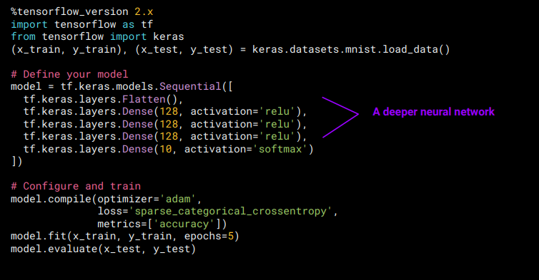

* An Epoch is a complete pass on the dataset during training.

  * Step 0 : Get Data

  * Step 1: Define Model

  * Step 2: Compile Model

    * Optimzer : optimizers shape and mold your model into its most accurate possible form by playing around with those weights. Examples of optimzers
      * **<u>SGD</u>** (stochastic gradient descent): 
      * **<u>adam</u>** :  invariability due to the diagonal rescaling of the gradients.
        *  is well suited for models that have large data sets or if you have a lot of parameters that you're adjusting
        * appropriate for problems with very noisy or sparse gradients and non-stationary objectives
      * **<u>momentum</u>** :  reduces the learning rate when the gradient values are smal
      * **<u>adagrad</u>** : It gives frequently occurring features low learning rates.
      * **<u>adadelta</u>**: improves adagrad by avoiding and reducing learning rates to 0
      * **<u>ftrl (follow the regularized leader):</u>** it works well on wide models 

  * Step 3: Fit model to data

  * What is the significance of the Fit method while training a Keras model ?

    * Defines the number of epochs

    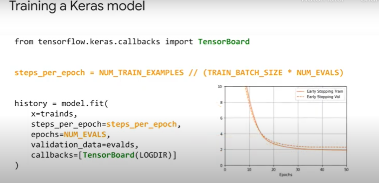

    * steps_per_epoch : No of batch iterations before a training epoc is considered finished
    * callbacks are utilities called at certain points during model training for activities such as logging and visualization using tools such as tensorboard 

  * Step 4: Evaluate on test Data

    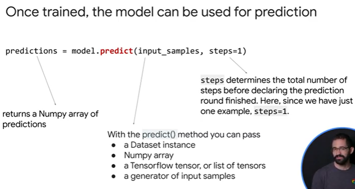

* For training Imbalance dataset
  * **<u>Class Weights</u>** : define and train a model using keras including setting class weights
  * **<u>Evaluation Metric:</u>** Use precision and recall etc.
  * **<u>Oversampling</u>**

### Training neural networks with Tensorflow 2 and Keras Functional API

* 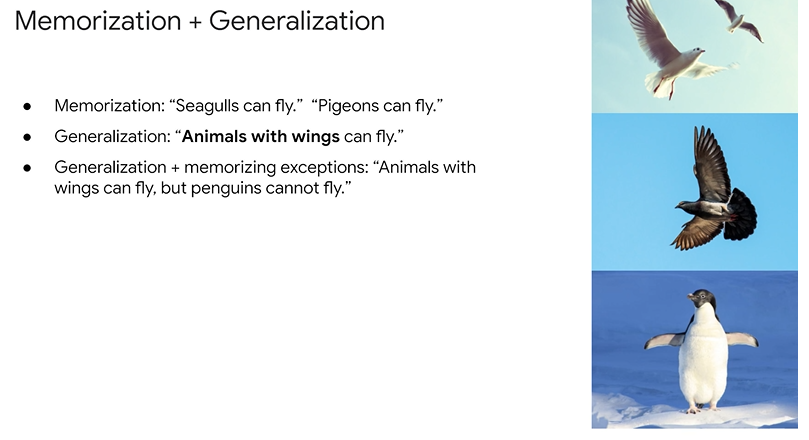
* Wide and Deep Models : A deep model might learn that animals with wings can fly, but it needs to memorize examples such as a penguine/orstrich. 
* Jointly training a wide linear model for memorization alongside a deep neural network for generalization.
* 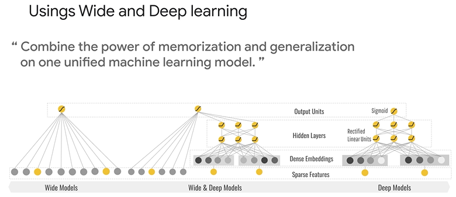
* A wide and deep model is useful for generic large-scale regression and classification problems with sparse inputs (sparse inputs are categorical features with a large number of possible feature values like high dimensionality such as 
  * recommender systems 
  * search and ranking
* **<u>Linear Models are good for sparse, independent features</u>**
* <u>**DNN's are good for dense, highly correlated features**</u>

####  Neural Networks with Keras Functional API

* With that functional api models are defined by creating instances of layers and then connecting them directly to each other's in pairs then defining a model that specifies the layers to act as the input and the output to the model
  * Unlike the Keras Sequential API, we have to provide the shape of the input to the model.
  * The input layer needs to have shape(p,)where p is the number of columns in your training matrix. For example:inputs = Input(shape=(3,))
* Benefits of Functional API over Sequential API it can handle :
  * models with non-linear topology 
  * models with shared layers and 
  * models with multiple inputs or outputs
* 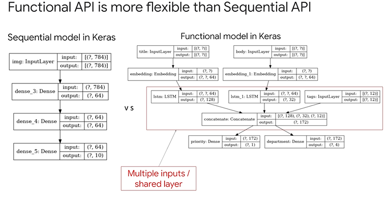

* In the functional api models are created by specifying their inputs and outputs in a graph of layers that means a single graph of layers can be used to generate multiple models 
* **<u>you can treat any model as if it were a layer by calling it on an input or an output of another layer</u>**
* by calling a model you're not just reusing the architecture of the model you're also reusing its weights
* 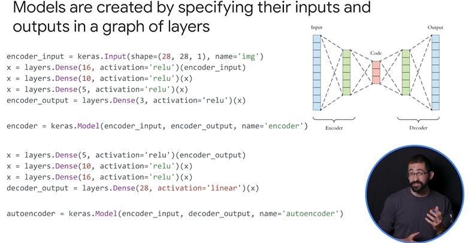
* **<u>Shared Layers</u>**
  * Another really good use for the functional api are models that share layers. shared layers are layer instances that get reused multiple times in the same model. they learn features that correspond to multiple paths in the graph of layers
  * shared layers are often used to encode inputs that come from say similar places like two different pieces of text that feature relatively the same vocabulary
  * since they enable the sharing of the information across these different inputs and they make it possible to train a model on much less data
  * if a given word is seen in one of those inputs that will benefit the processing of all inputs that go in through that shared layer
  * to share a layer in the functional api just call the same layer instance multiple times.

**<u>CREATE A WIDE AND DEEP MODEL</u>**

* In the below code 

* `import tf.feature_column as fc`

* 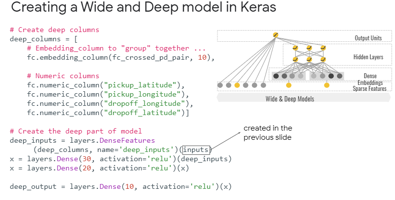

* 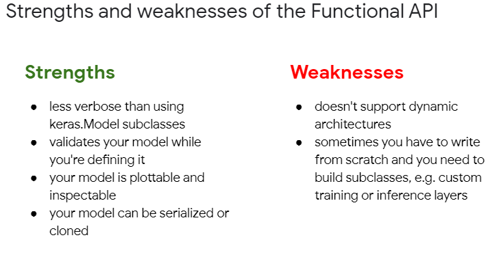

  

* What are the weaknesses of the Keras Functional API?

  * It doesn't support dynamic architectures. The Functional API treats models as DAGs of layers. This is true for most deep learning architectures, but not all: for instance, recursive networks or Tree RNNs do not follow this assumption and cannot be implemented in the Functional API.
  * Sometimes we have to write from scratch and need to build subclasses. When writing advanced achitectures, you may want to do things that are outside the scope of “defining a DAG of layers”: for instance, you may want to expose multiple custom training and inference methods on your model instance. This requires subclassing.

#### Regularization

When Model Complexity becomes the cause of a model to overfit we use regularization. 

* **<u>Regularization refers to any technique that helps generalize a model a generalized model</u>**

* our basic heuristic guide is in favoring those simpler models which make less assumptions about your training data 

* 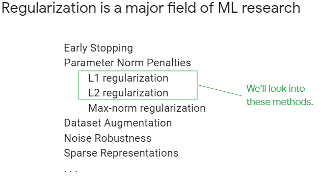

* L2 Regularization : l2 regularization adds a sum of the squared parameter weights term to the loss function 

  * this is great at keeping weight small having stability and a unique solution but it can leave the model unnecessarily large and complex since all of the features may still remain albeit with a small weight 

* L1 regularization on the other hand adds the sum of the absolute value of the parameter's weights to the loss function which tends to force the weights of not very predictive features useless features to zero 

  * this acts as a built-in feature selector by killing off those bad features and leaving only the strongest in the model the resulting sparse model has many benefits first with fewer coefficients to store and load there's a reduction in storage and memory needed.
  * decrease in training time
  * decrease in prediction time (which means faster predictions)

* **<u>Preventing Overfitting</u>**

  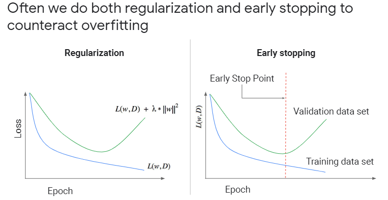

* To prevent overfitting we do both regularization and early stopping.

* during your hyperparameter turning you're searching for a point in the validation loss function where you obtain the lowest value 

* at that point any less regularization increases your variance, starts overfitting and hurts your generalization

* any more regularization increases your bias starts underfitting and hurts your generalization

* early stopping stops training when overfitting begins as you train your model you should evaluate your model on your validation step every so often every epoch a certain number of steps or minutes etc

* early stopping is an approximate equivalent of the l2 regularization as is often used in its place because it's computationally cheaper

* Use feature cross to feature engineer new features from a combination of existing features. This might let you get away with designing a simpler model. Although feature cross offer a simpler model they come at the cost of memorization of the input space.

  * So when should we use feature cross?
    * When you have large amounts of data (which is not the case with general statistics as compared to ML) and the distribution of data in each grid sell is statistically significant.

#### Dropout Layers

Randomly drop neurons in a layer to better distribute data

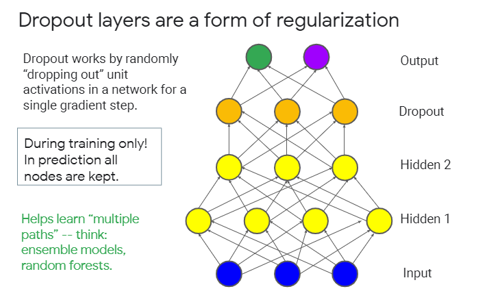

* This is much like any ensemble learning methods like a random forrest.
* Typical dropout values are 0.2 to 0.5 (start with 0.2 and increase till 0.5)
* 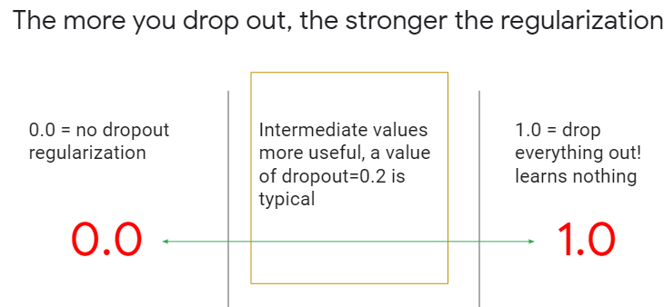

####  Serving models in the cloud

* Step 1 : Create model object in Vertex AI 
  * Check if a model with same name and version exists
* Step 2 : Push model to cloud 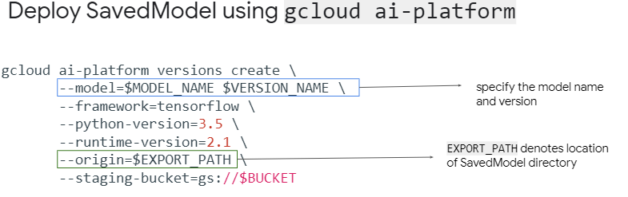
* Step 3: 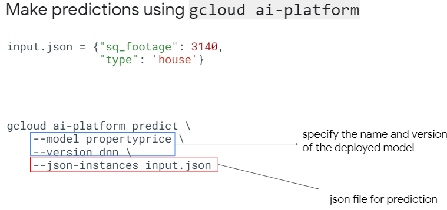
