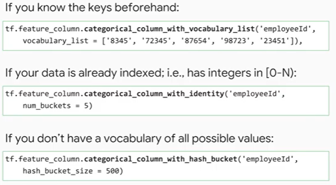
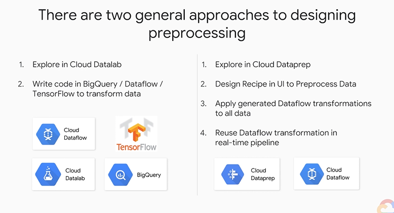
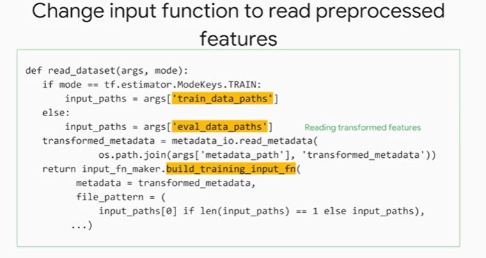

|[Home](../README.md)|[Course Page]()|
|---------------------|--------------|

# Feature Engineering

[TOC]

## Introduction to Course

### To revise

* Dataflow (GCP Offering)
  * How from data sources like
    * BigQuery (data warehouse) (GCP Offering)
    * PubSub (streaming) (GCP Offering)
    * Apache kafka (streaming)
  * does data transform and stored.
  * p-collection
* Cloud Data Prep (GCP Offering)
  * 

* TF Transform (GCP Offering)

###  Introduction to Course

* Scale to large datasets : Use Cloud ML
* Find good features
* Preprocess with Cloud MLE

## Raw Data to Features

Map the raw data from `vector` format to the data on the right in `proto` format.

###  Good vs Bad Features

Some heuristics to differentiate

1. Be related to objective
2. Be known at prediction time
3. All features should be numeric with meaningful magnitude
4. Have enough examples
   1. At least 5-10 examples of each value should be present.
5. Bring human Insights to problem

###  Representing Features

* Features which are already Numeric (real value features) :  `tf.feature_column.numeric_column()`
* Categorical Features: These are one-hot encoded. `tf.feature_column.categorical_column_with_vocabulary_list()`
  * If you have 5 categories, we should have 4 columns (we could do 5 but we do 4 to keep them linearly independent)
  * In tensorflow this is called a sparse column you basically say that i want to create a sparse column with the keys and the column name is an employee id and the keys are 9879 for the employee id.
  * 
  * Hashing is used when we don't want to explicitly provide a vocabulary list before hand
* **<u>MAGIC NUMBERS</u>** : Add new column to indicate if a numeric categorical feature value (example rating from 1-5) is missing .Don't mark it as 0 for missing values, create a separate column called "missing".

###  ML vs Statistics

Statistics is generally used when data is limited and ML when data is in abundance.	

* In case of missing values for example
  * In Statistics we try to impute the missing value of the data
  * In ML we should create a new column called "missing feature" for the respective feature and populate it.
* Same with outliers
  * In ML we try and find as many outliers to train
  * In statistics we remove them.
* Converting continuous features into discrete bins 
  * Fixed Bin boundaries : then one hot encoding them or use `tf.feature_column.bucketized_column`
  * Using Quantile Boundaries : so that each of the bin contains same number of samples.
* Modern architectures for ml end up taking a variable magnitudes into account because of what's called batch normalization although you might run into issues if a batch of examples happens to have all unusual values (which if very uncommon.)

###  Performing Basic Feature Engineering in BQML

###  Performing Basic Feature Engineering in Keras

## Preprocessing and feature creation

###  Beam and Dataflow

* Cloud dataflow is a serverless a fully managed offering from google that allows you to run data processing pipelines.

* Dataflow can run pipelines written in python and java programming languages

* Beam (Batch and Stream) : is used to implement a data processing pipeline you write your code using the apache beam apis and then deploy the code to cloud dataflow. Example:

  

  * as an input to the pipeline you may want to read text files from google cloud storage 
  * then you transform the data, figure out the number of words in each line of text as i will explain shortly this kind of a transformation can be automatically scaled by dataflow to run in parallel 
  * next in your pipeline you can group lines by the number of words using grouping and other aggregation operations you can also filter out values for example to ignore lines with fewer than 10 words 
  * once all the transformation grouping and filtering operations are done the pipeline writes the result to google cloud storage notice that this implementation separates the pipeline definition from the pipeline execution all the steps that you see before call to the p.run method are just defining what the pipeline should do 
  * the pipeline actually gets executed only when you call the run method one of the coolest things about apache beam is that it supports both batch and streaming data processing using the same pipeline code

* Source : Where data comes from

* Transform : Each Step is called a transform. 

  * Transform works on a data structure called p collection.
  * Every transform gets a p-collection as input and outputs the result to another p-collection
  * A p-collection does not store all its data in memory. p collection is like a data structure with pointers to where the dataflow cluster stores your data

* sink which is the output of the pipeline

* **<u>Runner :</u>** a runner takes the pipeline code and executes it.

  * runners are platform specific meaning that there is a data flow runner for executing a pipeline on 

    * cloud data flow

    * apache spark

    * direct runner (local computer)

    * custom distributed computing platform.

    * 

    * Step 4 : Execute pipeline

      

      

###  Data Pipelines that Scale

* If you want to take a transformation in your data processing pipeline and let dataflow run it at scale with automatic distribution across many nodes in a cluster then you should use the apache beams **<u>ParDo</u>** class

* ParDo (Parallel Do)

  

  

###  Preprocessing with Dataprep

Cloud data prep lets you use an interactive graphical user interface to better understand visualize and pre-process your data.

1. First approach:

   

   

2. Second Approach

    

   

## Feature Crosses

###  Introducing Feature Crosses

###  What is a Feature Cross

* Feature cross are a combination of existing features to create new features.
* Optimizing Linear models is a convex problems, a NN with many layers is a non-convex problem. Convex problems are much simpler to optimize for. Remember that convexity is a property of the hyper-parameter space to have a global minimum. For example a 3d graph of x2 has a definite global minimum at x=0
* feature crosses are a way to bring non-linear inputs to a linear learner
* Although feature cross offer a simpler model they come at the cost of memorization of the input space.
* feature crosses allow a linear model to memorize large data sets the idea is you can assign a weight to each feature cross and this way the model learns about combinations of features so even though it's a linear model the actual underlying relationship between inputs and outputs is non-linear
* 
* feature crosses allow you to have a simple model but still get non-linearity
* Feature Crosses only work on categorical features (if you have continueous features, then discritize them first.)

###  Discretization

* The white lines (which are a combination of x1 and x2) are additional hyperparameters we need to account for in our model.
* In case when we don't shift the axis to the center (i.e. we dont substract a constant from x1-c1 and x2-c2) and let the axis remain where it is, notice that we can still separate the space, only in this case, the product of x1*x2 we will have to separate it by the magnitude of the product (x1 * x2) instead of only the sign. i.e. if x3<threshold 1 and x3> threshold2 then it belongs to blue class. if threshold1 < x3 < threshold2, then it belongs to yellow class. Therefore, we now have 2 decision boundaries.
* 
* Basically we were able to make independent predictions for 4 quadrants when we decide to bin by x1 and x2 by (50 percentile/mean/median).
  * Q1: x1 and x2 are small
  * Q2 : x1 is small and x2 is big
  * Q3 : x1 is big x2 is small
  * Q4 : x1 and x2 are big
* Similarly if we decide to discretize the input space into m bins of x1 and n bins of x2 we will have (m+1)(n+1) quadrants on which we can independently make a decision
* Therefore before the model becomes linearly sperable buy just one parameter, we need the white lines to be just in the right place. and this transformation (x1-c1) and (x2-c2) where c1 and c2 are additional hyper-parameters we need to account for while in training.
* The following space can also be discretized.
* If we have *m* vertical lines and *n* horizontal lines, then we have *(m+1)(n+1)* discrete regions.
* Divide the input space into quadrants similarly with *(m+1)(n+1)* discrete regions we have independent decision making capability for each quadrant.

* Essentially we get to make a prediction for each of the quadrant. 
* 
* Remember that x1 is a feature with many distinct values (like day of week) and so is x2 (say, public holiday or not) therefore x3 which is defined as x1 * x2 is accounts for all the combinations of day of the week * public holiday pairs.
* So basically in our case the weight of x3 ends up being the ratio of blue to yellow dots in that region of space once we fit it in our linear model
* you essentially discretize the input space and memorize the training data. For example in the region shown below the model will say its always going to be blue. 
* Although feature cross offer a simpler model they come at the cost of memorization of the input space.
* So when should we use feature cross?
  * When you have large amounts of data (which is not the case with general statistics as compared to ML) and the distribution of data in each grid sell is statistically significant.
  * Memorization works when you have so much data that for any single grid cell in your input space the distribution of data is statistically significant when that's the case you can memorize essentially just learning the mean for every grid cell 
  * You can also choose to add more layers instead of using feature crosses

###  Taxi colors

* Input features
  * x1 : city name
  * x2 : car color
  * Known condition, yellow cars in NY and white cars in Rome are taxis.
  * We use feature cross to solve this.
  * using feature crosses plus massive data is a very efficient strategy for learning highly complex spaces 
  * neural networks provide another way to learn highly complex spaces but feature crosses let linear models stay in the game without feature crosses the expressivity of linear models would be quite limited
  * feature crosses allow a linear model to memorize large data sets the idea is you can assign a weight to each feature cross and this way the model learns about combinations of features so even though it's a linear model the actual underlying relationship between inputs and outputs is non-linear
  * 

###  Implementing Feature Crosses

* Feature Crosses only work on categorical features (if you have continueous features, then discritize them first.)
* Without features crosses we had 24 + 7 input features
* With feature cross we have 24*7 = 168 input features.
* internally tensorflow uses a sparse representation for both one heart encoding and for feature crosses so it has no problem with this
* Therefore when feature crossing, the input is very very sparse.
* Option 3 is correct 

* Feature crossing can allow a model to overfit 
* 
* If the weights of the normal features are much more than the weights of the feature crossed feature, then its a good idea to remove it or use L1 regularization (as it removes unused feature) so that the model becomes more general. 

###  Feature Creation in TensorFlow

* to create feature cross in tf use the `tf.feature_column.crossed_column()` the inputs have to be categorical columns only along with the size of the hash buckets

  

* If we give hash bucket of just 6, then there will be more collision

* 

* In practice follow the green value in the image above to decide on the number of hash buckets.

* We need to pass the engineered feature when there is a call from an input function. In tensorflow we have 3 input functions

  * training input function
  * validation input function
  * serving input function
  * 
  * 

### Embedding Feature Crosses

* Instead of OHE features and directly using the feature cross of this in our model we first pass this crossed feature through a dense layer with less number of nodes
* 
* Step 1 : from time feature we extract the day and the hour 
* Step 2 : we feature across them to get x3 in the diagram and as we discussed x3 is essentially one heart encoded into a number of hash buckets 
* Step 3 : now take this and pass it through a dense layer whose weights are trained to predict a number of things about the traffic

* Therefore a similar day hour combinations in terms of traffic tend to be similar and day our combinations that have very different traffic conditions tend to be far apart in the two-dimensional space this is what we mean when we say that the model learns to embed the feature cross in a lower dimensional space

* To implement in tensorflow 

  

* **<u>Embedding that you have learned on one problem can often apply to other similar machine learning models</u>**

  

  * We can load an embedded layer and tell the network to not train this layer i.e. set trainable = False	

###  Feature Creation in DataFlow

* Remember there are 3 places where you can do preprocessing in Google Cloud

  1. feature pre-processing and feature creation on the fly in tensorflow.

  2. other option is to do the pre-processing of feature creation in cloud data flow.

  3. tf.transform

     

* 

* When using a feature such as `average number of customer who looked at a product in the last hour` we can use logs to compute this feature from the past and use streaming data to do it at real time during prediction

  

###  Improve Machine Learning model with Feature Engineering

###  Performing Advanced Feature Engineering in BQML

###  Performing Advanced Feature Engineering in Keras

## TensorFlow Transform

* using tf transform will allow us to carry out feature pre-processing and feature creation efficiently at scale and on streaming data

###  Introducing TensorFlow Transform

Remember there are 3 places where you can do preprocessing in Google Cloud

1. feature pre-processing and feature creation on the fly in tensorflow.

2. other option is to do the pre-processing of feature creation in cloud data flow.

3. tf.transform

   

* tf transform this is a hybrid of the first two approaches with tensorflow transform you are limited to tensorflow methods but then you also get the efficiency of tensorflow you can also use the aggregate of your entire training data set because
* **<u>tf transform uses data flow during training but only tensorflow during prediction</u>**
* tensorflow transform is a hybrid of apache beam and tensorflow it's in between the two
* data flow pre-processing only works in the context of a pipeline think in terms of incoming streaming data such as iot data internet of things data, etc.
* the data flow pipeline might involve the predictions and it might invoke those predictions and save those predictions to bigtable these predictions are then served to anyone who visits the web page in the next 60 seconds at which point a new prediction is available in big table
* in other words when you hear data flow think back end pre-processing for machine learning models
* use data flow for pre-processing that needs to maintain state such as time windows
* for on-the-fly pre-processing for machine learning models think tensorflow. you use tensorflow for pre-processing that's based on the provided input only
* 
* TF Transform is a hybrid between them, for example to find the min/max and then scale you need to also have historical data or OHE categorical feature like 'car manufacturer' 
* Therefore, as seen above there are two stages,
  * Analyze stage - which is the speciality of beam
  * On the fly transform of input data, i.e. transform stage. - which is speciality of tf.

###  TensorFlow Transform

* 

###  Analyze phase

###  Transform phase

 

###  Supporting serving

* In order for the model to know what functions to call we need to save the transform function

  

  

  

###  Summary

###  Course Summary

###  Course Quiz

## Course Resources

###  Course Resources

###  All Quiz Questions and Answers
