|[Home](../README.md)|[Course Page]()|
|---------------------|--------------|

# 6 Art and Science of Machine Learning

[TOC]

## Revision

* In logistic regression, understand AUC curve etc, (second part of the video.)

##  The Art of ML

###  Regularization

* Regularization is any technique that helps us generalize the model.

  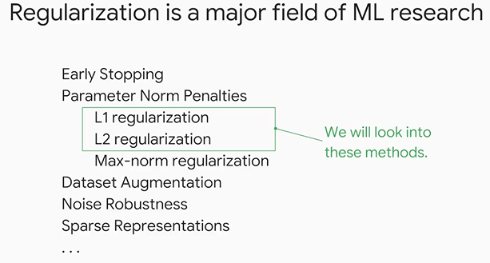

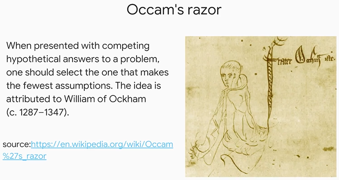

* Regularization vs early stopping.

  * The more complex a model is the more chance it has to overfit, since it tries to fit itself to the noise in the data.
  * Early stopping does not help us here, its the model complexity we need to bring under control.

* How do we measure model complexity?

  * Both L1 and L2 regularization represent model complexity as a magnitude of the weight vector.
  * Magnitude of the vector is represented by the `Norm` function in linear algebra.
  * 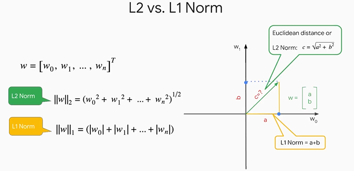

* So how do we penalize complex models?

  * **<u>We add the L1 (Lasso) or L2 (Ridge) Norm of the model to its Loss Function</u>**

  * Therefore, the 

    * new loss = loss function + complexity (which is measured by L1 or L2 Norm)

    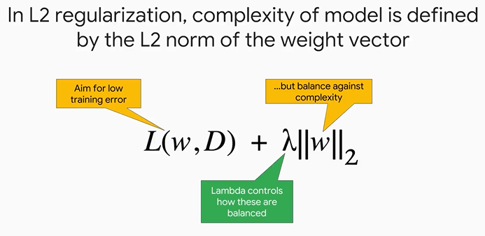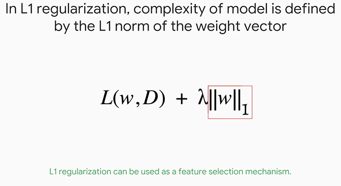

  * The **<u>regularization rate *lambda*</u>** which in above image can be seen as the coefficient of the complexity, is a parameter we define to control how much emphasis we want to put on having a simpler model.

  * L1 regularization is more aggressive and can lead to some features being 0 (dropping of those features) resulting in a sparser model.

###  Learning rate and batch size

* Learning Rate
  * Smaller learning rate also might result in getting stuck in local minima, slower convergence but the loss curve is more smooth
  * Larger learning rate might cause model to never converge (although there are also some optimization steps we can take - check below), faster convergence and loss curve might bounce around.
* 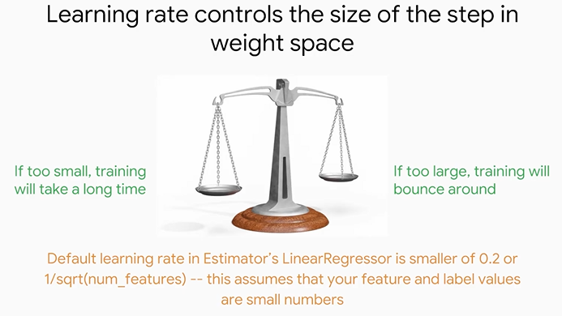

* Batch Size: (These are the sample of input values which are used to calculate the gradient during the back propagation step)
  * Smaller batch size results in more aggressive/faster convergence (in a way similar to larger learning rate)
  * Larger batch size will cause slower convergence (in a way similar to smaller learning rate)
  * **<u>It is important to shuffle the batch before sending to training, because consecutive records in a batch tend to be correlated</u>**
  * 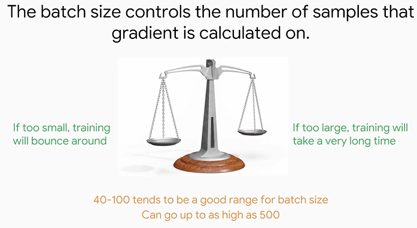

###  Optimization

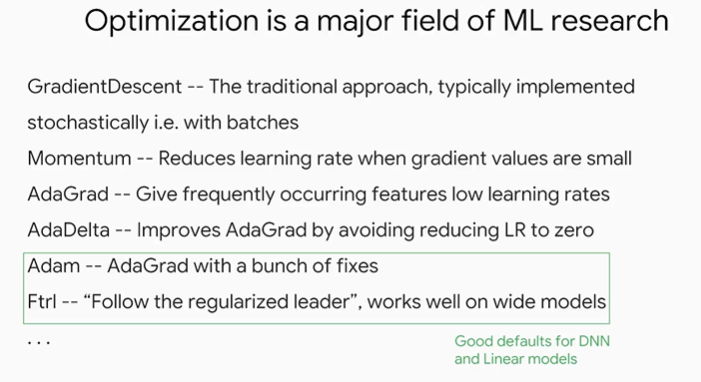

###  Reviewing Learning Curve

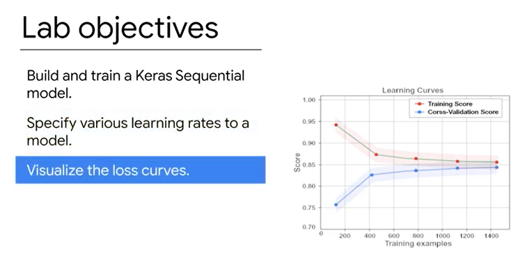

##  Hyperparameter Tuning

###  Parameters vs Hyperparameters

* Parameters are taken care by the algorithm, hyper-parameters is something we need to set before starting training.

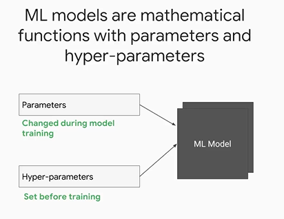

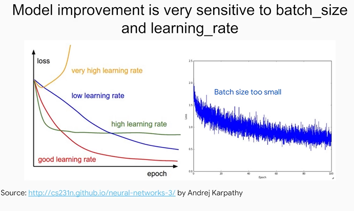

###  Think Beyond Grid Search

* Instead of using normal grid search, google using a custom service built upon the paper below to find the right set of hyper-parameters.

* 

* 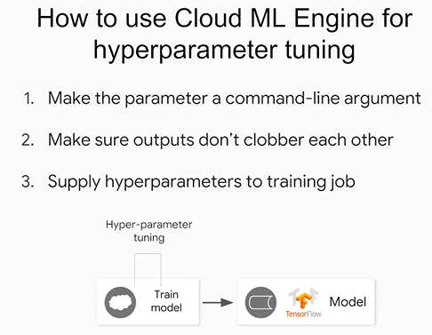

* 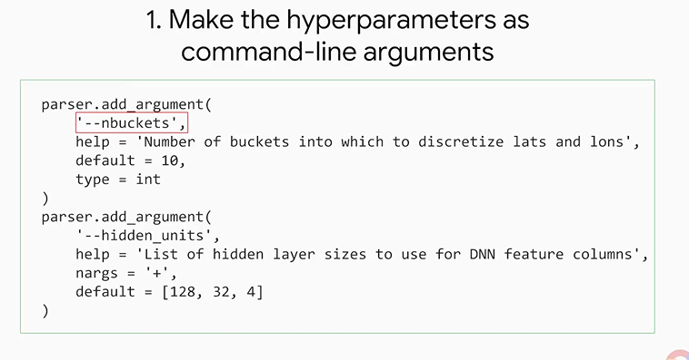

* Ensure that output have unique names

  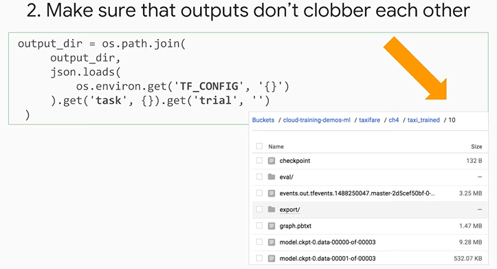

* Start training and write the .yml file as shown 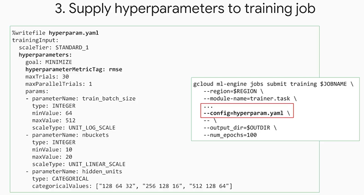

* 

###  Exporting data from BigQuery to Cloud Storage

###  Performing the Hyperparameter Tuning

##  A Pinch of Science

###  Introduction

###  Regularization for sparsity

* Whenever we are doing regularization techniques we are adding a penalty term to the loss function or in general the objective function so that it doesn't over optimize our decision variables or parameter weights 
* We choose the penalty terms based on prior knowledge function state etc 

* Limitation of L2 regularization is that it does not reduce the weights to 0.

  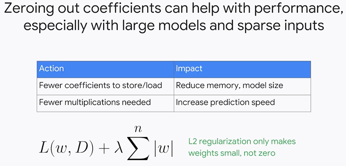

* There are a lot of features, especially after feature crosses.

* 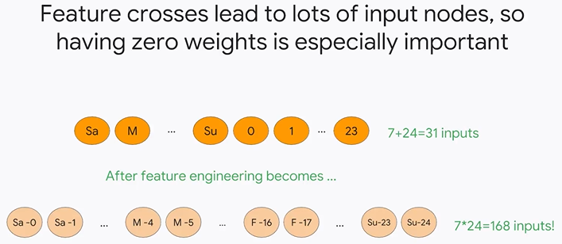

* 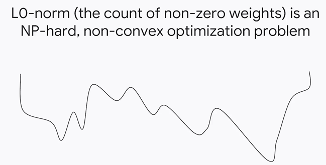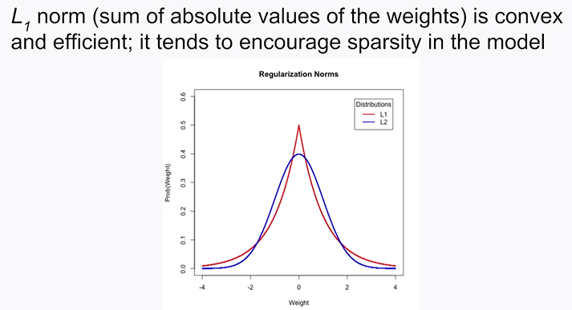

*  there are an infinite number of norms which are generalized by the p norm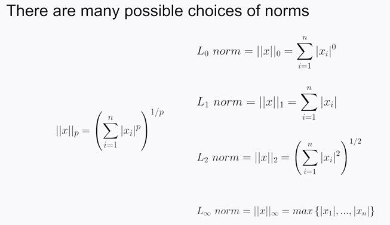

* L1 vs L2 

  * In practice though usually the l2 norm provides more generalizable models than the l1 norm however we will end up with much more complex heavy models if we use l2 instead of l1.
  * this happens because often features have high correlation with each other and l1 regularization will choose one of them and throw the other away whereas l2 regularization will keep both features and keep their weight magnitudes small.
  * so with L1 you can end up with a smaller model but it may be less predictive.

* Best of both worlds? (L1 and L2)

  * 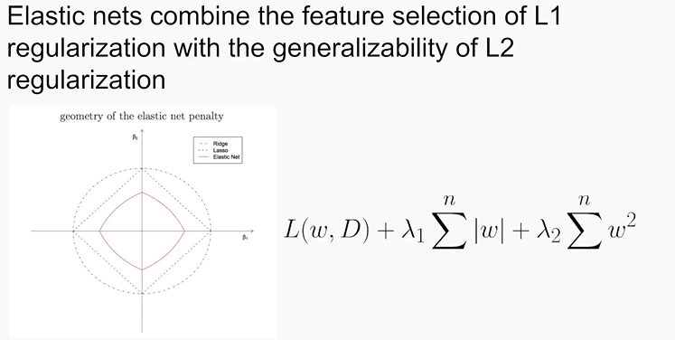

  * The elastic net is just a linear combination of the l1 and l2 regulation penalties, this way you get both

    * the benefits of sparsity for really poor predictive features 
    * while also keeping decent and great features with smaller weights to provide good generalization 
    * The only trade-off now is there are two instead of one hyperparameter to train, with the two different lambda regularization parameters.

  * 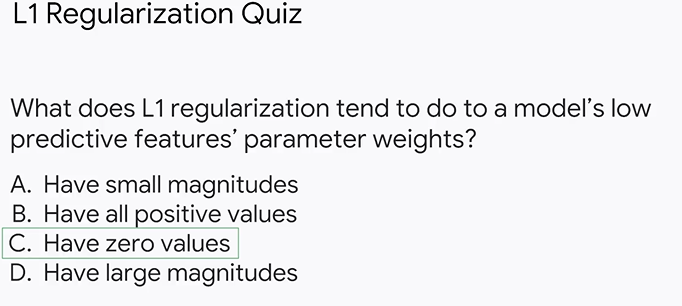

    Explanation :

    * Whenever we are doing regularization techniques we are adding a penalty term to the loss function or in general the objective function so that it doesn't over optimize our decision variables or parameter weights 
    * We choose the penalty terms based on prior knowledge function state etc 
    * l1 organization has been shown to induce sparsity to the model and due to its probability distribution having a high peak at zero most weights except for the highly predictive ones will be shifted from their non-regularized values to zero
    * l2 regularization would be used for having small magnitudes and its negative would be used for having large magnitudes which are both incorrect 
    * having all positive values would be like adding many additional constraints to the optimization problem bounding all decision variables to be greater than zero which is also not l1 regularization

* 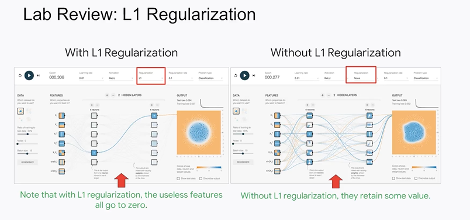

###  Logistic Regression

* Since we cannot use RMSE to find a binary outcome, because it might give us any real value (and not just between 0-1) we make use of the sigmoid function

* 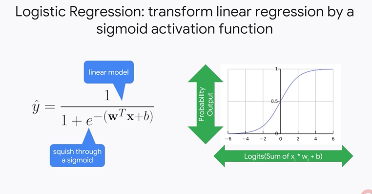

* **<u>Logits :</u>** The inputs given to a sigmoid function (normally the output of the linear regression) is called logits. This is the step where we are performing a non-linear transform on our linear model.

* Since the sigmoid never guess 1 or 0 (it tends to them at infinity), during our gradient descent step it will drive the weights closer and closer to +- infinity in the absence of regularization.

* Why does sigmoid represent probability?

  * the sigmoid function is the cumulative distribution function of the logistic probability distribution whose quantile function is the inverse of the logit which models the log odds 
  * Therefore mathematically the outputs of a sigmoid can be considered probabilities
  * lots of output activation functions (in fact an infinite number) could give you a number between 0 and 1 but only this sigmoid is proven to be a calibrated estimate of the training data set probability of occurrence
  * using this fact about the sigmoid activation function we can cast binary classification problems into probabilistic problems
  * for instance instead of a model just predicting a yes or no such as will a customer buy an item it can now prove the probability that a customer buys an item this paired with a threshold can provide a lot more predictive power than just a simple binary answer
  * 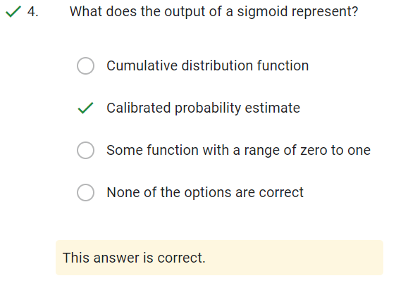

* Which is the loss function we use? (why we use cross-entropy(LogLoss) instead of MSE)

  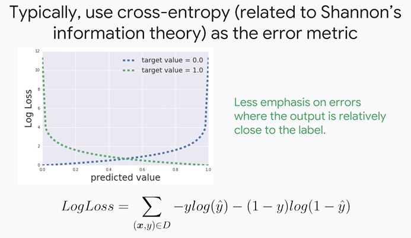

  * Difference between MSE and Logloss (cross-entropy):
    * errors where the output is relatively close to the label : In cross-entropy there is less emphasis on errors where the output is relatively close to the label which is almost linear compared to quadratic in MSE.
    * however also unlike mean squared error cross entropy grows exponentially when the prediction is close to the opposite the label 
    * In other words there is a very high penalty when the model not only gets it wrong but does so with very high confidence
    * furthermore the derivative of mean squared error could cause problems with training as we push the output closer and closer to 0 or 1 then the gradient which is the output times 1 minus the output becomes smaller and smaller and changes the weights less and less training could completely stall however
    * 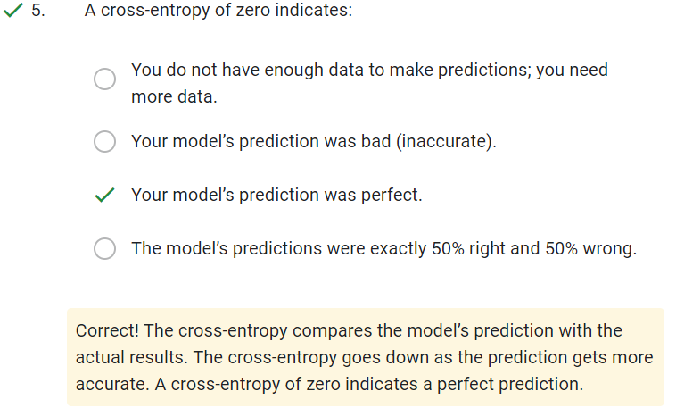
    * 

* Why is regularization important in logistic regression?

  * Regularization is important in logistic regression because driving the loss to zero is difficult and dangerous
  * As gradient descent seeks to minimize cross entropy it pushes output values closer to 1 for positive labels and closer to 0 for negative labels 
  * due to the equation of the sigmoid the function asymptotes to 0 when the logit is negative infinity and to 1 when the logit is positive infinity 
  * **<u>to get the logits to negative or positive infinity the magnitude of the weights is increased and increased, leading to numerical stability problems (overflows and underflows) this is dangerous and can ruin our training</u>** 
  * Also near the asymptotes as you can see from the graph the sigmoid function becomes flatter and flatter this means that the derivative is getting closer and closer to zero since we use the derivative in back propagation to update the weights **<u>it is important for the gradient not to become zero or else trading will stop this is called saturation</u>**
  * **<u>when all activations end up in these plateaus which leads to a vanishing gradient problem</u>**
  * When we use feature cross, we might end up with only one or two example of a particular feature cross causing training to never converge.
  * Therefore, its important to use regularization.
  * 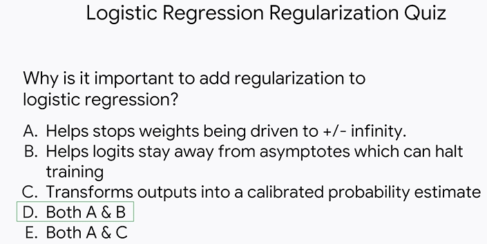

* To prevent overfitting we do both, overfitting and early stopping.

* 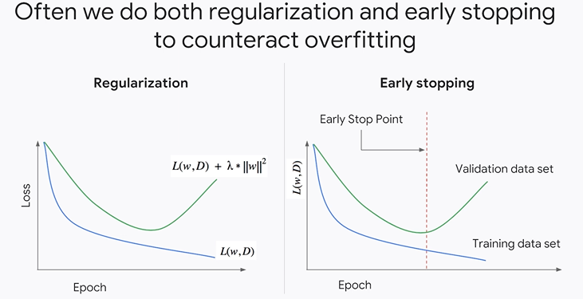

* When the outcome is not equally likely, we use different metric other than probability. Therefore, we use other metrics like Precision, recall, ROC-AUC

* 

##  The Science of Neural Networks

###  Introduction to Neural Networks

###  Neural Networks

* Quiz

  * 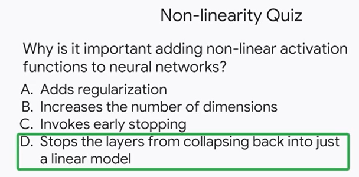

  * not only do non-linear activation functions help create interesting transformations to our data's feature space but it allows for deep composition of functions as we explained if there are any two or more layers with linear activation functions this product of matrices can be summarized by just one matrix times the input feature vector therefore you end up with slower model with more computation.  But with all of your functional complexity reduced
  * non-linearities do not add organization to the loss function and they do not invoke early stopping
  * even though non-linear activation functions do create complex transformations of vector space the dimension does not change and you remain in the same vector space albeit stretched squished or rotated.

* What is the purpose of many layers?

  * 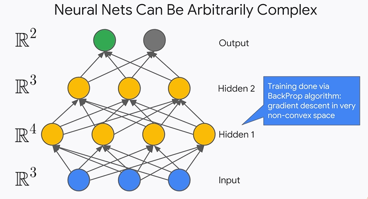
  * there can be many layers neurons per layer outputs inputs different types of activation functions etc 
  * each layer i add adds to the complexity of the functions i can create 
  * each subsequent layer is a composition of the previous functions since we are using nonlinear activation functions in my hidden layers i'm creating a stack of data transformations that rotate stretch and squeeze my data
  * remember the purpose of doing all of this is to transform my data in such a way that i can nicely fit a hyperplane to it for regression or separate my data with the hyperplanes for classification
  * we are mapping from the original feature space to some new convoluted feature space

* What does adding additional neurons to a layer do ?

  * each neuron i add adds a new dimension to my vector space if i begin with three input neurons i start in r3 vector space but if my next layer has four neurons then i move to an r4 vector space back

* What might having multiple output nodes do ?

  * having multiple output nodes allows you to compare to multiple labels and then propagate the corresponding errors backwards 
  * you can imagine doing image classification where there are multiple entities or classes within each image we can't just predict one class because there may be many so having this flexibility is great 

* Quiz

  * 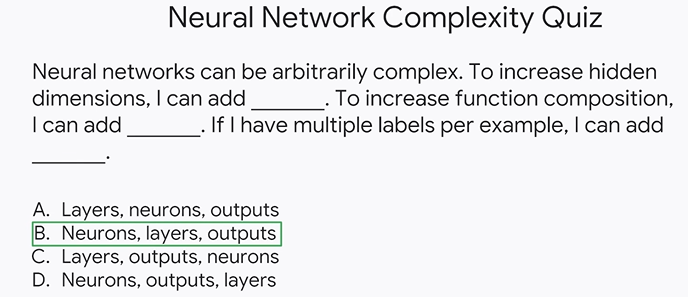
  * **<u>if a layer has four neurons then it is an r4 vector space</u>** and if a layer has 500 neurons it is an r500 vector space meaning it has 500 real dimensions
  * **<u>adding a layer doesn't change the dimension</u>** the previous layer and it might not even change the dimension in its layer unless it has a different number of neurons than the previous layer.  what additional layers do add is a greater composition of functions. This is great for combining non-linear functions together to make very convoluted feature maps that are hard for humans to construct but great for computers and allow us to better get our data into a shape that we can learn and gain insights from
  * speaking of insights we receive those through our output layers where during inference those will be the answers to our ml formulated problem if you only want to know the probability of an image being a dog then you can get by with only one output node but if you wanted to know the probability of an image being a cat dog bird or moose then you would need to have a node for each one
  * the other three answers are all wrong since they get two or more of the words wrong

###  Training Neural Networks

###  Build a DNN using the Keras Functional API

###  Training Models at Scale with AI Platform

##  Embeddings

###  Introduction to Embeddings

###  Review of Embeddings

###  Recommendations

###  Sparse Tensors

###  Train an Embedding

###  Similarity Property

###  Introducing the Keras Functional API

##  Summary

###  Course Summary

##  Course Resources

###  Course resources

###  All Course Readings

###  All Quiz Questions and Answers
