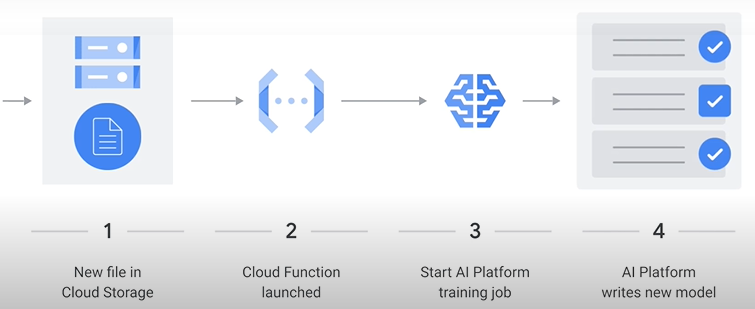
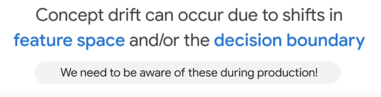
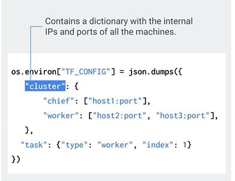
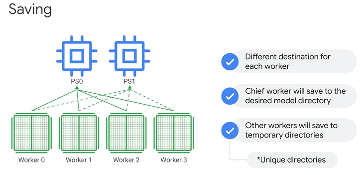
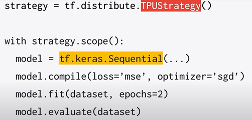
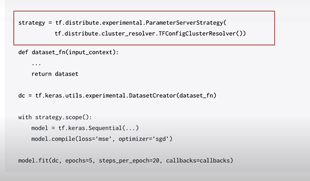
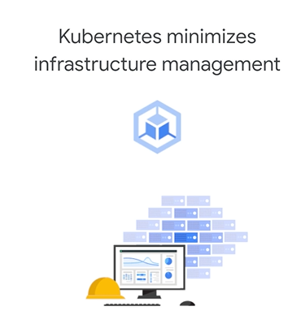
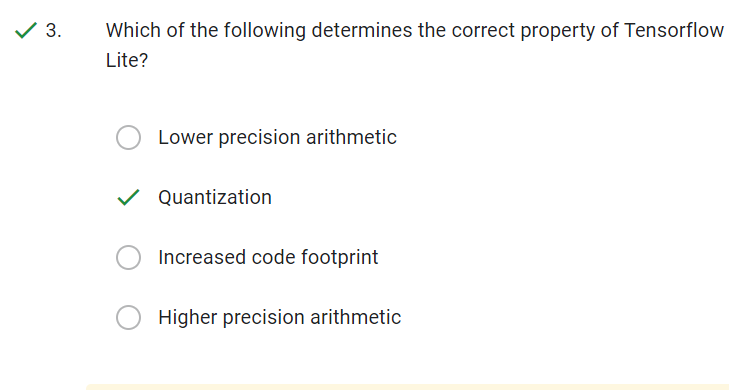

|[Home](../README.md)|[Course Page]()|
|---------------------|--------------|

# 7 Production Machine Learning Systems

[TOC]

## Revision

1. Concept Drift definition

##  Architecting Production ML Systems

###  Architecting ML systems

* 

* 

* Starting From scratch :

  * 

* Overall ML Pipeline

  

  1. Data extraction: With data extraction, you retrieve the data from various sources. Those sources can be streaming, in real time, or batch. (Both Structured and Unstructured.)

     1. **<u>If data is structured : Big Query (Data Warehouse), Apache Beam IO Module.</u>**
     2. In this data flow example, we're loading data from BigQuery, calling predict on every record, and then writing the results back into BigQuery.

  2. Data Analysis: We perform EDA. This is also where you monitor for data shift.

  3. Data Preparation: Data preparation includes 

     * data transformation 

     * feature engineering, which is the process of changing or converting the format, structure, or values of data you've extracted into another format or structure.

     * **<u>Example : Using SQL in Big Query ML</u>**

       

       

     * **<u>Data Studio is used to Visualization</u>**

     * **<u>Important Note : For all non-numeric columns other than timestamp, BigQuery ML performs a one-hot encoding transformation. This transformation generates a separate feature for each unique value in the column.</u>**

  4. Model Training : Train Model

  5. Model Evaluation : Feeding it test data and checking if it generalizes. This step is done by humans just after training.

  6. Model Validation (Performance testing by filtering/business criteria): Before the model is deployed in production, this step monitors the model performance against a set threshold and alerts us when the performance drops below it.

     * One common test is to look at performance by slice. (Example, if we care about geographic regions)

  7. Trained Model : 

     * The output of model validation is a trained model that can be pushed to the model registry.

  8. Model Registry:  The machine learning model registry is a centralized tracking system that stores linage, versioning, and related metadata for published machine learning models.

     * A registry may capture governance data required for auditing purposes, such as who trained and published a model, which datasets were used for training, the values of metrics measuring predictive performance, and when the model was deployed to production.

  9. Prediction Service: The trained model is served as a prediction service to production for example, a microservice with a REST API, instead of deploying the entire ML system.

     * Google's AI Platform Prediction service has an API for serving predictions from machine learning models. AI Platform Prediction retrieves the trained model and saves it as a PKL in Cloud Storage.
     * 
     * The AI Platform Prediction service can host models trained in popular machine learning frameworks, including TensorFlow, XGBoost, and Scikit-Learn.

  10. Performance Monitoring: Monitoring lets you detect model performance degradation or model staleness.

      * The output of monitoring for these changes then feeds into the data analysis component, which can serve as a trigger to execute the pipeline or to execute a new experimental cycle.
      * **<u>Data Skews:</u>** monitoring should be designed to detect data skews, which occur when your model training data is not representative of the live data.

###  Training design decisions

* **<u>What is the relationship between the features and the lables? Is it changing or the same?</u>**

* Static is  like physics and Dynamic is like fashion 

* If the relationship you're trying to model is constant, like physics, a statically trained model may be sufficient. If, in contrast, the relationship you're trying to model is one that changes, like fashion, the dynamically trained model might be more appropriate.

* 

* **<u>Static Training</u>**: For static training, models are trained once and then pushed to AI platform

* **<u>Dynamic Training</u>**: There are three potential architectures to explore: 

  * **<u>Cloud Functions</u>**: A new data file appears in Cloud Storage, and then the Cloud Function is launched. After that, the Cloud Function starts the AI Platform training job. And then the AI Platform writes out a new model.

    

  * **<u>App Engine</u>**: A user makes a web request from a dashboard to App Engine, an AI Platform training job is launched, and the AI Platform job writes a new model to Cloud Storage. From there, the statistics of the training job are displayed to the user when the job is complete.

    

  * **<u>Dataflow:</u>** The Dataflow pipeline is also possibly invoking the model for predictions. Here, the streaming topic is ingested into Pub/Sub from subscribers. Messages are then aggregated with Dataflow, and aggregated data is stored in BigQuery. AI Platform is launched on the arrival of new data in BigQuery, and then an updated model is deployed.

    

    

###  Serving design decisions

* **<u>Is the distribution of prediction requests likely to be more peaked or more flat?</u>**

* Just as the use case determines appropriate training architecture, it also determines the appropriate serving architecture.

* Decision Criteria 1: Static vs Dynamic Service

  * **<u>Static Serving:</u>** Making predictions before hand. 

    * We use a cache, In this case, instead of faster memory, we'll use a table. Static serving then computes the label ahead of time and serves by looking it up in the table.
    * 
    * These keys in step 2 will allow you to join your request to prediction at serving time.
    * And third, you write the predictions to a data warehouse like BigQuery, and create an API to read from it.
    * Overall these are the steps required for static serving in GCP

  * **<u>Dynamic serving:</u>**  The label is generated on demand.

  * There's a space-time trade-off between the two.

    

* Decision Criteria 2: Peakedness and Cardinality

  * **<u>Peakedness</u>**: Am I repeatedly making predictions for the same few records again and again?

    *  Peakedness in a data distribution is a degree to which data values are concentrated around the mean, or in this case, how concentrated the distribution of the prediction workload is. You can also think of it as inverse entropy.
    * For example, a model that predicts the next word based on the current word, which you might find in your mobile phone keyboard app would be highly peaked because a small number of words account for the majority of words used.
    * In contrast, a model that predicted quarterly revenue for all sales verticals in order to populate a report would be right on the same verticals and with the same frequently for each. And so, it would be very flat.

  * **<u>Cardinality:</u>**  Am I expected to make repeated predictions for only a limited records with limited features. i.e. the overall possible size of the input space.

    * Cardinality refers to the number of values in a set. In our case, the set is composed of all the possible things we might have to make predictions for.
    * So, a model predicting sales revenue given organization division number would have fairly low cardinality. Because we're making predictions for only 4-5 divisions at a time.
    * A model predicting lifetime value given a user for an e-commerce platform would have high cardinality because the number of users and the number of characteristics of each user are probably quite large.

  * Taken together peakedness and cardinality create a space.

  * Final Decision:

    

    1. When the cardinality is sufficiently low, we can store the entire expected prediction workload. For example, the predicted sales revenue for all divisions in a table and use static serving.
    2. When the cardinality is high because the size of the input space is large and the workload is not very peaked, you probably want to use dynamic training.
    3. In practice though, a hybrid of static and dynamic is often chosen, where you statically cache some of the predictions while responding on demand for the long tail. This works best when the distribution is sufficiently peaked.
    4. The striped area above the curve and not inside the blue rectangle is suitable for a hybrid solution, with the most frequently requested predictions cached and the tail computed on demand.

  * Decision Examples : 

    * Email : Depending on the choice of representation, the cardinality might be enormous, so this would be dynamic.
    * in the 3rd use case: The set of all ads (all ads when running a campaign) doesn't change much from day to day, assuming users (marketing people) are comfortable waiting for a short while after uploading their ads. This will be static

###  Designing from scratch

* [Designing from scratch | Google Cloud Skills Boost](https://www.cloudskillsboost.google/course_sessions/854773/video/103408)

* 

###  Using Vertex AI

* Vertex AI brings together the Google Cloud services for building ML under one unified user interface and application programming interface, or API.

  

* Datasets:

  * Vertex AI has a unified data preparation tool that supports image, tabular, text, and video content.
  * **Uploaded datasets are stored in a Cloud Storage bucket that acts as an input for both AutoML and custom training jobs.** Remember, they are NOT stored in a database or bigquery (data warehouse) etc.
  * Transformation of feature: When you use the data to train a model, Vertex AI examines the source data type and feature values and infers how it will use that feature in model training.

* Notebooks:

* Training:

  * With Vertex AI, you can train and compare models using AutoML or custom code training, with all models stored in one central model repository.
  * **<u>Training pipelines</u>**: are the primary model training workflow in Vertex AI, which can use training pipelines to create 
    * an AutoML-trained model or 
    * a custom-trained model.
      * orchestrate custom training jobs and hyperparameter tuning 
      * adding a dataset 
      * uploading the model to Vertex AI for prediction serving.
  * **<u>Custom jobs</u>**: specify how Vertex AI runs custom training code, including worker pools, machine types, and settings related to a Python training application and custom container.
  * **<u>Hyperparameter tuning:</u>** Hyperparameter tuning searches for the best combination of hyperparameter values by optimizing metric values across a series of trials.

* Models:

  * A new model can be trained, or an existing model can be imported.

* Endpoints:

  * Endpoints are machine learning models made available for online prediction requests.
  * An endpoint is an HTTPS endpoint that clients can call to receive the inferencing (scoring) output of a trained model.
  * They can provide timely predictions from many users, for example, in response to an application request.
  * They can also request batch predictions if immediate results aren't required.
  * Multiple models can be deployed to an endpoint, and a single model can be deployed to multiple endpoints to split traffic.
  * You might deploy a single model to multiple endpoints to test out a new model before serving it to all traffic.

##  Designing Adaptable ML Systems

###  Adapting to data

1. your model run's in series after a weather prediction model. if the model before changes this will change the accuracy of your model

2. Data source is not maintained

3. The distribution of the data can change for all sorts of reasons.:

   *  sometimes the distribution of the label changes.

   * When the distribution of the label changes, it could mean that the relationship between features and labels is changing as well.

   * Sometimes it's not the labels, but the features, that change their distribution.

   * extrapolation : when models are asked to make predictions on points in feature space that are far away from the training data

   * Best Practices:

     

     * If the mean or the variance has changed substantially, then you can analyze this new segment of the input space, to see if the relationships learned still hold.
     * Check whether the models residuals, that is the difference between its predictions and the labels, has changed as a function of your inputs. If, for example, you used to have small errors at one slice of the input and large in another, and now its switched, this could be evidence of a change in the relationship.
     * If you have reason to believe that the relationship is changing over time, you can force the model to treat more recent observations as more important by writing a custom loss function, or by retraining the model on the most recent data.

### Adapting to data lab

* Scenario 1: Code sprint to increase model performance by 5%

  * **<u>Ablation analysis</u>**, where the value of an individual feature is computed by comparing it to a model trained without it.
  * 

* Scenario 2: Found new data source related to label The problem is that its in a unique format and theres no parser written in Python, which is what the codebase is composed of.

  * Code  smell: 

    

###  Right and wrong decisions

* For cancer model, it performed well on training and test data but still poorly on new data.

  * Make sure all the features used while creation of model are available during prediction time and have same distribution, in the above case it was the hospital name. So during prediction time the hospital name was not available.

    

  * **<u>Data leakage:</u>**

###  System failure

* You've trained a product recommendation model based on users click and purchase behavior on your ecommerce site.
* On Black Friday, your server responsible for transactions and payments goes down whilst the web server remains up and running, so the model thinks that no one who clicks is buying anything.
* It's impossible to have models unlearn things that have already been learned, but one thing you can do is roll back the model's state to a time prior to the **<u>data pollution.</u>** In order to do this you need to have model versioning enabled.
* Case 2 : Recommendation system based on collaborative filtering needs to retrain frequently, if not done the the static model will continue to recommend old products

###  Concept drift

* **<u>Concept drift occurs when the distribution of our observations shifts over time, or that the joint probability distribution changes.</u>**

* 

* 

* If the data is changing, or if the relationship between the features and the label is changing, this is going to cause issues with our model.

* There are 4 types of drifts:

  

Why do machine learning models lose their predictive power over time? 

* 

* Drift is the change in an entity with respect to a baseline. In the case of production ML models, this is the change between the real-time production data and a baseline data set, likely the training set, that is representative of the task the model is intended to perform.

* 

* **<u>Types of drifts:</u>**

  

  * **<u>Data Drift</u>** or change in probability of X P(X) is a shift in the models input data distribution. For example, incomes of all applicants increase by 5%, but the economic fundamentals are the same. 
    * Data drift, feature drift, population, or covariate shift are all names to describe changes in the data distribution of the inputs.
  * **<u>Concept drift</u>**, or change in probability of Y given X, is a shift in the actual relationship between the model inputs and the output.
    *  An example of concept drift is when macroeconomic factors make lending riskier, and there is a higher standard to be eligible for a loan. In this case, an income level that was earlier considered creditworthy is no longer creditworthy. 
    * concept drift occurs when there is a change in the relationship between the input feature and the label, or target.
    * Case 1: Adding new dataset: This might not necessarily change the data distribution, but the internal correlation between features might change
    * Case 2: In streaming data from sensors, the sensor's performance might degrade over time.
  * **<u>Prediction drift,</u>** or change in the predicted value of Y given X, is a shift in the models predictions. For example, a larger proportion of credit-worthy applications when your product was launched in a more affluent area. Your model still holds, but your business may be unprepared for this scenario. 
  * **<u>Label drift</u>** or change in the predicted value of Y as your target variable is a shift in the models output or label distribution.

###  Actions to mitigate concept drift

* Summing up data drifts, we have two general types of drift.
* **<u>What if you diagnose data drift?</u>** 
  * If you diagnose data drift, enough of the data needs to be labeled to introduce new classes and the model retrained. 
* **<u>What if you diagnose concept drift?</u>** 
  * If you diagnose concept drift, the old data needs to be relabeled and the model retrained. 
  * Also, for concept drift, you can design your systems to detect changes. **<u>Periodically updating your static model with more recent historical data</u>**, for example, is a common way to mitigate concept drift.
  * You can either discard the static model completely or you can use the existing state as the starting point for a better model
  * You can also use an ensemble approach to train your new model in order to correct the predictions from prior models.
  * Ensembles which learnt the old concept with high diversity are trained by using low diversity on the new concept.
* After your diagnosis and mitigation efforts, retraining or refreshing the model over time will help to maintain model quality.

###  TensorFlow data validation

* TensorFlow Data Validation is part of the ingest and validate data phase.

* Two common use-cases of TensorFlow Data Validation within a TensorFlow Extended pipelines are 
  * validation of continuously arriving data 
  * training-serving skew detection.
* **<u>The ExampleGen component:</u>** This component takes raw data as input and generates TensorFlow examples,
  * it can take many input formats, for example CSV, TF Record.
  * It also splits the examples for you into Train/Eval.
  * It then passes the result to the StatisticsGen component.
* **<u>The Statistics Generation component:</u>** The Statistics Generation component, generates statistics for feature analysis.
* **<u>The Schema Generation component</u>**, which gives you a description of your data.
* **<u>The Example Validator component,</u>** which allows you to check for anomalies 
* 
* 
* **<u>Training Service Skew</u>**: Training-serving skew occurs when training data is generated differently from how the data used to request predictions is generated. 
  * Possible causes might come from a change in how data is handled in training vs in production, or even a faulty sampling mechanism. 
  * Training-serving skew can also occur based on your data distribution in your training, validation, and testing data splits.
  * 
  * In Summary: 

###  Components of TensorFlow data validation

TensorFlow Data Validation is a library for analyzing and validating machine learning data, for which there are three components: 

1. **<u>The Statistics Generation component</u>**: The StatisticsGen component generates features statistics and random samples over training data, which can be used for visualization and validation. 

* TensorFlow Data Validation can also help you identify unbalanced data distributions.
* The most unbalanced features will be listed at the top of each feature-type list.
* 

2. **<u>The Schema Generation component</u>**: The SchemaGen TFX pipeline component can specify data types for feature values, whether a feature has to be present in all examples, allowed value ranges, and other properties.
   * A SchemaGen pipeline component will automatically generate a schema by inferring types, categories, and ranges from the training data. 
   * In essence, SchemaGen is looking at the data type of the input, is it an int, float, categorical, etc.
   * And if it is categorical then what are the valid values?
   * It also comes with a visualization tool to review the inferred schema and fix any issues.
   * 
     * "type" indicates the feature datatype, "presence" indicates whether the feature must be present in 100% of examples or not, so whether its required or optional.
     * "Valency" indicates the number of values required per training example.
     * "Domain" and "Values" indicates the feature domain and its values.
     * In the case of categorical features, single indicates that each training example must have exactly one category for the feature.

3. **<u>The Example Validator component:</u>** The ExampleValidator pipeline component identifies anomalies in training and serving data.
   * The ExampleValidator pipeline component identifies any anomalies in the example data by comparing data statistics computed by the StatisticsGen pipeline component against a schema.
   * It takes the inputs and looks for problems in the data, like missing values, and reports any anomalies.

* Summary: 
  * As we've explored, TensorFlow Data Validation is a component of TensorFlow Extended, and it helps you to analyze and validate your data.
  * Data validation checks include identifying feature correlations, checking for missing values, and identifying class imbalances.

###  Mitigating training-serving skews:

* Training-serving skew refers to differences caused by one of three things: 

  1. A discrepancy between how you handle data in the training and serving pipelines.

  1. A change in the data between when you train and when you serve

  1. A feedback loop between your model and your algorithm.

* Training-serving skew are also possible due to inconsistencies that arise after the data have been introduced say, for example, that in your development environment, you have version 2 of a library, but in production you have version 1.

  * Consequently, predictions might be significantly slower or consume more memory in production than they did in development.
  * Finally, its also possible that different code is used in production versus development, perhaps because of recognition of one of the other issues, but though the intent was to create equivalent code, the results were imperfect.

###  Serving ML Predictions in Batch and Real Time

* [Lab Debrief: Serving ML predictions in batch and real-time | Google Cloud Skills Boost](https://www.cloudskillsboost.google/course_sessions/854773/video/103431)

###  Diagnosing a production model

[Diagnosing a production model | Google Cloud Skills Boost](https://www.cloudskillsboost.google/course_sessions/854773/video/103432)

##  Designing High Performance ML Systems

###  Training

* What does high performance mean for hardware?
  * To train models to same accuracy what is the performance boost in terms of time.

* So when it comes to you training budget, you have three considerations-- three levers that you can adjust. These are 

  * time: you need to train model every night and recommend products for the next day. 
  * cost: 
  * scale: how much of the training data will be used for training. Generally, the more data, the more accurate the model. But there are diminishing returns to larger and larger data sizes.
    * a single, more expensive machine, or multiple cheaper machines?
    * Use earlier model checkpoints.

* Model training performance will be bound by one of three things: 

  

  * Input/output, which is how fast you can get data into the model for each training step.
    * Your ML training will be IO-bound if the number of inputs is large, heterogenous, requiring parsing, or if the model is so small that the compute requirements are trivial. This also tends to be the case if the input data is on a storage system with very low throughput.
    * If you're IO-bound, look at storing the data more efficiently on a storage system with higher throughput, or parallelizing the reads. Although it's not ideal, you might also consider reducing the batch size so that you're reading less data in each step. 
  * the CPU, which is how fast you can compute the gradient in each training step.
    * Your ML training will be CPU-bound if the IO is simple, but the model involves lots of expensive computations. You will also encounter this situation if you're running a model on underpowered hardware.
    * Solutions:
      * If you are CPU-bound, see if you can run the training on a faster accelerator. GPUs keep getting faster, so move to a newer generation processor. and if you're using Google Cloud, you also have the option of running on TPUs.
      * Even if it's not ideal, you might consider using a simpler model, a less computationally expensive activation function or simply just train for fewer steps.
  * Memory-- how many weights can you hold in memory so that you can do the matrix multiplications in memory? Or do you use the GPU or TPU.
    * Your ML training might be memory-bound if the number of inputs is really large or if the model is complex and has lots of free parameters. You'll also face memory limitations if your accelerator doesn't have enough memory.
    * Solution:
      * If you are memory-bound, see if you can add more memory to the individual workers. 
      * Again, this may not be ideal, but you could also consider using fewer layers in your model. 
      * Reducing the batch size can also help with memory-bound ML systems.

###  Predictions

* For Batch Predictions the considerations are similar to that of training, i.e.
  * Time: next day 
  * cost:
  * scale: single machines or multiple machines for distributed predictions.
* For online predictions since the end users are waiting its different.
  * You typically cannot distribute the prediction graph, instead you carry out the computation for one end user on one machine.
  * However you almost always scale out the predictions on to multiple workers. Essentially each prediction is handled by a micro-service and you can replicate and **<u>scale out the predictions using Kubernetes or App Engine.</u>**
  * The unit of measuring performance is QPS (Queries per second). This is the performance target.
* Building hybrid both batch and online is generally the way to go.

###  Why distributed training is needed

###  Distributed training architectures

* TensorFlow automatically handles scaling on multiple cores.

* You may speed up your training by adding an accelerator to your machine, such as a GPU.

* But with distributed training, you can go further.

  * You can go from using one machine with a single device, in this case a GPU, to a machine with multiple devices attached to it.
  * And finally, to multiple machines, possibly with multiple devices each, connected over a network.
  * Eventually, with various approaches, you can scale up to hundreds of devices.

* What is distributed training?

  * Simply stated, distributed training distributes training workloads across multiple mini-processors, or worker nodes. These worker nodes work in parallel to accelerate the training process. Their parallelism can be achieved via two types of distributed training architecture:

  1. **<u>Data parallelism (most common):</u>** In data parallelism, you run the same model and computation on every device, but train each of them using different training data samples.

     * Each device computes loss and gradients based on the training samples.

     * Then you update the model's parameters using these gradients.

     * The updated model is then used in the next round of computation.

     * Data parallelism is model-agnostic, making it the most widely used paradigm for parallelizing neural network training.

     * There are currently two approaches used to update the model using gradients from various devices, 
       * **<u>Synchronous Training</u>**: In synchronous training, all of the devices train their local model using different parts of data from a single, large mini-batch. 
         * They then communicate their locally calculated gradients, directly or indirectly, to all devices. In this approach, each worker device computes the forward and backward passes through the model on a different slice of input data.
         * The computed gradients from each of these slices are then aggregated across all of the devices and reduced, usually using an average, in a process known as **<u>Allreduce.</u>**
         * The optimizer then performs the parameter updates with these reduced gradients, thereby keeping the devices in sync.
         * Because each worker cannot proceed to the next training step until all the other workers have finished the current step, this gradient calculation becomes the main overhead in distributed training for synchronous strategies.
         * Only after all devices have successfully computed and sent their gradients, so that all models are synchronized, is the model updated.
         * After the model weights are updated, splits from the next mini-batch are sent to each worker device.
         * That is, devices trained on non-overlapping splits of the mini-batch.
         * **<u>Asynchronous Training</u>**: In asynchronous training, no device waits for updates to the model from any other device.
           * The devices can run independently and share results as peers, or communicate through one or more central servers known as **<u>parameter servers.</u>**
           * **<u>Thus, in an asynchronous parameter server architecture, some devices are designated to be parameter servers and others as workers.</u>**
           * Devices used to run computations are called worker devices, while devices used to store variables are parameter devices.
           * Each worker independently fetches the latest parameters from the parameter servers and computes gradients based on a subset of training samples.
           * It then sends the gradients back to the parameter server, which then updates its copy of the parameters with those gradients.
           * Each worker does this independently.
           * This allows it to scale well to a large number of workers, where training workers might be preempted by higher priority production jobs, or a machine may go down for maintenance, or where there is asymmetry between the workers. This doesn't hurt the scaling, because workers are not waiting for each other.
           * The downside of this approach, however, is that workers can get out of sync. They compute parameter updates based on stale values, and this can delay convergence.

     * Which approach to choose between the asynchronous parameter server approach and the synchronous Allreduce approach?

       

       * Choose Asynchonouse for 
         * Sparse models as it shards the model across parameter servers, and workers only need to fetch the part they need for each step.
         * For dense models, the parameter server transfers the whole model each step, and this can create a lot of network pressure.
       * The synchronous Allreduce approach should be considered for dense models which contain many features and thus consume more memory.
         * In this approach, all machines share the load of storing and maintaining the global parameters.
         * This makes it the best option for dense models, like BERT, Bidirectional Encoder Representations from Transformers.

  2. Model Parallelism: When a model is too big to fit on one device's memory, you can divide it into smaller parts on multiple devices and then compute over the same training samples.

     

     * Model parallelism feeds or gives every processor the same data, but applies a different model to it.
     * Think of model parallelism as simply multiple program, same data. Model parallelism splits the weights of the net equally among the threads. And all threads work on a single mini-batch.
     * Here, the generated output after each layer needs to be synchronized, i.e. stacked, to provide the input to the next layer.
     * In this approach, each GPU has different parameters and computation of different parts of a model. In other words, multiple GPUs do not need to synchronize the values of the parameters.
     * Model parallelism needs special care when assigning different layers to different GPUs, which is more complicated than data parallelism.
     * The gradients obtained from each model and each GPU are accumulated after a backward process, and the parameters are synchronized and updated.

* However, a hybrid of the data and model parallelism approaches is sometimes used together in the same architecture.

###  TensorFlow distributed training strategies

* **<u>tf.distribute.Strategy</u>**: It is a TensorFlow API to distribute training across multiple GPUs, multiple machines, or TPUs. There are four TensorFlow distributed training strategies that support data parallelism.

1. **<u>Mirrored Strategy:</u>** You can use mirrored strategy when you have a **<u>single machine with multiple GPU devices.</u>**

   * Mirrored strategy will create a replica of the model on each GPU.
   * During training, one minibatch is split into n parts, where "n" equals the number of GPUs, and each part is fed to one GPU device.
   * For this setup, mirrored strategy manages the coordination of data distribution and gradient updates across all of the GPUs.
   * Example: 
   * 
   * Step 3 
   * Step 4 
   * Step 5 
   * If you pass a batch size of 64 and you have two GPUs, then each machine will process 32 examples per step. In this case, 64 is known as the global batch size, and 32 is the per replica batch size. To make the most out of your GPUs, you'll want to scale the batch size by the number of replicas.
   * Step 6 
   * Step 7 
   * Summary: 

2. <u>**Multi-Worker Mirrored Strategy: **</u>It implements synchronous distributed training across multiple workers, each with potentially multiple GPUs.

   * Similar to mirrored strategy, it creates copies of all variables in the model on each device across all workers.

   * Adding multiple machines to your cluster can help you get an even greater performance boost. You can make use of a cluster of machines that are CPU only or that each have one or more GPUs.

   * Like its single-worker counterpart, mirrored strategy, multi-worker mirrored strategy is a synchronous data parallelism strategy that can be used with only a few code changes.

   * However we need to define a **<u>TF_CONFIG</u>** since TensorFlow needs to know which machines are part of the cluster.

     Sample TF_CONFIG file

     * All machines are designated as "workers", which are the physical machines on which the replicated computation is executed.
     * The **<u>"chief"</u>** is a worker node which takes on some extra work, such as saving checkpoints and writing summary files to TensorBoard.

   * As with any strategy in the tf.distribute module:

     

     * Step 1 is to create a strategy object.
     * Step 2 is to wrap the creation of the model parameters within the Scope of the strategy. This is crucial, because it tells mirrored strategy which variables to mirror across the GPU devices.
     * Step 3, the final step is to scale the batch size by the number of replicas in the cluster.

   * The main difference when moving from synchronous data parallelism on one machine to many is that the gradients at the end of each step now need to be synchronized across all GPUs in the machine and across all machines in the cluster. This additional step of synchronizing across the machines increases the overhead of distribution.

   * With multi-worker mirrored strategy, the data needs to be sharded, meaning that each worker is assigned a subset of the entire dataset.

   * If autosharding is turned off, each replica processes every example in the dataset, which is not recommended. Therefore, at each step, a global batch size of non-overlapping dataset elements will be processed by each worker. This sharding happens automatically with tf.data.experimental.

     

     

     * Saving the model is slightly more complicated in the multi-worker case, because there needs to be different destinations for each worker. The chief worker will save to the desired model directory, while the other workers will save the model to temporary directories

3. <u>**TPU strategy:**</u> Similar to MirroredStrategy, TPUStrategy uses **<u>a single machine where the same model is replicated on each core with its variables synchronized-- mirrored-- across each replica of the model.</u>**

   * The main difference, however, is that TPUStrategy will all-reduce across TPU cores, whereas MirroredStrategy will all-reduce across GPUs.

     

   * 

   * Example:

     * Step1 Base Code: 

     * Step 2 : Distribution strategy.

       

4. ###  <u>**Parameter server strategy**</u> (the asynchronous parameter server architecture) : A parameter server training cluster consists of Workers and ParameterServers.

   ​	

   * By default, Workers read and update these variables independently without synchronizing with each other.

   * The Coordinator is a special task type that creates resources, dispatches training tasks, writes checkpoints and deals with task failures.

   * You can create your parameter server strategy object just like you would for the other strategies.

     

   * Note that you will need to parse in the ClusterResolver argument, and if training with AI platform, this is just a simple TFConfigClusterResolver.
   * When using parameter server strategy, it is recommended that you shuffle and repeat your dataset and parse in the steps per epoch argument to model.fit.

###   Distributed Training with Keras 

###  Distributed Training using GPUs on Cloud AI Platform

###  Inference

* So how do you obtain high performance inference?

  * Well, you need to consider several aspects.

    * **<u>Throughput requirements:</u>** How many queries per second do you need to process. 
    * **<u>Latency requirements:</u>** This means how long a query actually takes.
    * **<u>Costs</u>** that's in terms of infrastructure and in terms of maintenance.

  * There are 3 approaches to implement this:

    1. Using a deployed model, which is REST or HTTP API for streaming pipelines:

    2. Cloud ML Engine batch prediction jobs for batch pipelines

    3. Cloud Dataflow direct-model prediction, which can be used for both batch and streaming pipelines: 

       * We're exploring the 3rd option

       * We're using the word "batch" differently from the word "batch" in ML training. Here we're using "batch" to refer to a bounded dataset. 

       * A typical batch data pipeline reads data from some persistent storage, either a data lake, like Google Cloud Storage, or a data warehouse like BigQuery.

         

       * It then does some processing and writes it out to the same or a different format.

       * The processing carried on by Cloud Dataflow typically enriches the data with the predictions of an ML model 

       * Either by using a TensorFlow SavedModel, and loading it directly into the Dataflow pipeline from Cloud Storage, or by using TensorFlow Serving, and accessing it via an HTTP endpoint as a microservice either from Cloud ML Engine, as shown, or using Kubeflow running on a Kubernetes engine.

    4. So which of the 3 is the best?

       * 
       * For batch prediction CMLE is the fastest
       * But if you want maintainability, the second and third options reverse.

  * **<u>Streaming Pipeline</u>**:

    * 
    * 

##  Building Hybrid ML Systems

###  Introduction

* Using Kubernetes, it is possible to orchestrate containers whether they are running on-prem or on the cloud.
* So one possible solution to retain the ability to move fast, minimize your infrastructure management needs, and still retain the ability to move or burst to GCP is to use Kubernetes.

* Kubeflow is an open-source machine learning stack built on Kubernetes. On Google Cloud, you can run Kubeflow on Google Kubernetes Engine--GKE.
* However, you can run Kubeflow on anything from a phone, to a laptop, to an on-prem cluster.

###  Machine Learning on Hybrid Cloud

In order to build hybrid machine learning systems that work well both on-premises and in the cloud, your machine learning framework has to support three things: 

* composability: it's about the ability to compose a bunch of microservices together and the option to use what makes sense for your problem.
* portability: from dev to staging to production environments.
* scalability: 

###  Kubeflow

* Why Kubeflow?
  * kubeflow is an open source machine learning platform designed to enable the use of machine learning pipelines to orchestrate complicated workflows running on kubernetes. kubeflow helps build hybrid cloud machine learning models. kubeflow is the machine learning toolkit for kubernetes
  * Using kubernetes you can orchestrate containers that run either on-premises or in the cloud and that can be any cloud.
  * using kubernetes allows for speed and the ability to minimize infrastructure management needs all while being able to move or burst to google cloud.
  * it makes deploying machine learning workflows on kubernetes simple portable and scalable 
  * it also extends kubernetes ability to run independent and configurable steps
  * kubeflow can actually run on anything whether it's a phone a laptop or an on-premises cluster 
  * regardless of where it's run the code remains the same, some of the configuration settings just change

###  Using Kubeflow Pipelines with AI Platform (Lab)

###  Embedded models

* Deploying model on edge device and sending only the output of the video stream to cloud is much more efficient than sending the raw video feed to cloud for analysis.
* So we want to embed the model on the device itself.
* So how do we do it?
  * With tensorflow lite.

###  TensorFlow Lite

* TensorFlow supports multiple mobile platforms including Android, iOS and Raspberry Pi.

* Mobile TensorFlow makes sense when there's a poor or missing network connection, or where sending continuous data to a server would be too expensive.

* **<u>Bazel:</u>**You can build a TensorFlow shared object on Android using Android Studio using a continuous integration tool called Bazel.

* And for iOS, there is **<u>CocoaPod</u>** integration as well.

* Steps to use the tensorflow API:

  * Step 1: first, you create TensorFlowInferenceInterface, opening the model file from the asset in the API

  * Step 2: then you set up an input feed using the Feed API and on mobile, the input data tends to be retrieved from various sensors like the camera, etc.

  * Step 3: And then you run the inference

  * Step 4: You fetch the result using the fetch method.

    

* Training on device?

  * Federated Learning: Even though we've talked primarily about prediction on mobile, a new frontier is confederated learning.
  * The idea is you continuously train the model on the device, and then you combine the model updates from a federation of user devices to update the overall model.
  * The goal is for each user to get their customized experience (because there's model training happening on the device) but still retain privacy because it's the overall model update that goes back to the cloud.

###  Optimizing TensorFlow for mobile

* more and more applications are combining machine learning with mobile applications.
* Google Translate, for example, is composed of several models. It uses 
  * one model to find a sign, 
  * another model to read the sign, using optical character recognition, 
  * a third model to translate the sign, 
  * a fourth model to superimpose the translated text, and 
  * a fifth model to select the best font to use.
* 
* 

* This means embedding model on the device itself.

###  Summary

Kubeflow Summary:

* 
* Kubeflow gives you composability, portability, and scalability, while preserving the ability to run everywhere.
* Specifically, Kubeflow offers portability and composability between your on-premises environment and Cloud ML Engine.
* The tradeoff is that Kubeflow is not serverless. You will have to do cluster management. Still, retaining the ability to move to cloud and serverless at some point in the future, all for some fraction of your workload, provides flexibility.

Tensorflow Lite:

* TensorFlow Lite makes specific compromises to enable machine learning inference on low-power or under-resourced devices.
* For example, you can convert variable nodes into constant nodes, which streamlines your model because constant nodes are embedded in the graph itself.
* 
* However, you sacrifice maintainability and portability since you cannot resume training from that model graph.
* Another compromise you might make is to use a less-accurate model on the device. Perhaps you quantize the nodes, or you use a smaller model.

So if business and real-world considerations require you to be able to train or serve machine learning models outside a cloud environment, it's good to know that you have these options. So Kubeflow and TensorFlow Lite are good to know about to have in your back pocket when such situations arise.

##  Summary

###  Course summary

* First module
  * In the first module, Architecting Production ML Systems, we explored what an ML system should be able to do and the components that take responsibility for those actions.
  * We also introduced two decisions that system architects will have to make: Whether to conduct dynamic or static training, or even conduct dynamic or static inference.
* In module two, Designing Adaptable ML Systems, you saw how change can effect an ML System and what can be done to mitigate those effects
* In module three, Designing High-Performance ML Systems, we explored how to optimize the performance of an ML System by choosing the right hardware and removing bottlenecks.
* And finally, in module four, Building Hybrid ML Systems, you learned about the technology behind hybrid systems that allows you to run your workloads on the cloud, on the edge using mobile devices, or on-premises.

