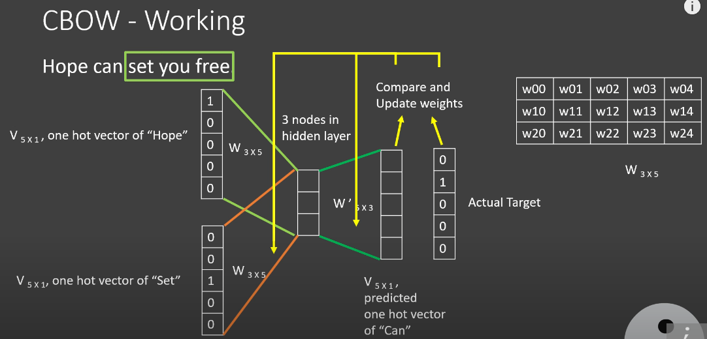
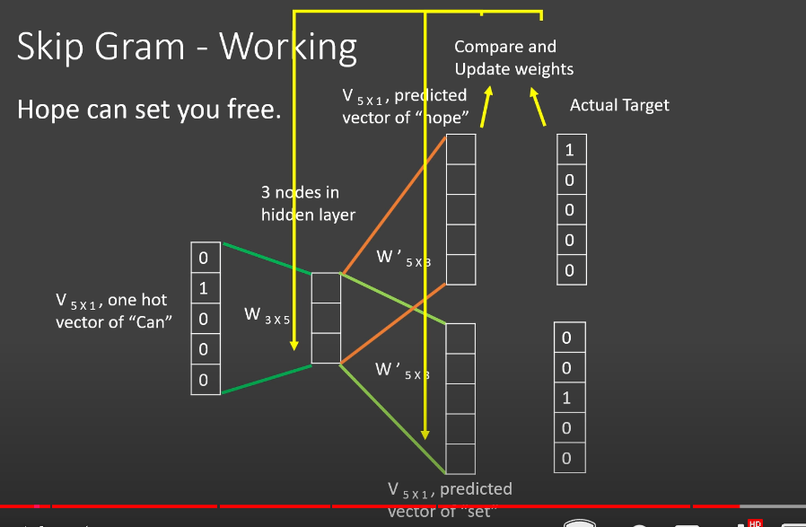
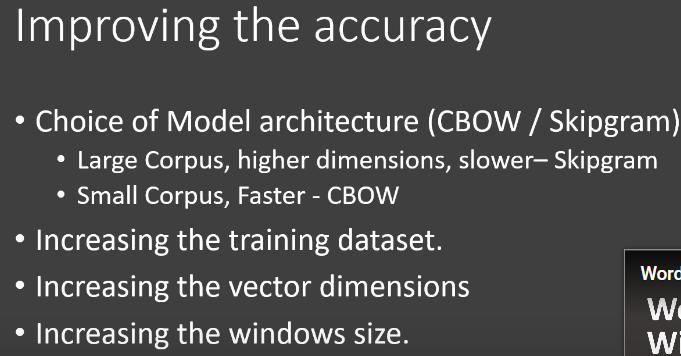
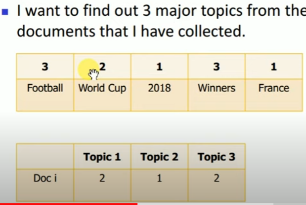
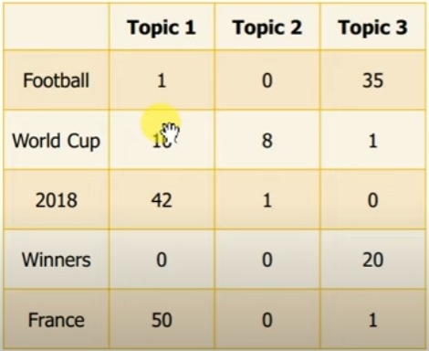

| [Home](../README.md) | [Course Page]() |
| -------------------- | --------------- |

## 9 Sequence Models for Time Series and Natural Language Processing on Google Cloud

[TOC]

## NLP Path

## NLP Tasks/Problems

[Natural Language Processing | Papers With Code](https://paperswithcode.com/area/natural-language-processing)

1. 

### Tokenization

### Word2Vec

**<u>Working of word2vec</u>**

*[Word2Vec - Skipgram and CBOW - YouTube](https://www.youtube.com/watch?v=UqRCEmrv1gQ)*

* Its a vector representation of a word (embedding) of size >32 dimensions (by default gensim uses 100 dimensions)

* It is created by training a neural network of 1 layer, where the size of the layer is the dimensions mentioned above.

* The inputs are dependent on how which of the following two approaches (definition of the problem) we are using to train the network.
  
  * **<u>CBOW (predict target word from context):</u>** A window of size n (typically the window size if 5 or 10) is defined called the *context*. The target word, which is usually a the center word is what is being predicted. The size of the each input word is a one-hot encoded word, therefore it is the size of the vocabular. The number of nodes in hidden layer (hidden layer dimension) are what defines the size of the embedding of the word. Softmax function is used in the output layer. Finally an embedding for a word is defined as  the weights from the hidden layer to the output layer for the word. i.e you take the  weight matrix and multiply it with the OHE of the word for which you want the embedding for.
    
    
  
  * **<u>Skip Gram (predict context from target word):</u>**  Skipgram uses also 1 layer for training, however since it uses the word to predict the context, we have single  input word and multiple output words.
    
    
    
    * 

**<u>How to create custom word2vec</u>**

* Remove Stopwords, digits, numbers, convert to lower. (leave special characters in)

* tokenize sentences.

* for each tokenized sentence tokenize words

* remove stopwords

* use gensim word2vec model

* ```python
  # Training the Word2Vec model
  model = Word2Vec(sentences, min_count=1)
  words = model.wv.vocab
  
  # Finding Word Vectors
  vector = model.wv['war']
  
  # Most similar words
  similar = model.wv.most_similar('vikram')
  ```


### LDA:

1. Define the number of topics that a corpus of document contains.

2. For each word in every document randomly assign a topic number to it.

3. Iteration 0:
   
   1. **Create a table of topic composition per table**
      
      
   
   2. Create a topic composition per token table.
      
      

### RNN

**<u>Motivation (Limitation of previous techniques):</u>** 

* Sequence (word order) information is disregarded by CBOW and Skipgram methods.

**<u>Benefits</u>**

**<u>Limitation (Limitation of RNN) and alternative techniques.</u>**

**<u>Working of RNN</u>**: