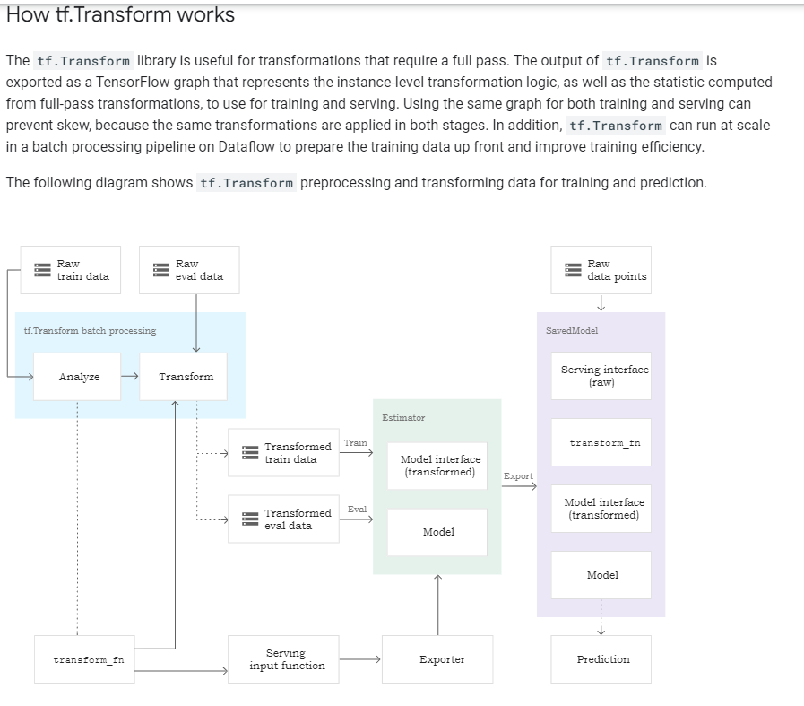
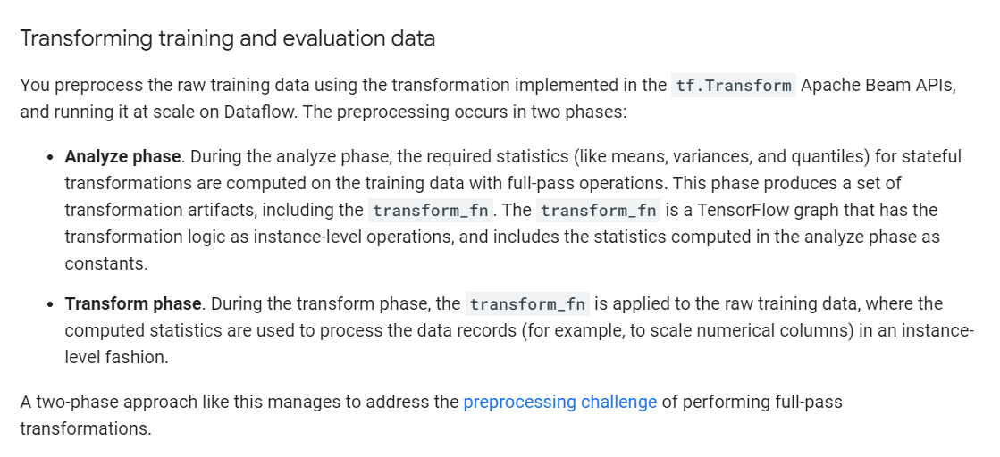
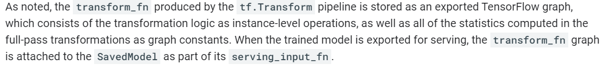
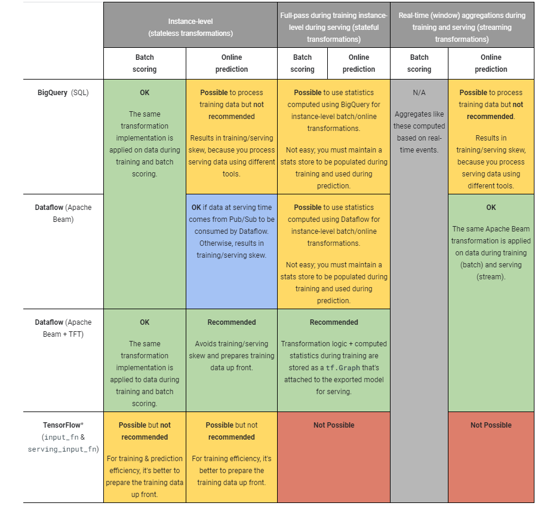
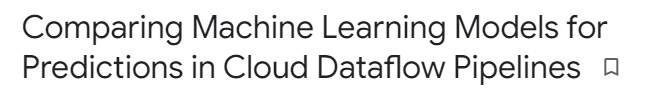
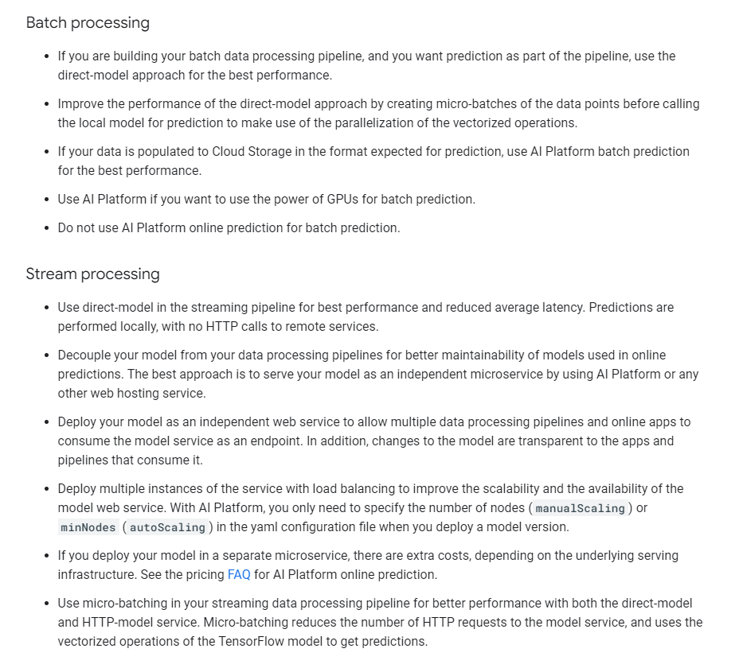
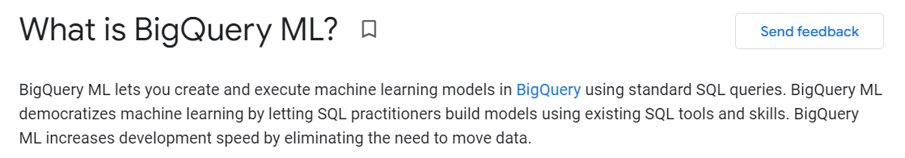
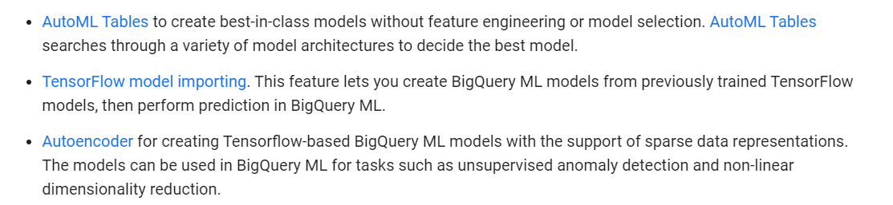

# Best practices for implementing machine learning on Google Cloud

###  [Best practices for implementing machine learning on Google Cloud  | Cloud Architecture Center](https://cloud.google.com/architecture/ml-on-gcp-best-practices)

[TOC]

## Recommended Tools

https://cloud.google.com/architecture/ml-on-gcp-best-practices#use-recommended-tools-and-products

### Before using custom models check if other tools are enough

1. BigQueryML
2. AutoML

* Random Advices
  * You can use of overfitting (driving the training loss to 0) on the training data (memorization) as a measure of if you have enough parameters to learn the complexity of the model. If your model can overfit, then it has enough parameters like layers/neurons per layer etc.

6,11,4,5,

3,3,2,3

## 1. [Machine learning environment setup](https://cloud.google.com/architecture/ml-on-gcp-best-practices#machine-learning-environment-setup)

6 things to remember. [u]	[m]	[p]	[s]	[c]	[p]

###  [Use Vertex AI Workbench user-managed notebooks for experimentation and development](https://cloud.google.com/architecture/ml-on-gcp-best-practices#use-notebooks-for-experimentation-and-development).

* Components of Vertex AI

  * Model Training 

    * AutoML
    * Custom training
      * select from among many different machine types to power your training jobs
      * enable distributed training
      * use hyperparameter tuning
      * accelerate with GPUs.

  * ### Model deployment for prediction

    *  get an endpoint to serve predictions on Vertex AI whether or not the model was trained on Vertex AI.

  * ### Vertex AI Data Labeling

  * ### Vertex AI Feature Store

  * ### Vertex AI Workbench

###  [Create a user-managed notebooks instance for each team member](https://cloud.google.com/architecture/ml-on-gcp-best-practices#create-a-notebooks-instance-for-each-team-member).

###  [Help secure PII in a user-managed notebooks instance](https://cloud.google.com/architecture/ml-on-gcp-best-practices#help-secure-pii-in-your-notebooks).

###  [Store prepared data and your model in the same project](https://cloud.google.com/architecture/ml-on-gcp-best-practices#store-prepared-data-and-your-model-in-the-same-project).

###  [Optimize performance and cost](https://cloud.google.com/architecture/ml-on-gcp-best-practices#optimize-performance-cost).

###  [Use Vertex SDK for Python](https://cloud.google.com/architecture/ml-on-gcp-best-practices#use-vertex-sdk-for-python).

## 2. [Machine learning development](https://cloud.google.com/architecture/ml-on-gcp-best-practices#machine-learning-development)

11 things (bul-fat-shef)

###  [Prepare training data](https://cloud.google.com/architecture/ml-on-gcp-best-practices#prepare-training-data).

###  [Store tabular data in **<u>BigQuery</u>**](https://cloud.google.com/architecture/ml-on-gcp-best-practices#store-tabular-data-in-bigquery).

###  [Store image, video, audio and **<u>unstructured data</u>** on Cloud Storage](https://cloud.google.com/architecture/ml-on-gcp-best-practices#store-image-video-audio-and-unstructured-data-on-cloud-storage).

###  [Use Vertex **<u>Data Labeling</u>** for unstructured data](https://cloud.google.com/architecture/ml-on-gcp-best-practices#use-vertex-data-labeling).

###  [Use Vertex **<u>AI Feature Store</u>** with structured data](https://cloud.google.com/architecture/ml-on-gcp-best-practices#use-vertex-feature-store-with-structured-data).

###  [**<u>Avoid storing data in block storage</u>**](https://cloud.google.com/architecture/ml-on-gcp-best-practices#avoid-storing-data-in-block-storage).

###  [Use Vertex AI **<u>TensorBoard</u>** to visualize experiments](https://cloud.google.com/architecture/ml-on-gcp-best-practices#use-vertex-tensorboard-to-visualize-experiments).

###  [Train a model within a user-managed notebooks instance for **<u>small datasets</u>**](https://cloud.google.com/architecture/ml-on-gcp-best-practices#train-a-model-within-notebooks-for-small-datasets).

###  [Maximize your model's predictive accuracy with **<u>hyperparameter tuning</u>**](https://cloud.google.com/architecture/ml-on-gcp-best-practices#maximize-your-model's-predictive-accuracy-with-hyperparameter-tuning).

###  [Use a user-managed notebooks instance to **<u>evaluate and understand</u>** your models](https://cloud.google.com/architecture/ml-on-gcp-best-practices#use-notebooks-to-evaluate-and-understand-your-models). 

* [What-if Tool (WIT)](https://www.youtube.com/watch?v=qTUUwfG1vSs) and [Language Interpretability Tool (LIT)](https://pair-code.github.io/lit/)

###  [Use **<u>feature attributions</u>** to gain insights into model predictions](https://cloud.google.com/architecture/ml-on-gcp-best-practices#use-feature-attributions-to-gain-insights-into-model-predictions).

* [Vertex Explainable AI](https://cloud.google.com/vertex-ai/docs/explainable-ai/overview) 

## 3. [Data processing](https://cloud.google.com/architecture/ml-on-gcp-best-practices#data-processing)

4 things

[Where to do preprocessing](https://cloud.google.com/architecture/data-preprocessing-for-ml-with-tf-transform-pt1#where_to_do_preprocessing)

* There are 3 levels/types of data transofmration
  * instance-level transformations, --- eg, clipping the value of a feature to some threshold, polynomially expanding another feature, multiplying two features, or comparing two features to create a Boolean flag. splitting a feature into two
  * stateful full-pass transformations -- calculating mean,sd,min,max
  * window-aggregation feature transformations. - an averaging/rolling window of say 5 or 10 records.
* Dataflow is used to read real-time data from pub/sub and transform it in desirable state and then write it to BigTable (low latency store. BigTable=OLTP, BigQuery=OLAP)
* 
* 
* 
* 
* 

###  [Use TensorFlow Extended when leveraging TensorFlow ecosystem ](https://cloud.google.com/architecture/ml-on-gcp-best-practices#use-tensorflow-extended-when-leveraging-tensorflow-ecosystem).

###  [Use BigQuery to process tabular data](https://cloud.google.com/architecture/ml-on-gcp-best-practices#use-bigquery-to-process-tabular-data).

[What is BigQuery ML?  | Google Cloud](https://cloud.google.com/bigquery-ml/docs/introduction)

* Pay attention to "Auto ML Tables" : This is auto ml which is a part of the Vertex AI solution but, it can be called in BigQuery and it will automatically choose and create a model.

  

###  [Use Dataflow to process unstructured data](https://cloud.google.com/architecture/ml-on-gcp-best-practices#use-dataflow-to-process-unstructured-data).

* You can use Dataflow to convert the unstructured data into binary data formats like TFRecord, which can improve performance of data ingestion during the training process.
* Alternatively, if your organization has an investment in an [Apache Spark](https://spark.apache.org/) codebase and skills, consider using [Dataproc](https://cloud.google.com/dataproc/docs). Use one-off Python scripts for smaller datasets that fit into memory.

###  [Use managed datasets to link data to your models](https://cloud.google.com/architecture/ml-on-gcp-best-practices#use-managed-datasets-to-link-data-to-your-models).

* Managed datasets enable you to create a clear link between your data and custom-trained models, and provide descriptive statistics and automatic or manual splitting into train, test, and validation sets.

## 4. [Operationalized training](https://cloud.google.com/architecture/ml-on-gcp-best-practices#operationalized-training)

5 things         [m]    [p]    [c]	[a] 	[r]

###  [Run your code in a **<u>managed service</u>**](https://cloud.google.com/architecture/ml-on-gcp-best-practices#run-your-code-in-a-managed-service).

There are 4 options

* Vertex AI Training Service
* Vertex AI Training Service as part of a Vertex AI Pipeline
* [Deep Learning Virtual Machine](https://cloud.google.com/deep-learning-vm/docs) container  (not auto scalable)
* [Compute Engine](https://cloud.google.com/compute) (not auto scalable)

###  [Operationalize job execution with training **<u>pipelines</u>**](https://cloud.google.com/architecture/ml-on-gcp-best-practices#operationalize-job-execution-with-training-pipelines).

* A training pipeline, which is different than a general ML pipeline, encapsulates training jobs with additional steps. 

###  [Use training **<u>checkpoints</u>** to save the current state of your experiment](https://cloud.google.com/architecture/ml-on-gcp-best-practices#use-training-checkpoints-to-save-the-current-state-of-your-experiment).

*  If your model fails and isn't checkpointed, the training job or pipeline will finish and the data will be lost because the model isn't in memory. 

###  [Prepare production **<u>artifacts</u>** for serving in Cloud Storage](https://cloud.google.com/architecture/ml-on-gcp-best-practices#prepare-production-artifacts-for-serving-in-cloud-storage).

###  [**<u>Regularly</u>** compute new feature values](https://cloud.google.com/architecture/ml-on-gcp-best-practices#regularly-compute-new-feature-values).

## 5. [Model deployment and serving](https://cloud.google.com/architecture/ml-on-gcp-best-practices#model-deployment-and-serving)

3 things    	[c]	[i]	[as]

###  [Specify the **<u>number and types</u>** of machines you need / **<u>compute requirements</u>**](https://cloud.google.com/architecture/ml-on-gcp-best-practices#specify-the-number-and-types-of-machines-you-need).

###  [Plan **<u>inputs</u>** to the model](https://cloud.google.com/architecture/ml-on-gcp-best-practices#plan-inputs-to-the-model).

###  [Turn on **<u>automatic scaling</u>**](https://cloud.google.com/architecture/ml-on-gcp-best-practices#turn-on-automatic scaling).

## 6. [Machine learning workflow orchestration](https://cloud.google.com/architecture/ml-on-gcp-best-practices#machine-learning-workflow-orchestration)

3 things

###  [Use ML pipelines to orchestrate the ML workflow](https://cloud.google.com/architecture/ml-on-gcp-best-practices#use-ml-pipelines).

###  [Use Kubeflow Pipelines for flexible pipeline construction](https://cloud.google.com/architecture/ml-on-gcp-best-practices#use-kubeflow-pipelines-sdk-for-flexible-pipeline-construction).

###  [Use TensorFlow Extended SDK to leverage pre-built components for common steps](https://cloud.google.com/architecture/ml-on-gcp-best-practices#use-tensorflow-extended-sdk-to-leverage-pre-built-components-for-common-steps).

## 7. [Artifact organization](https://cloud.google.com/architecture/ml-on-gcp-best-practices#artifact-organization)

2 things

###  [Organize your ML **<u>model artifacts</u>**](https://cloud.google.com/architecture/ml-on-gcp-best-practices#organize-your-ml-model-artifacts).

###  [Use a **<u>Git repository</u>** for pipeline definitions and training code](https://cloud.google.com/architecture/ml-on-gcp-best-practices#use-a-git-repository-for-pipeline-definitions-and-training-code).

## 8. [Model monitoring](https://cloud.google.com/architecture/ml-on-gcp-best-practices#model-monitoring)

3 things	[s]	[at]	[d]

###  [Use skew detection](https://cloud.google.com/architecture/ml-on-gcp-best-practices#use-skew-detection).

###  [Fine tune alert thresholds](https://cloud.google.com/architecture/ml-on-gcp-best-practices#fine-tune-alert-thresholds).

###  [Use feature attributions to detect data drift or skew](https://cloud.google.com/architecture/ml-on-gcp-best-practices#use-feature-attributions-to-detect-data-drift-or-skew).