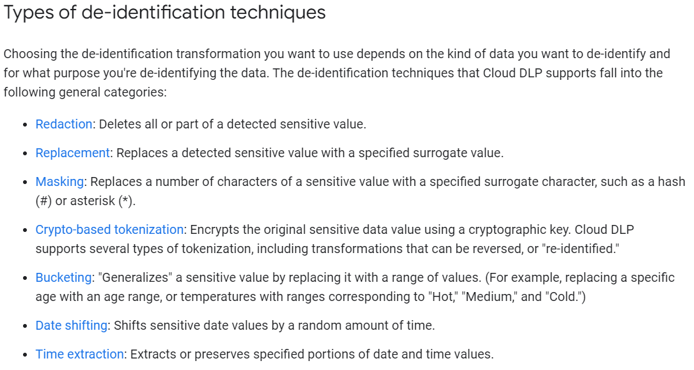
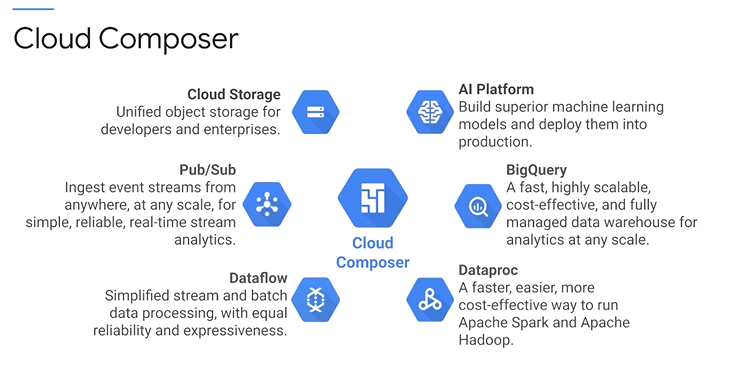

# Google Products

* CloudML Engine -> AI Platform -> Vertex AI
* BigQuery -> Data Warehousing.
* BigQueryML
* Cloud Monitoring
* Cloud Data Loss Prevention (DLP) 
  *  Automatically discover sensitive data
  * Classify data across your enterprise
  * Protect sensitive data as you migrate to the cloud
  *  [Cloud DLP ](https://cloud.google.com/dlp/docs)enables transformations such as 
    * 

  * Also keep in mind Federated Learning will help maintain privacy as the training is done on device.
* Cloud Data Fusion 
  * Data Lakes. 
  * Cloud Data Fusion helps users build scalable, distributed data lakes on Google Cloud by integrating data from siloed on-premises platforms. 
  * Visual point-and-click interface enabling code-free deployment of ETL/ELT data pipelines. 
  * End-to-end data lineage for root cause and impact analysis
  * Data Fusion is not SQL syntax ....
  * Cloud Data Fusion offers [pre-built transformations](https://cloud.google.com/data-fusion/plugins) for both batch and real-time processing.

* Cloud Spanner
  * Fully managed relational database with unlimited scale, strong consistency.
  * , [SQL queries](https://cloud.google.com/spanner/docs/query-syntax), and ACID transactions

* App Engine ->  Build highly scalable applications on a fully managed serverless platform.
* Cloud DataPrep -> Dataprep by Trifacta is an intelligent data service for visually exploring, cleaning, and preparing structured and unstructured data for analysis, reporting, and machine learning. 
* Cloud Datalab -> Datalab is scheduled to be deprecated on August 11, 2022. [Vertex AI Workbench](https://cloud.google.com/vertex-ai/docs/workbench) provides a notebook-based environment that offers capabilities beyond Datalab. 
* Tensorboard
* GKE (Google Kubernetes Engine)
* Kubeflow
* Apache Beam
* Apache Airflow
* Tensorflow Extended (TFX)
* Cloud Data Loss Prevention (DLP) can de-identify sensitive data in text content, including text stored in container structures such as tables.
* Dataflow
* Dataproc
* Compute Engine
* Vertex Prediction
* Deep Learning VM Images
* [BigQuery ML](https://cloud.google.com/bigquery-ml/docs/introduction)
* [Dialogflow](https://cloud.google.com/dialogflow)
* [Recommendations AI](https://cloud.google.com/recommendations)
* [Cloud Natural Language API](https://cloud.google.com/natural-language)
* [Translation API](https://cloud.google.com/translate)
* [Speech-To-Text](https://cloud.google.com/speech-to-text)
* [Video AI](https://cloud.google.com/video-intelligence)
* [AutoML](https://cloud.google.com/automl) (note: it’s [now part of Vertex AI](https://cloud.google.com/vertex-ai/docs/beginner/beginners-guide/))
* Cloud Build
* Cloud Logging
* [Google Data Studio](https://datastudio.google.com/u/0/)
* [Vertex AI Model Monitoring](https://cloud.google.com/vertex-ai/docs/model-monitoring/overview)
* [Vertex Explainable AI](https://cloud.google.com/vertex-ai/docs/explainable-ai/overview)
* [Cloud Scheduler](https://cloud.google.com/scheduler)
* [Cloud Run](https://cloud.google.com/run)
* [Cloud Functions](https://cloud.google.com/functions) 
* [Cloud Pub/Sub](https://cloud.google.com/pubsub)
* *Cloud Composer*
* Tensorflow Lite (on edge model deployment)
  * **<u>Bazel:</u>**You can build a TensorFlow shared object on Android using Android Studio using a continuous integration tool called Bazel.
  * And for iOS, there is **<u>CocoaPod</u>** integration as well.

## Use recommended tools and products

https://cloud.google.com/architecture/ml-on-gcp-best-practices#use-recommended-tools-and-products

The following table lists recommended tools and products for each phase of the ML workflow as outlined in this document:

| **Machine learning workflow step**                           | **Recommended tools and products**                           |
| ------------------------------------------------------------ | ------------------------------------------------------------ |
| [ML environment setup](https://cloud.google.com/architecture/ml-on-gcp-best-practices#machine-learning-environment-setup) | [Vertex AI Workbench user-managed notebooks](https://cloud.google.com/vertex-ai/docs/workbench/user-managed)[Vertex SDK for Python](https://cloud.google.com/vertex-ai/docs/start/client-libraries#python) |
| [ML development](https://cloud.google.com/architecture/ml-on-gcp-best-practices#machine-learning-development) | [BigQuery](https://cloud.google.com/bigquery/docs/introduction)[Cloud Storage](https://cloud.google.com/storage/docs/introduction)[Vertex AI Workbench user-managed notebooks](https://cloud.google.com/vertex-ai/docs/workbench/user-managed)[Vertex Data Labeling](https://cloud.google.com/vertex-ai/docs/datasets/data-labeling-job)[Vertex Explainable AI](https://cloud.google.com/vertex-ai/docs/explainable-ai/overview)[Vertex AI Feature Store](https://cloud.google.com/vertex-ai/docs/featurestore/overview)[Vertex AI TensorBoard](https://cloud.google.com/vertex-ai/docs/experiments/tensorboard-overview)[Vertex Training](https://cloud.google.com/ai-platform-unified/docs/training/create-model-custom-training) |
| [Data processing](https://cloud.google.com/architecture/ml-on-gcp-best-practices#data-processing) | [BigQuery](https://cloud.google.com/bigquery/docs/introduction)[Dataflow](https://cloud.google.com/dataflow/docs)[Dataproc](https://cloud.google.com/dataproc/docs)[Managed datasets](https://cloud.google.com/vertex-ai/docs/training/using-managed-datasets)[TensorFlow Extended](https://www.tensorflow.org/tfx) |
| [Operationalized training](https://cloud.google.com/architecture/ml-on-gcp-best-practices#operationalized-training) | [Cloud Storage](https://cloud.google.com/storage/docs/introduction)[PyTorch](https://pytorch.org/tutorials/recipes/recipes/saving_and_loading_a_general_checkpoint.html)[TensorFlow Core](https://www.tensorflow.org/overview)[Vertex AI Feature Store](https://cloud.google.com/vertex-ai/docs/featurestore/overview)[Vertex AI Pipelines](https://cloud.google.com/vertex-ai/docs/pipelines)[Vertex Training](https://cloud.google.com/vertex-ai/docs/training/create-model-custom-training) |
| [Model deployment and serving](https://cloud.google.com/architecture/ml-on-gcp-best-practices#model-deployment-and-serving) | [Vertex Prediction](https://cloud.google.com/vertex-ai/docs/predictions/getting-predictions) |
| [ML workflow orchestration](https://cloud.google.com/architecture/ml-on-gcp-best-practices#machine-learning-workflow-orchestration) | [Kubeflow Pipelines](https://www.kubeflow.org/docs/components/pipelines/)[TensorFlow Extended](https://www.tensorflow.org/tfx)[Vertex AI Pipelines](https://cloud.google.com/vertex-ai/docs/pipelines) |
| [Artifact organization](https://cloud.google.com/architecture/ml-on-gcp-best-practices#artifact-organization) | [Artifact Registry](https://cloud.google.com/artifact-management/docs) |
| [Model monitoring](https://cloud.google.com/architecture/ml-on-gcp-best-practices#model-monitoring) | [Vertex Explainable AI](https://cloud.google.com/vertex-ai/docs/explainable-ai/overview)[Vertex Model Monitoring](https://cloud.google.com/vertex-ai/docs/model-monitoring/overview) |

