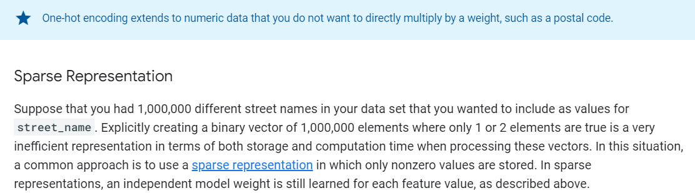
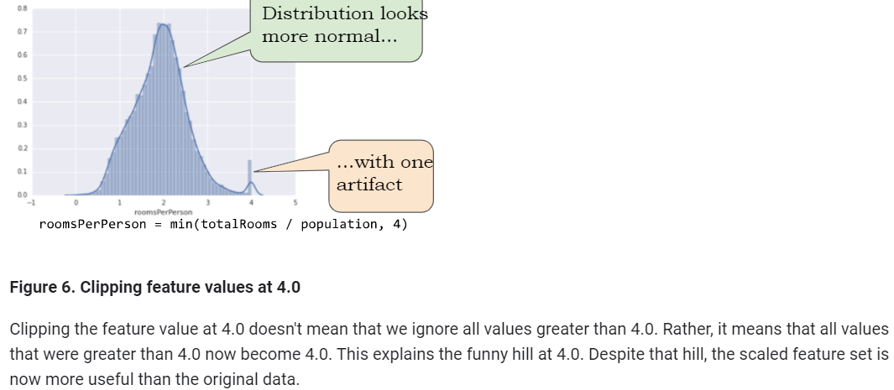
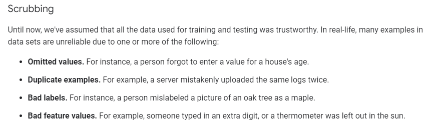
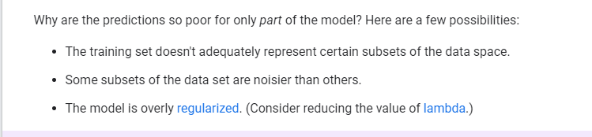
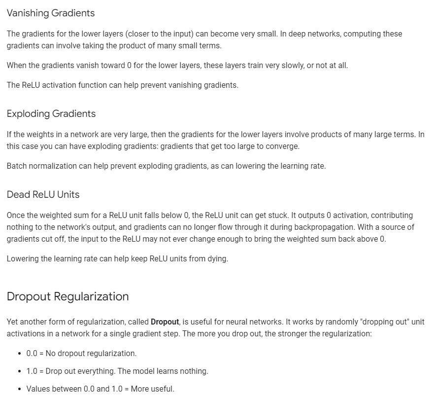
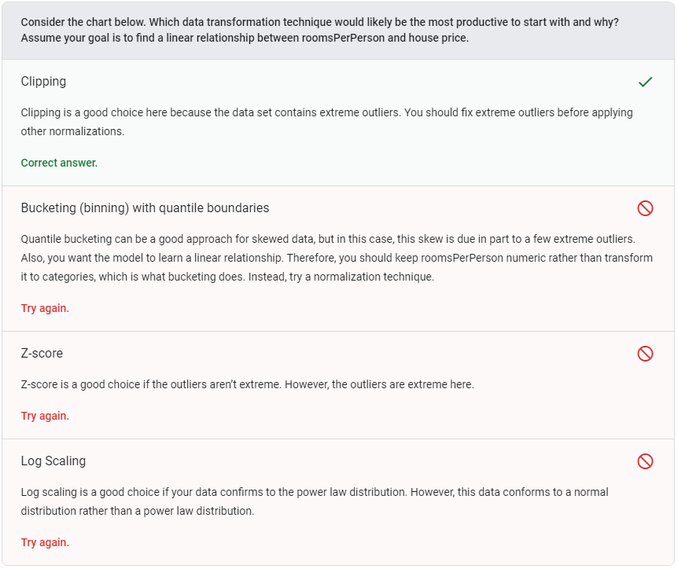

* Learning Rates

* SGD vs Mini batch SGD

  

* Overfitting

  

* 

	

Questions:

[Sampling and Splitting: Check Your Understanding  | Data Preparation and Feature Engineering for Machine Learning  | Google Developers](https://developers.google.com/machine-learning/data-prep/construct/sampling-splitting/check-your-understanding)

[Transforming Your Data: Check Your Understanding  | Data Preparation and Feature Engineering for Machine Learning  | Google Developers](https://developers.google.com/machine-learning/data-prep/transform/check-your-understanding)

[Check Your Understanding  | Introduction to Machine Learning Problem Framing  | Google Developers](https://developers.google.com/machine-learning/problem-framing/check-your-understanding)