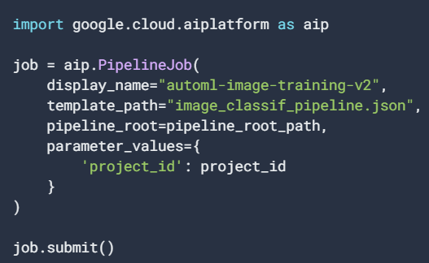

# Vertex AI Notes

## Training Jobs


1. Choose/Setup Environment: Two options here

   1.  Pull a prebuilt Image from Cloud Storage
   2.  Pull a Custom Image you created as a container or have previously uploaded in artifact registery

2. Create/Assign a folder as a Cloud Storage Bucket where the model output and artifacts will be stored.

3. Create a training job type

   There are three types of Vertex AI resources you can create to train custom models on Vertex AI:

   - [Custom jobs](https://cloud.google.com/vertex-ai/docs/training/create-custom-job): Need to specify following 2 requirements

     - One worker pool for single-node training ([`WorkerPoolSpec`](https://cloud.google.com/vertex-ai/docs/reference/rest/v1/CustomJobSpec#workerpoolspec)), or multiple worker pools for distributed training
       - Define machine type and accelerators
       - [Configuration of what type of training code the worker pool runs](https://cloud.google.com/vertex-ai/docs/training/configure-container-settings): either a Python training application ([`PythonPackageSpec`](https://cloud.google.com/vertex-ai/docs/reference/rest/v1/CustomJobSpec#pythonpackagespec)) or a custom container ([`ContainerSpec`](https://cloud.google.com/vertex-ai/docs/reference/rest/v1/CustomJobSpec#containerspec))
     - Optional settings for configuring job scheduling ([`Scheduling`](https://cloud.google.com/vertex-ai/docs/reference/rest/v1/CustomJobSpec#scheduling)), [setting certain environment variables for your training code](https://cloud.google.com/vertex-ai/docs/training/code-requirements#environment-variables), [using a custom service account](https://cloud.google.com/vertex-ai/docs/general/custom-service-account), and [using VPC Network Peering](https://cloud.google.com/vertex-ai/docs/general/vpc-peering)

   - [Hyperparameter tuning jobs](https://cloud.google.com/vertex-ai/docs/training/using-hyperparameter-tuning)

     When you configure a hyperparameter tuning job, you must specify the following details:

     - The hyperparameters you want to tune and the metrics that you want to use to evaluate trials.

     - Details about the number of trials to run as a part of this tuning job, such as the following:

       - [The maximum number of trials to run](https://cloud.google.com/vertex-ai/docs/training/using-hyperparameter-tuning#understanding-trials).
       - [The number of trials that can run in parallel](https://cloud.google.com/vertex-ai/docs/training/using-hyperparameter-tuning#parallel-trials).
       - [The maximum number of trials that are allowed to fail before the job stops early](https://cloud.google.com/vertex-ai/docs/training/using-hyperparameter-tuning#failed-trials).

     - Details about the custom training job that is run for each trial, such as the following:

       - The [machine type](https://cloud.google.com/vertex-ai/docs/training/configure-compute) that the trials jobs run in and the accelerators that the job uses.

         **Note:** Currently, Vertex AI does not support hyperparameter tuning jobs that require TPUs.

       - The details of the custom container or Python package job.

   - [Training pipelines](https://cloud.google.com/vertex-ai/docs/training/create-training-pipeline)

     A *training pipeline* encapsulates training jobs with additional steps. This guide explains two different training pipelines:

     - Launch a `CustomJob` and upload the resulting model to Vertex AI
     - Launch a hyperparameter tuning job and upload the resulting model to Vertex AI

   

4. Export Model Artifacts to Cloud Storage you created in step 2:

   **<u>Framework specific requriments</u>**

   * Depending on [which ML framework you plan to use for prediction](https://cloud.google.com/vertex-ai/docs/predictions/pre-built-containers), you must export model artifacts in different formats.
     * Tensorflow
     * XGBoost
     * scikit-learn

   Keep in mind some additional considerations if you want you model to use Vertex Explainable AI service.

5. Monitor Model
   1. Ensure that anyone who wants to access an interactive shell has the following permissions for the Google Cloud project where custom training is running:
      - `aiplatform.customJobs.create`
      - `aiplatform.customJobs.get`
      - `aiplatform.customJobs.cancel`

6. Configure Models and get predictions

   Vertex AI provides Docker container images that you run as *pre-built containers* for serving predictions and explanations from trained model artifacts. These containers, which are organized by machine learning (ML) framework and framework version, provide [HTTP prediction servers](https://cloud.google.com/vertex-ai/docs/predictions/custom-container-requirements#server) that you can use to serve predictions with minimal configuration.

   * Prebuild Container for serving

   * Custom Container for serving.

   * Or just save it directly without using it as a serving endpoint and directly use model during batch predictions.

   Configure compute resources for prediction:

   * Vertex AI allocates *nodes* to handle online and batch predictions. When you [deploy a custom-trained model or AutoML tabular model to an `Endpoint` resource to serve online predictions](https://cloud.google.com/vertex-ai/docs/predictions/deploy-model-console) or when you [request batch predictions](https://cloud.google.com/vertex-ai/docs/predictions/batch-predictions), you can customize the type of virtual machine that the prediction service uses for these nodes.

   **Note:** GPUs are **not** recommended for use with AutoML tabular models. For this type of model, GPUs do not provide a worthwhile performance benefit. Specifying GPUs during AutoML model deployment is not supported in Cloud Console.

## Introduction to Vertex Explainable AI

**<u>Feature attributions</u>**

Feature attributions indicate how much each feature in your model contributed to the predictions for each given instance. Feature attributions work on tabular data, and include built-in visualization capabilities for image data. 

Vertex Explainable AI offers three methods to use for feature attributions: 

* *sampled Shapley*
  1. Non-differentiable models (like a model which is an ensemble of trees and neural network). This is model agnostic.
* *integrated gradients*
  1. Differentiable models like NN
  2. Large Feature space
  3. Low contranst images
* *XRAI*
  1. Models accpeting image inputs
  2. Natural Images which are any real -world scents that contain multiple objects


* The integrated gradients method does <u>not</u> work for non-differentiable models
* *Non-differentiable* models include non-differentiable operations in the TensorFlow graph, such as operations that perform decoding and rounding tasks.


## Vertex AI Model Monitoring

**<u>Training-serving skew and prediction drift</u>**

### Baselines for skew and drift detection

Model Monitoring uses different baselines for skew detection and drift detection:

- For *skew* detection, the baseline is the statistical distribution of the feature's values in the training data.
- For *drift* detection, the baseline is the statistical distribution of the feature's values seen in production in the recent past.

To compare two statistical distributions, Model Monitoring uses the following statistical measures:

- For numerical features, use [Jensen-Shannon divergence](https://en.wikipedia.org/wiki/Jensen–Shannon_divergence) to calculate the distance between two distributions.
- For categorical features, use [L-infinity distance](https://en.wikipedia.org/wiki/Chebyshev_distance) to calculate the distance between two distributions.

### Monitor feature skew and drift

**<u>To use Model Monitoring, you should first complete the following:</u>**

When a model is in production with Model Monitoring enabled, its incoming prediction requests are logged in a BigQuery table in your Google Cloud project. The input feature values contained in the logged requests are then analyzed for skew or drift.

1. Have an available model in Vertex AI that is either **Imported Custom Training** or **Tabular AutoML** type.

2. If you are enabling skew detection, upload your training data to [Cloud Storage](https://cloud.google.com/storage/docs/uploading-objects) or [BigQuery](https://cloud.google.com/bigquery/docs/loading-data) and obtain the URI link to the data.

3. Create a Model Monitoring job

   For Skew Detection

   For Drift Detection

4. You can update, pause, and delete a Model Monitoring job

5. Model Monitoring detects an anomaly when the threshold set for a feature is exceeded. 

   There are two ways that Model Monitoring can notify you when an anomaly is detected:

   * Cloud Logging alerts
   * email alerts.

6. Monitor the Model Monitoring job

   You can monitor the progress of the model monitoring job through logs populated in Cloud Logging, or by email.

7. Analyze skew and drift data

   You can use Cloud Console to visualize the distributions of each monitored feature and learn which changes led to skew or drift over time. You can view the feature value distributions as a histogram.

### Monitor feature attribution skew and drift

Vertex AI Model Monitoring supports *feature attribution* (feature importance scores) and detects skew and drift for categorical and numerical input features based on [Vertex Explainable AI](https://cloud.google.com/vertex-ai/docs/explainable-ai).


## Vertex AI Pipelines

You can use Vertex AI Pipelines to run pipelines that were built using the Kubeflow Pipelines SDK or TensorFlow Extended.

Choosing between the Kubeflow Pipelines SDK and TFX

* If you use TensorFlow in an ML workflow that processes terabytes of structured data or text data, we recommend that you build your pipeline using TFX.
* For other use cases, we recommend that you build your pipeline using the Kubeflow Pipelines SDK. By building a pipeline with the Kubeflow Pipelines SDK, you can implement your workflow by building custom components or reusing prebuilt components, such as the [Google Cloud Pipeline Components](https://cloud.google.com/vertex-ai/docs/pipelines/components-introduction). Google Cloud Pipeline Components make it easier to use Vertex AI services like AutoML in your pipeline.

### Understanding pipeline components

Pipeline components are self-contained sets of code that perform one part of a pipeline's workflow, such as data preprocessing, data transformation, and training a model.

[Introduction to Google Cloud Pipeline Components  | Vertex AI](https://cloud.google.com/vertex-ai/docs/pipelines/components-introduction)

Components are composed of a set of inputs, a set of outputs, and the location of a container image. A component's container image is a package that includes the component's executable code and a definition of the environment that the code runs in.

You can build custom components or you can reuse prebuilt components. To use features of Vertex AI like AutoML in your pipeline, use the Google Cloud pipeline components. Learn more about [using Google Cloud pipeline components in your pipeline](https://cloud.google.com/vertex-ai/docs/pipelines/build-pipeline#google-cloud-components).


### Getting started building a pipeline

* Define your workflow using Kubeflow Pipelines DSL package : This is a sequence of **<u>OPS</u>** 

  ```python
  import kfp
  from google.cloud import aiplatform
  from google_cloud_pipeline_components import aiplatform as gcc_aip
  
  project_id = PROJECT_ID
  pipeline_root_path = PIPELINE_ROOT
  
  # Define the workflow of the pipeline.
  @kfp.dsl.pipeline(
      name="automl-image-training-v2",
      pipeline_root=pipeline_root_path)
  def pipeline(project_id: str):
      ds_op = gcc_aip.ImageDatasetCreateOp(
          project=project_id,
          display_name="flowers",
          gcs_source="gs://cloud-samples-data/vision/automl_classification/flowers/all_data_v2.csv",
          import_schema_uri=aiplatform.schema.dataset.ioformat.image.single_label_classification,
      )
  
  
      training_job_run_op = gcc_aip.AutoMLImageTrainingJobRunOp(
          project=project_id,
          display_name="train-iris-automl-mbsdk-1",
          prediction_type="classification",
          model_type="CLOUD",
          base_model=None,
          dataset=ds_op.outputs["dataset"],
          model_display_name="iris-classification-model-mbsdk",
          training_fraction_split=0.6,
          validation_fraction_split=0.2,
          test_fraction_split=0.2,
          budget_milli_node_hours=8000,
      )
  
      # The third and fourth step are for deploying the model.
      create_endpoint_op = gcc_aip.EndpointCreateOp(
          project=project_id,
          display_name = "create-endpoint",
      )
  
      model_deploy_op = gcc_aip.ModelDeployOp(
          model=training_job_run_op.outputs["model"],
          endpoint=create_endpoint_op.outputs['endpoint'],
          automatic_resources_min_replica_count=1,
          automatic_resources_max_replica_count=1,
      )
  ```

* Compile your pipeline into a JSON file

  

* Submit your pipeline run

  

#### Schedule Pipeline Runs

* **<u>Cloud Scheduler</u>**:You can schedule the execution of a precompiled pipeline, using Cloud Scheduler, through the use of [Event-Driven Cloud Function](https://cloud.google.com/functions/docs/writing#event-driven_functions) with an HTTP trigger.
  * Build and compile a simple Pipeline
  * Upload compiled pipeline JSON to Cloud Storage bucket
  * Create a Cloud Function with HTTP Trigger
  * Create a Cloud Scheduler job
  * Manually run your job (optional)
* **<u>Trigger a pipeline run with Cloud Pub/Sub</u>**:
  * Build and compile a simple Pipeline as before
  * Upload compiled pipeline JSON to Cloud Storage bucket
  * Create a Cloud Function with Pub/Sub Trigger

## Vertex ML Metadata

Vertex ML Metadata lets you track and analyze the metadata produced by your machine learning (ML) workflows.

## Vertex AI TensorBoard

Vertex AI TensorBoard is an enterprise-ready managed version of TensorBoard. Vertex AI TensorBoard provides:

- A persistent, shareable link to your experiment's dashboard
- A searchable list of all experiments in a project
- Tight integrations with Vertex AI services for model training
- Enterprise-grade security, privacy, and compliance

Getting Started

* Install the Vertex AI TensorBoard Uploader through Vertex AI SDK
* Uploading Vertex AI TensorBoard logs

To View the logs

* Use the Google Cloud Console
* Use the link from CLI output

## Vertex AI Vizier

* Vertex AI Vizier is a black-box optimization service that helps you tune hyperparameters in complex machine learning (ML) models. 
* When ML models have many different hyperparameters, it can be difficult and time consuming to tune them manually. 
* Vertex AI Vizier optimizes your model's output by tuning the hyperparameters for you.
* *Black-box optimization* is the optimization of a system that meets either of the following criteria:
  - Doesn't have a known [objective function](https://developers.google.com/machine-learning/glossary#objective-function) to evaluate.
  - Is too costly to evaluate by using the objective function, usually due to the complexity of the system.
* How Vertex AI Vizier works: You start by determining a study configuration.
  * Study configurations : 
    * A *study configuration* is the definition of the optimization problem that you are trying to solve. It includes the result you would like to optimize and the hyperparameters or parameters that affect that result.
  * Studies and trials
    * A *study* is the implementation of a study configuration.
    * A *trial* is a specific set of input values that produce a measured outcome relative to your goals.
  * Measurements
    * A *measurement* is the measured outcome of your trial.
  * Search algorithms
    * If you do not specify an algorithm, Vertex AI Vizier uses the default algorithm. The default algorithm applies Bayesian optimization to arrive at the optimal solution with a more effective search over the parameter space.
    * ALGORITHM_UNSPECIFIED : Results in the same behavior as when you don't specify a search algorithm
    * GRID_SEARCH
    * RANDOM_SEARCH
* How Vertex AI Vizier differs from custom training
  * Vertex AI Vizier is an independent service for optimizing complex models with many parameters. 
  * It can be used for both ML and non-ML use cases. 
  * It can be used with Training jobs or with other systems (even multi-cloud). 
  * Hyperparameter tuning for custom training is a built-in feature that uses Vizier for training jobs. 
  * It helps determine the best hyperparameter settings for an ML model.
* Use cases: In the following scenarios, Vertex AI Vizier helps tune hyperparameters to optimize a model or tune parameters to optimize an outcome:
  * Optimize the learning rate, batch size, and other hyperparameters of a neural network recommendation engine.
  * Optimize usability of an application by testing different arrangements of user interface elements.
  * Minimize computing resources for a job by identifying an ideal buffer size and thread count.
  * Optimize the amounts of ingredients in a recipe to produce the most delicious version.

## Vertex AI Feature Store

Vertex AI Feature Store provides a centralized repository for organizing, storing, and serving ML features.

* Benefits
  * Share features across your organization
  * Managed solution for online serving at scale
  * Mitigate training-serving skew
  * Detecting drift
  * Quotas and limits: Vertex AI Feature Store sets a quota on the number of online serving nodes and a quota on the number of online serving requests that you can make per minute.
  * Data retention: Vertex AI Feature Store schedules to delete values with timestamps that exceed the limit.
  * Pricing: pricing is based on several factors, such as how much data you store and the number of featurestore online nodes you use.

## Vertex AI Matching Engine


